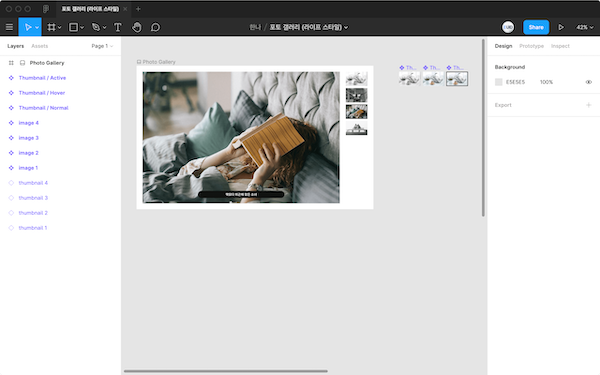

[← BACK](../README.md)

 

# SCHEDULES

영상 강의 학습 일정을 일차 별로 안내하니, 학습 일정을 완료한 후 [`완료 상태`로 변경하고 원격 저장소에 푸시(push)](./tutorials/changeCompleteState.md) 합니다.
**영강 강의를 시청한 후, 질문을 정리해 밋업에 참여하세요.**

- [DAY 01](#-day-01)
- [DAY 02](#-day-02)
- [DAY 03](#-day-03)
- [DAY 04](#-day-04)
- [DAY 05](#-day-05)
- [DAY 06](#-day-06)
- [DAY 07](#-day-07)
- [DAY 08](#-day-08)
- [DAY 09](#-day-09)
- [DAY 10](#-day-10)
- [DAY 11](#-day-11)
- [DAY 12](#-day-12)
- [DAY 13](#-day-13)
- [DAY 14](#-day-14)
- [DAY 15](#-day-15)
- [DAY 16-17](#-day-16-17)
- [DAY 18](#-day-18)
- [DAY 19](#-day-19)
- [DAY 20](#-day-20)
- [DAY 21](#-day-21)
- [DAY 22](#-day-22)

 

<!-- 일차 별 학습 진행 목표 -->

## ␥ DAY 22

  
<b>학습 진행</b>

  
   비동기 프로그래밍에 대해 학습을 시작합니다. 

- [x] 비동기 프로그래밍 → 서버 환경 구성 (11분 25초, 6분 54초)
- [x] 비동기 프로그래밍 → XMLHttpRequest (11분 24초, 6분 23초, 7분 51초)
- [x] `ES6` 단축 속성 ⎼ Shorthand Properties (4분 43초)
- [x] `ES6` 향상된 객체 표기법 ⎼ Object Enhancements (10분 19초, 8분 45초)

## ␥ DAY 21

  
<b>학습 진행</b>

  
   객체 지향, 함수형 프로그래밍, ES6 구조 분해 할당에 대해 학습합니다. 

- [x] 객체 지향 프로그래밍 용어 풀이
- [x] 함수형 vs 객체 지향 프로그래밍 (15분 45초, 16분 59초)
- [x] `ES6` 구조 분해 할당 ⎼ Destructuring Assignment (15분 2초)

## ␥ DAY 22

  
<b>학습 진행</b>

  
   객체 지향 JavaScript, ES6에 대해 학습합니다. 

- [ ] 객체 / 상속 (6분 48초, 8분 28초, 16분 54초)
- [ ] 생성자 / 프로토타입 (9분 47초, 10분 54초, 16분 41초)
- [ ] 객체지향 프로그래밍 (21분 12초)
- [ ] `ES6` 문자 ⎼ Template Literal (5분 44초)
- [ ] `ES6` 문자 ⎼ String Addtions (8분 47초)
- [ ] `ES6` 함수 ⎼ Arrow Function (20분 21초)
- [ ] `ES6` 함수 ⎼ Default Parameter (10분 05초)
- [ ] `ES6` 함수 ⎼ Rest Parameter (18분 38초)
- [ ] `ES6` 함수 ⎼ Spread Operator
- [ ] `ES6` 배열 ⎼ Array Additions (15분 43초, 10분 06초)

## ␥ DAY 20

  
<b>학습 진행</b>

  
   JavaScript 수학, 숫자, 문자 객체에 대해 학습합니다. 

- [x] 숫자 / 수학 객체 (15분 31초, 8분 9초)
- [x] 문자 객체 (7분 26초, 16분 8초)
- [x] [ES6] 문자 ⎼ String Addtions (8분 47초)

## ␥ DAY 19

  
<b>학습 진행</b>

  
   모던 JavaScript인 ES6 학습을 진행합니다. 

- [x] [ES6] 블록영역 ⎼ let & const (14분 36초, 14분 05초)
- [x] [ES6] 블록영역 ⎼ IIFE → Block (읽기)
- [x] [ES6] 문자 ⎼ Template Literal (5분 44초)
- [x] [ES6] 문자 ⎼ String Addtions (8분 47초)

## ␥ DAY 18

  
<b>학습 진행</b>

  
   JavaScript 클로저에 대해 학습합니다. 

- [x] JavaScript 클로저 (원할한 이해를 위해서는 반복 시청이 중요합니다.)

## ␥ DAY 16-17

  
<b>학습 진행</b>

  
   Netflix 웹사이트 홈페이지를 제작합니다. 

- [x] Netflix 웹사이트에 사용된 개발 가이드 읽고 분석
- [x] Netflix 웹사이트 홈페이지 스타일링
- [x] CSS 리마인드 (모르는 부분 영상 강의 찾아 시청 후 정리)

## ␥ DAY 15

  
<b>학습 진행</b>

  
   JavaScript 함수 식 중 즉시 실행 함수 식을 공부해봅니다. 

- [x] 즉시 실행 함수 식 (9분 52초)

## ␥ DAY 14

  
<b>학습 진행</b>

  
   오프라인 학습 내용을 리마인드/검토 합니다. 

- [x] 지난 주 토요일 오프라인 실습 내용 TIL 정리
- [x] 실습 내용 손코딩 작성 후, 촬영 / 업로드

## ␥ DAY 13

  
<b>학습 진행</b>

  
   배열과 객체 그리고 상속에 대해 학습해봅니다. 

- [x] 배열 객체 (20분 57초)
- [x] 객체 / 상속 (6분 48초, 8분 28초, 16분 54초)

## ␥ DAY 12

  
<b>학습 진행</b>

  
   함수 객체에 대해 좀 더 깊이 학습해봅니다. 

- [x] 함수 객체 (17분 40초, 6분 53초, 9분 50초)

## ␥ DAY 11

  
<b>학습 진행</b>

  
   함수 그리고 HTML, Sass에 익숙해질 수 있도록 훈련해봅니다. 

- [x] 함수 정복하기! (일상 생활에서 생각해볼 수 있는 절차를 함수로 만들어 보기, 손코딩)
- [x] Netflix 홈페이지 디자인 시안 → HTML, Sass 실습 (구조 설계, BEM 방법론 도입)

## ␥ DAY 10

  
<b>학습 진행</b>

  
   호이스트 현상과 스코프 체인. 그리고 문자, 숫자 객체에 대해 학습합니다. 

- [x] 호이스팅 / 스코프 체이닝 (19분 1초)
- [x] 숫자 / 수학 객체 (15분 31초, 8분 9초)
- [x] 문자 객체 (7분 26초, 16분 8초)

## ␥ DAY 09

  
<b>학습 진행</b>

  
   웹 사이트 / 애플리케이션의 이벤트 처리 시점과 값 복사, 참조 그리고 블록 영역에 대해 학습합니다. 

- [x] 이벤트 처리 시점 (10분 2초, 7분 9초, 5분 32초)
- [x] 값 복사 vs 값 참조 (11분 42초)
- [x] 함수 영역 vs 블록 영역 (9분 40초)

## ␥ DAY 08

  
<b>학습 진행</b>

  
   포토 갤러리 UI를 제작해보세요. 

- [x] 라이프 스타일 포토 갤러리 Figma 디자인 시안을 참고하여 HTML, CSS UI 그리기
- [x] JavaScript를 사용해 썸네일 이미지 버튼을 클릭하면 빅 이미지 교체 스크립트 구현
- [x] 포토 갤러리를 만들면서 경험한 이야기를 TIL에 요약 정리

## ␥ DAY 07

  
<b>학습 진행</b>

  
   리스트 / 반복 처리 학습을 진행합니다. 

- [x] 배열과 반복/순환 문 (2분 55초)
- [x] while 문 (15분 04초)
- [x] continue, break, label 문 & do ~while 문 (15분 13초)
- [x] for 문 (11분 39초)
- [x] for ~ in 문 (4분 46초)

## ␥ DAY 06

  
<b>학습 진행</b>

  
   이벤트 프로그래밍 학습을 진행합니다. 

- [x] 마우스 이벤트 핸들링 (10분 2초, 5분 21초)
- [x] 키보드 이벤트 핸들링 (11분 16초, 17분 20초)

## ␥ DAY 05

  
<b>학습 진행</b>

  
   프로그래밍 조건 처리를 위한 기초 공부 Part 2를 진행합니다. 

- [x] 3항 연산 식 (12분 46초, 5분 46초)
- [x] 이벤트 핸들링 (10분 55초)

## ␥ DAY 04

  
<b>학습 진행</b>

  
   프로그래밍 조건 처리를 위한 기초 공부 Part 1을 진행합니다. 

- [x] 조건 처리 (11분 12초)
- [x] 연산자 × 조건 처리 (14분 20초)
- [x] 스위칭 조건 처리 (8분 47초, 8분 22초, 11분 24 초)

## ␥ DAY 03

  
<b>학습 진행</b>

  
   프로그래밍에서 매우 중요한 개념인 **함수**에 대해 익혀보는 시간을 가져봅니다. 

- [x] JavaScript 함수 (10분 17초, 5분 9초, 6분 34초, 6분 2초)

## ␥ DAY 02

  
<b>학습 진행</b>

  
   기본이자 중요한 열쇠인 JavaScript 데이터에 대해 이해하고, 언어가 가진 특성에 대해 살펴봅니다. 

- [x] 데이터 타입 / 리터럴 (9분 50초)
- [x] 네이밍 컨벤션 (2분 22초)
- [x] 동적 형 지정 / 자동 형 변환 (14분 4초)
- [x] 동일한 변수 이름 문제 (5분 24초)
- [x] 문서객체에 접근하는 방법 (9분 37초, 5분 54초)

## ␥ DAY 01

  
<b>학습 진행</b>

 JavaScript를 시작하는 기초 내용을 다뤄봅니다. 

- [x] JavaScript란? (2분 41초)
- [x] 최고의 교과서 (9분 8초)
- [x] 워밍 업! - Console 패널 (2분 17초)
- [x] 코멘트 / 디버깅 (4분 22초)
- [x] 선언 / 할당 (14분 22초)
- [x] Start! 인터랙션 (5분 31초)

**🍿 참고:** [CSS 변수(Variables, Custom Property)](./documents/css-variables.md)

