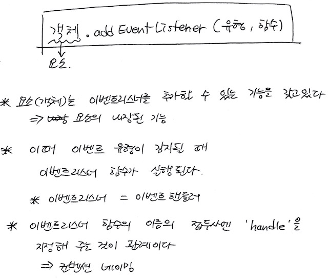

[← BACK](../README.md)

# 2020. 10. 21

오프라인 멘토링 2회차 진행 내용 정리.

<br/>

## 1. `<script>`태그의 `defer` 속성
* HTML 문서가 해석된 이후 맨 마지막에 스크립트를 해석하게 하는 속성이다. 즉, 스크립트를 맨 마지막에 마크업 하는 것과 같은 기능이다.이벤트
* 간편한 기능을 가진 속성들을 많이 알면 작업의 속도가 훨씬 올라가겠다. 대신 지금은 편하고 빠르게 하는 것보다 배우는 시간이니 손코딩을 스스로에게 매우 권장! 외국에서 코딩테스트와 같은 인터뷰를 진행할 때 손코딩을 시킨다고 하더라 그때 가서 해당 속성이 기억 안날 수 있으니 지금 많이 연습해 두자!

## 2. 정의 순서 (변수, 함수)
* 변수와 함수는 항상 맨 위 상단에다 작성해야한다.
* 왜? <br>
변수를 선언해야 선언된 변수에 함수를 참조할 수 있고, 함수를 선언해야 그 변수가 어떤 조건을 실행하는지 알 수 있다. 그래서 항상 상단에 작성해야 함!

> **첨언** 🐧<br/>
> 변수나 함수를 먼저 선언하는 코딩 습관을 가져야, 의도치 않는 오류가 발생하지 않도록 막을 수 있습니다.
> 하지만 JavaScript는 함수 선언을 나중에 작성해도 오류를 발생시키지 않아 그래도 되는 것처럼 알려지거나 학습됩니다.
> 이러한 점은 배울 당시에는 좋게 보일 수 있으나... 실제 개발에서는 의도치 않는 오류를 발생시킬 소지가 있어 권장하지 않습니다.

## 3. 이벤트 핸들링 컨벤션 네이밍 

* 관례적으로 이벤트 <del>리스닝</del> <ins>리스너</ins> 함수는 앞에 접두사로 `handle`을 붙여준다.
* 일반 함수와 이벤트 리스너 함수를 구분하기 위함이다!

## 4. `data-*` 접두사 속성

* HTML5 표준부터 사용되었으며, 사용자가 필요에 의해 임의의 속성을 요소에 추가하고자 할 경우 사용한다. (내용 정정 🐧)
* 예) `data-index`, `data-columns` 등 
* [data-*, [MDN]](https://developer.mozilla.org/ko/docs/Web/HTML/Global_attributes/data-*), [데이터 속성 사용하기, [MDN]](https://wiki.developer.mozilla.org/ko/docs/Learn/HTML/Howto/%EB%8D%B0%EC%9D%B4%ED%84%B0_%EC%86%8D%EC%84%B1_%EC%82%AC%EC%9A%A9%ED%95%98%EA%B8%B0) 참고

## 5. `getAttribute`, `setAttribute`

- 선택할요소`.setAttribute('지정할 속성', '지정할 값')`;
- 선택할요소`.getAttribute('값을 불러올 속성')`;

```js
button.getAttribute('class');   // 클래스명 불러오기
button.getAttribute('data-no'); // 사용자 속성 data-no의 값 불러오기

button.setAttribute('data-index', i) // `button`요소 안에 `data-index` 속성에 `i`값 지정

// [예시]
e.currentTarget.getAttribute('data-index');
button.setAttribute('data-index', i);
``` 

## 6. 이벤트 리스너를 추가(연결)하는 메서드

`addEventListener` 메서드 노트 필기 스캔

- HTML 요소(또는 `window`, `document` 객체)는 이벤트 리스너를 추가할 수 있는 기능을 갖고 있다.
- 이벤트 유형(event type)이 감지(detection)될 때, 추가(add, 연결 binding)된 이벤트 리스너(또는 이벤트 핸들러)가 실행된다.
- 이벤트 리스너(함수)의 이름 앞엔 `handle`을 붙여 작성하는 네이밍 컨벤션을 지키는 것이 권장된다. (일반 함수와 구분 용이)
    ```js
    // 일반 함수 실행
    openMenu();
    ```
    ```js
    // 이벤트 핸들러(함수) 연결
    elementNode.addEventListener('click', handleOpenMenu);
    ```

<br/>



<br/>

## 7. 마크다운에 이미지 넣기

```md

```

<br/>

---

<br/>

## 학습 방법 돌아보기

* **오늘 내가 많이 한 말 중의 하나는 "아~!"이다.**<br/>분명 배웠지만 바로 떠오르지 않았고 강사님이 정답을 알려주니 그제서야 기억이 났을 때 나오는 말이었다. 그렇다는 것은 그 지식은 온전히 내 것이 아니라는 것이다. 꼼꼼하게 TIL을 작성하는 것도 물론 중요하지만 <u>복습과 실습이 더 중요하다.</u>

* **공부하는 방법도 달라져야겠다.**<br/>영상 강의를 보며 TIL을 같이 작성하다 보니, <u>정말 많은 시간이 걸리고 실습할 시간은 부족해진다.</u> 그러다보니 몸은 몸대로 지치고 배운 것을 연습해볼 실습 시간이 줄어들고 분명 배운 내용이지만 금방 잊어버리게 된다. 즉, 비효율적으로 공부를 하고 있다는 것!

* **TIL에는 내가 연구한 흔적, 배우면서 겪은 시행착오 등을 기록해야 한다.**<br/>(강사님이 자주 강조했듯이) 그런 경험을 통해 내공이 많이 쌓이기 때문이다. 영상 강의를 통해 머리로 이해 안되는 부분을 찾는 것보다, <strong>실습을 통해 내가 모르는 부분을 파악하는 것이 더 효과적인 공부</strong>이지 않을까? 왜 그렇게 미련을 떨었는지는 모르겠으나 <u>그 시간이 의미 없었던 것은 아니니 후회는 말자.</u>

* **지금도 잘하고 있고 열심히 하려는 내게 고맙다.**<br/>하지만 이제는 조금 더 <u>지혜롭게 시간을 배분하며 공부하자!</u> 내 스스로를 너무 과대평가하지 말자 난 천재가 아니다. 하지만 그렇다고 너무 과소평가 하지도 말자 그래도 <strong>난 이제까지 많이 성장</strong>했기 때문이다.

* **정말 다행인건!**<br/>실습을 할 수록 더 재밌어지고 <strong>스크립트 언어가 매력있게 느껴진다</strong>. 이제 이 언어를 정복하고 자유롭게 써보자!