# 멘토링

파이널 프로젝트 진행 멘토링을 진행합니다.

<br>

## 프로젝트 검토 및 방향성 제시

Netflix 프로젝트 진행 상황을 검토합니다. 그리고 "나의 영화(My Movies)" 북마크 서비스 실습 자료에 대해 안내합니다.

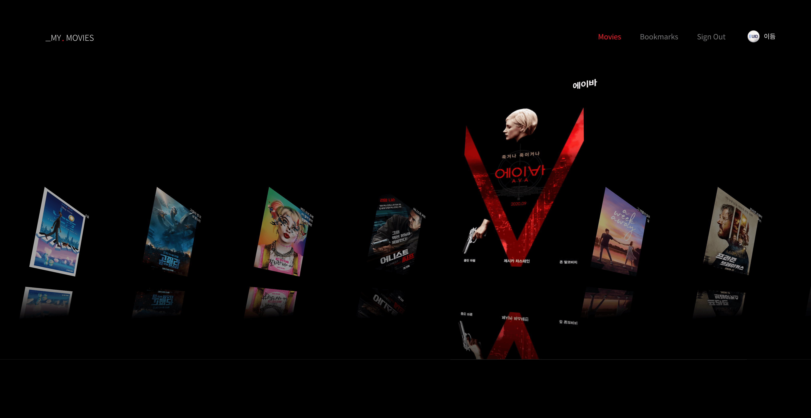

<br>

## 아코디어 컴포넌트

Netflix 아코디언 컴포넌트 제작에 도움이 되는 패턴 소개 (참고: [React Accordion 데모](https://codesandbox.io/s/akodieon-keomponeonteu-fy4so?file=/src/App.js))

- React 훅
- 컴파운드 컴포넌트 패턴
- 스타일 컴포넌트
- Framer Motion

<br>

## Framer Motion 

[framer-motion](https://www.framer.com/api/motion/)는 React "모션 라이브러리"입니다. 선언 형 프로그래밍을 제공하는 React 답게, 애니메이션도 선언 형으로 구성할 수 있게 도와줍니다. 전통적인 명령 형 애니메이션 라이브러리와 달리 애니메이션 상태를 선언하면 상태의 업데이트에 따라 모션이 변화합니다.

**모션 요소 → 상태 선언 → 애니메이션 렌더링**

```jsx
(
  <motion.figure
    animate={{
      x: 100,
      y: 100,
      scale: 1.1,
      rotate: -45,
      opacity: 1
    }}
  />
)
```

<br>

프로젝트 애니메이션을 담당 할 Framer Motion 라이브러리를 프로젝트에 설치합니다.

```sh
npm i framer-motion
```

> ⚠️ Motion Framer 라이브러리는 React v16.8 이상에서 사용 가능합니다.

<br>

## 모션 컴포넌트

Styled Components의 `styled` 컴포넌트와 유사하게 Framer Motion은 [`motion` 컴포넌트](https://www.framer.com/api/motion/component/)를 제공합니다.

```jsx
import { motion } from 'framer-motion'
```

`motion` 컴포넌트는 60FPS 애니메이션에 최적화 된 DOM 요소로 HTML 또는 SVG 요소에 모션을 적용할 수 있습니다. 방법은 아래와 같이 모션 컴포넌트를 사용하고 [애니메이션(animate) 상태](https://www.framer.com/api/motion/component/#animationprops.animate)를 설정하는 것입니다.

```jsx
(
  {/* HTML <figure> 요소에 모션 적용 */}
  <motion.figure animate={{ rotate: -45}} />
)

(
  {/* SVG <path> 요소에 모션 적용 */}
  <motion.path animate={{ strokeWidth: 3}} />
)
```

\<figure\/> 요소를 래핑한 Circle 컴포넌트를 모션 컴포넌트를 만들어 모션을 적용하는 실습을 진행해봅시다.

```jsx
import { motion } from 'framer-motion'

export const Circle = (props) => (
  <motion.figure
    style={{
      width: 100,
      height: 100,
      margin: 0,
      background: '#fff',
      borderRadius: 50,
    }}
    {...props}
  />
)
```

```jsx
(
  <Circle
    animate={{
      scale: 3,
      opacity: 0.7,
    }}
  />
)
```

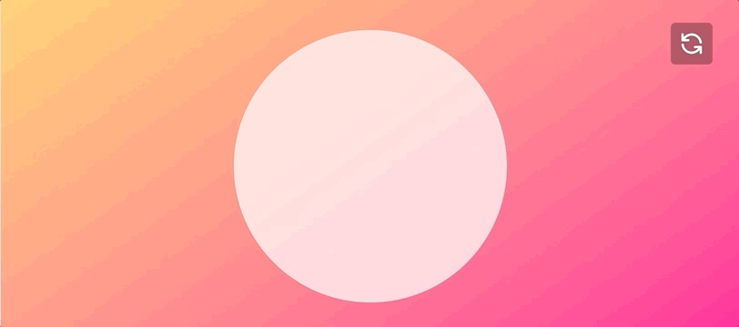

### 글자 크기 모션

타이틀 요소에 모션을 적용할 때 주의할 점은 <u>글자 크기를 조정할 때는 숫자 값이 적용이 안된다</u>는 점입니다.
숫자 값을 적용하면 `TypeError: v.match is not a function` 오류가 Console에 출력됩니다.
이 문제를 해결하려면 숫자 값 대신, 문자 값(단위 포함)을 입력하면 됩니다.

```jsx
(
  <motion.h2 lang="en" animate={{ fontSize: '100px' }}>
    Framer Motion
  </motion.h2>
)
```

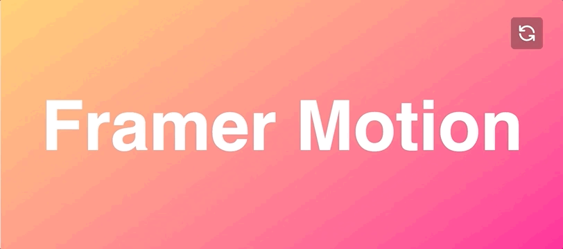

<br>

## 모션 with 스타일 컴포넌트

스타일 컴포넌트에도 모션 적용이 가능합니다. MotionLogo 스타일 컴포넌트를 모션 컴포넌트로 래핑해 모션을 적용해봅시다.

### 방법 1

`motion` 컴포넌트를 전달해 스타일 컴포넌트로 래핑하면 외부에서 `animate` 속성을 설정해 모션을 적용할 수 있습니다.

```jsx
const StyledLogo = styled(motion(ReactLogo))`
  width: auto;
  height: 30vh;

  g {
    fill: ${({ theme: { white } }) => white};
  }
`


(
  <MotionLogo animate={{ scale: 3, rotate: 360 * 2 }} />
)
```

### 방법 2

스타일 컴포넌트를 모션 컴포넌트로 래핑하되, 아래와 같이 컴포넌트 안에서 MotionLogo 컴포넌트로 등록해 사용할 수 있습니다.

```jsx
const MotionLogo = motion(StyledLogo)

export const Logo = () => {

  return (
    <MotionLogo animate={{ scale: 3, rotateZ: 360 * 2 }} />
  )
}
```

또는 아래 코드와 같이 `React.createElement()` API를 사용해도 무방합니다.

```jsx
export const Logo = () => {
  return React.createElement(
    motion(StyledLogo), 
    {
      animate: { scale: 3, rotateZ: 360 * 2 }
    }
  )
}
```

결과는 아래와 같이 모션이 렌더링 됩니다.

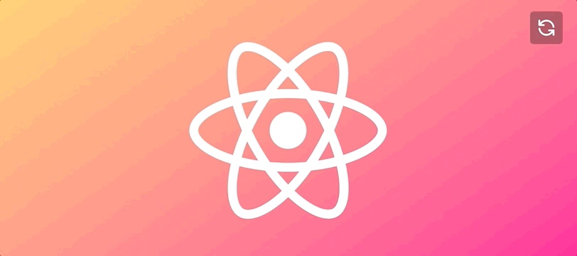

<br>

## 애니메이션 초기 상태

`animate` 속성으로 설정한 상태는 애니메이션의 시작(start) 상태를 정의한 것이 아니므로 기대만큼 자연스러운 모션으로 보이지 않습니다. 이런 경우 [초기(initial) 상태](https://www.framer.com/api/motion/component/#motionprops.initial)를 설정하여 애니메이션의 시작 상태를 설정하면 보다 자연스러운 모션을 만들 수 있습니다.

```jsx
(
  <Logo
    initial={{ x: '-100vw', opacity: 0, scale: 0, rotateZ: 0 }}
    animate={{ x: 0, opacity: 1, scale: 2, rotateZ: 360 * 2 }}
  />
)
```


<br>

## 트랜지션 옵션

여전히 자연스럽지 않다고요? 😔 네. 모션 컴포넌트에 기본 적용된 트랜지션 옵션이 너무 빠르기 때문입니다. 기본 트랜지션 대신, 사용자가 직접 정의한 [트랜지션(transition) 옵션](https://www.framer.com/api/motion/component/#animationprops.transition)을 설정하면 원하는 [지속 시간](https://www.framer.com/api/motion/types/#spring.duration), [지연 시간](https://www.framer.com/api/motion/types/#orchestration.delay), [스프링](https://www.framer.com/api/motion/types/#spring.type), [강도](https://www.framer.com/api/motion/types/#spring.stiffness) 등을 설정해 보다 자연스럽게 모션을 만들 수 있습니다.

```jsx
(
  <Logo
    initial={{ x: '-100vw', opacity: 0, scale: 0, rotateZ: 0 }}
    animate={{ x: 0, opacity: 1, scale: 2, rotateZ: 360 * 2 }}
    transition={{ 
      duration: 1, 
      delay: 0.3, 
      type: 'spring', 
      stiffness: 400
    }}
  />
)
```

스프링 강도(stiffness) 값을 기본 값인 `100`에서 `400`으로 변경했으므로 보다 강도(탄력)있는 모션을 렌더링 합니다.


[댐핑(damping, 제동)](https://www.framer.com/api/motion/types/#spring.damping), [매스(mass, 질량)](https://www.framer.com/api/motion/types/#spring.mass) 값을 설정해 모션을 보다 풍부하게 설정할 수도 있습니다.


댐핑 값이 `0`이 되면 스프링은 제동이 없으므로 무한 진동하게 되고, 매스 값이 클수록 질량이 커져서 스프링 모션이 늘어지게 됩니다.

<br>

## 호버 모션

지금까지 작성한 모션은 앱이 구동되지 마자 실행되었죠. 이번에는 [모션 요소에 마우스가 올라가 있는 동안](https://www.framer.com/api/motion/gestures/#hoverhandlers.whilehover) 모션이 작동되도록 구현해봅니다. 렌더링 되는 모션은 CSS의 호버(hover)와 유사합니다만, 트랜지션 옵션 설정을 통해 보다 강력한 모션을 구현할 수 있습니다.

```jsx
(
  <RefreshButton
    initial={{ borderRadius: '50%' }}
    whileHover={{
      scale: 1.3,
      boxShadow: '0 0 10px 5px rgba(255, 255, 255, 0.6)',
    }}
    transition={{ duration: 0.45, delay: 0.1, type: 'spring' }}
  />
)
```

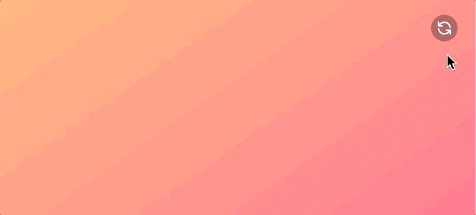

### 모션을 적용할 요소 참조

일반 컴포넌트에 모션을 적용할 경우 또는 스타일 컴포넌트에 래핑된 일반 컴포넌트일 경우 모션 컴포넌트가 모션을 적용할 요소를 못 찾아 Console에 오류를 표시할 수 있습니다. 오류 메시지를 읽어보면 `React.forwardRef()`를 사용해 모션을 적용할 요소에 참조(`ref`)를 연결하라고 안내합니다.

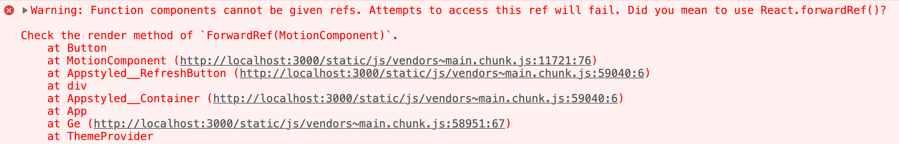

예를 들어 Button 컴포넌트를 작성했고, 모션 컴포넌트로 래핑한 경우 모션을 적용할 DOM 요소를 찾을 수 없어 오류를 발생한 것입니다.

```jsx
const Button = (props) => {
  return (
    <button {...props}>
      <RefreshIcon />
    </button>
  )
}
```

```jsx
export const RefreshButton = styled(motion(Button)).attrs((props) => ({
  type: 'button',
}))`...`
```

문제 해결을 위해 다음과 같이 `React.forwardRef()`를 사용해 모션을 적용할 요소에 `ref` 참조를 연결해야 합니다.

```jsx
const Button = React.forwardRef((props, ref) => {
  return (
    <button ref={ref} {...props}>
      <RefreshIcon />
    </button>
  )
})
```

<br>

### 리스트 모션

호버 모션을 사용하면 리스트 아이템에 마우스가 올라간 동안 모션을 적용할 수 있습니다.

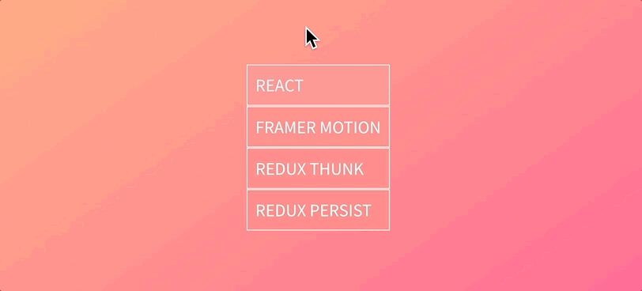

리스트, 리스트 아이템 스타일 컴포넌트를 작성해 모양을 꾸며봅니다.

```jsx
export const CardList = styled.ul`
  margin: 0;
  padding-left: 0;
  list-style: none;
`

export const CardItem = styled(motion.li)`
  border: 1px solid ${({ theme: { white } }) => white};
  padding: 1rem;
  font-size: 2rem;
  text-transform: uppercase;
  color: ${({ theme: { white } }) => white};
  background: #ff7c7c;
`
```

작성한 리스트, 리스트 아이템 컴포넌트를 사용해 `list` 데이터를 순환하도록 구성한 후, `whileHover` 속성 모션을 설정합니다.

```jsx
<CardList>
  {list.map((item) => (
    <CardItem
      key={item}
      whileHover={{
        y: -20,
        scale: 1.2,
        boxShadow: '0 4px 3px rgba(0,0,0,0.4)',
        backgroundColor: '#fff',
        color: '#333',
      }}
      transition={{
        type: 'spring',
        mass: 2,
      }}
    >
      {item}
    </CardItem>
  ))}
</CardList>
```

<br>

## 탭 모션

앞서 다룬 호버 모션은 모바일 환경에서는 사용할 수 없는 인터랙션 모션입니다. 모바일 환경을 고려해야 할 경우 [탭 모션](https://www.framer.com/api/motion/gestures/#taphandlers.whiletap)을 사용하세요.

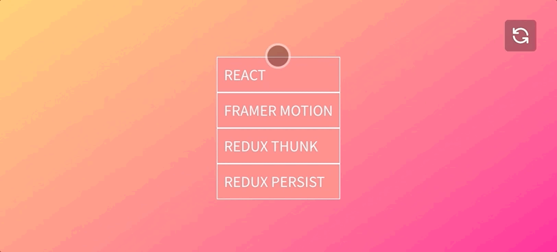

호버, 탭 모두 동일한 모션 적용이 필요한 경우, 모션 설정을 별도 상태 변수로 설정하는 것이 좋습니다.

```jsx
const hoverTapMotion = {
  y: -20,
  scale: 1.2,
  boxShadow: '0 4px 3px rgba(0,0,0,0.4)',
  backgroundColor: '#fff',
  color: '#333',
}

const transitionOption = {
  type: 'spring',
  mass: 2,
}

(
  <CardList>
    {list.map((item) => (
      <CardItem
        key={item}
        whileHover={hoverTapMotion}
        whileTap={hoverTapMotion}
        transition={transitionOption}
      >
        {item}
      </CardItem>
    )
  )}
)
</CardList>
```

<br>

## 드래그 모션

모션 요소에 [드래그(drag)](https://www.framer.com/api/motion/component/#draggableprops.drag) 모션을 적용할 수 있습니다. 

속성 | 설명
-- | --
`drag` | 드래그 활성(`true`) 또는 축 방향(`x` \| `y`)을 설정할 수 있습니다.
`dragConstraints` | 드래그 범위를 제한(constraints) 할 수 있습니다.
`dragElastic` | 드래그 모션이 허용되는 이동 정도를 설정합니다. (`0`: 안 움직임, `1`: 터치 포인트와 동일)
`dragTransition` | 드래그 [관성(inertia)](https://www.framer.com/api/animation/#inertia) 매개변수를 설정합니다.

```jsx
(
  <Logo
    drag
    dragConstraints={{ top: 10, right: 10, bottom: 10, left: 10 }}
    dragTransition={{ bounceStiffness: 600, bounceDamping: 10 }}
    dragElastic={0.1}
  />
)
```

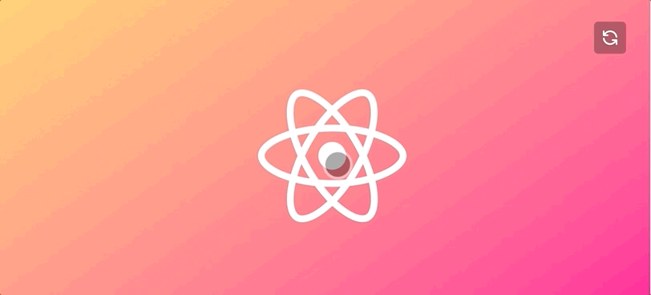

<br>


## 모션 배리에이션

앞서 학습한 초기화, 애니메이트, 트랜지션 속성을 사용해 요소에 모션을 설정할 수 있습니다만, 요소에 직접 설정해야 하므로 재사용이 어렵고 JSX 코드 또한 지저분해서 관리하기 불편합니다. 이러한 불편함 개선 및 재사용을 목표로 [배리에이션(variants)](https://www.framer.com/api/motion/component/#animationprops.variants)를 적용해봅니다.

```jsx
(
  <RefreshButton
    initial={{
      opacity: 0,
      rotateY: -360 * 2,
      scale: 0.8,
    }}
    animate={{
      opacity: 1,
      rotateY: 0,
      scale: 1,
    }}
    transition={{
      duration: 1,
      type: 'tween',
    }}
  />
)
```

배리에이션을 사용하면 애니메이션 상태를 정의하고 이름 별로 구성 할 수 있습니다. 이름은 자유롭게 작명 가능하고, `initial`, `animate`, `whileHover`, `whileTap`, `whileDrag` 등에 상태 이름을 문자 값으로 설정합니다.

```jsx
// 모션 배리에이션 객체 정의
const refreshButtonVariants = {
  begin: {
    opacity: 0,
    rotateY: -360 * 2,
    scale: 0.8,
  },
  finish: {
    opacity: 1,
    rotateY: 0,
    scale: 1,
    transition:{
      duration: 1,
      type: 'tween',
    }
  }
}

// 정리된 JSX 코드
(
  <RefreshButton
    variants={refreshButtonVariants}
    initial="begin"
    animate="finish"
  />
)
```

배리에이션으로 정의된 모션 또한 문제없이 잘 작동합니다. 코드를 효율적으로 관리하기 위해 배리에이션을 적극 사용하세요.

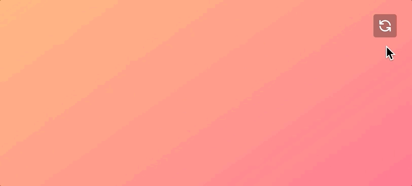

<br>

### 상태 이름 상속

배리에이션의 또 다른 특징은 상위 컴포넌트에 설정된 상태 이름과 하위 컴포넌트의 배리에이션 상태 이름이 동일한 경우, 이름을 상속하기 때문에 몇 줄의 코드를 추가하지 않아도 작동합니다.

```jsx
// 상위 모션 컴포넌트 배리에이션
const parentVariants = {
  hidden: { 
    opacity: 0, 
    scaleX: 0 
  },
  visible: { 
    opacity: 1, 
    scaleX: 1, 
    transition: { 
      duration: 0.4 
    } 
  },
}

// 하위 모션 컴포넌트 배리에이션
const childVariants = {
  hidden: { 
    scale: 2 
  },
  visible: {
    scale: 1,
    transition: {
      duration: 0.4,
      type: 'spring',
      stiffness: 270,
      velocity: 10,
    },
  },
}
```

상위 모션 컴포넌트에 설정된 초기 상태 이름 `hidden`, 애니메이트 상태 이름 `visible`은 하위 모션 컴포넌트에 상속되므로 Logo 컴포넌트에 `initial`, `animate` 이름을 설정하지 않아도 모션을 멋지게 렌더링합니다.

```jsx
<motion.div 
  variants={parentVariants} 
  initial="hidden" 
  animate="visible"
>
  <Logo variants={childVariants} />
</motion.div>
```

Logo 컴포넌트를 감싼 모션 div의 애니메이션과 Logo 컴포넌트의 모션이 동시에 렌더링 됩니다.


<br>

### `when` 오케스트레이션

앞서 만든 모션은 상위 컴포넌트와 하위 컴포넌트가 동시에 모션을 진행합니다. 때론 상위 컴포넌트 모션이 끝난 후
하위 컴포넌트 모션이 시작되어야 합니다. 이런 경우 트랜지션 옵션으로 지연 시간(`delay`)을 설정해 상위 컴포넌트 모션이 끝나는 시간 이후 하위 컴포넌트의 모션이 동작하도록 지연 처리할 수 있지만... 

상위 컴포넌트 지속 시간(`duration`) 수정이 잦을 경우, 하위 컴폰너트 지연 시간 수정도 불가피 하므로 불편합니다. Framer Motion은 이런 경우 유용하게 사용될 수 있는 [오케스트레이션(자동화 조정 관리)](https://www.redhat.com/ko/topics/automation/what-is-orchestration) 속성을 제공합니다.
예를 들어 하위 컴포넌트가 "[언제(when)?](https://www.framer.com/api/motion/types/#orchestration.when)" 모션을 시작해야 할 지 조정 관리(orchestration) 할 수 있습니다.

```jsx
// 상위 모션 컴포넌트 배리에이션
const parentVariants = {
  hidden: { 
    opacity: 0, 
    scaleX: 0 
  },
  visible: { 
    opacity: 1, 
    scaleX: 1, 
    transition: { 
      duration: 0.4,
      // 하위 컴포넌트 자식들의 모션 시작 전에 트랜지션 완료 처리
      when: 'beforeChildren'
    } 
  },
}
```

`when` 오케스트레이션 설정에 따라 전과 달리 하위 컴포넌트 모션이 시작하기 전에 상위 컴포넌트의 트랜지션이 종료됩니다.

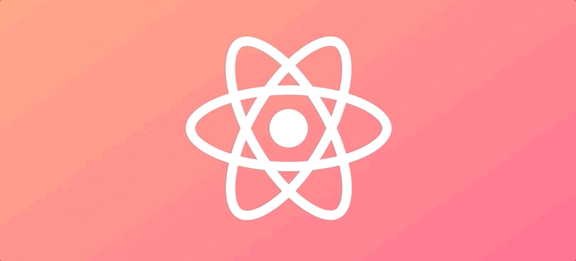

<br>

## 리프래시 모션

지금까지 학습한 내용을 토대로 새로고침 버튼을 사용자가 누르면 모션이 재실행되도록 구성해봅니다.
React는 [재조정(Reconciliation)](https://ko.reactjs.org/docs/reconciliation.html#keys)에 의해 이전/이후 상태가 바뀌면 다시 렌더링 합니다. 이 점을 활용해 사용자가 리프래시 버튼을 누를 때 상태를 업데이트 하여 React 앱을 다시 렌더링하게 만들 수 있습니다.

Logo 컴포넌트에서는 초기, 애니메이션 상태와 트랜지션을 설정해봅니다.

```jsx
(
  <Logo
    key={key}
    initial={{ scale: 12, opacity: 0 }}
    animate={{ scale: 1, opacity: 1 }}
    transition={{ duration: 2, type: 'spring', mass: 0.6 }}
  />
)
```

리프래시 버튼과 아이콘에 각각 적용할 배리에이션 상태 이름을 작성해보세요.

```jsx
const refreshButtonVariants = {
  normal: {
    scale: 1,
  },
  hovered: {
    scale: 1.1,
  },
  pressed: {
    scale: 0.9,
  },
}

const refreshIconVariants = {
  normal: {
    rotate: 0,
  },
  hovered: {
    rotate: 360,
    transition: { duration: 0.4, type: 'tween' },
  },
}
```

상위 컴포넌트인 리프래시 버튼에 배리에이션 설정과 상태 이름을 설정하면,
하위 컴포넌트인 리프래시 아이콘은 배리에이션만 설정해도 상태 이름이 같은 경우 상속 받게 되어 몇 줄의 코드를 생략해도 무방합니다.

```jsx
(
  <RefreshButton
    variants={refreshButtonVariants}
    initial="normal"
    whileHover="hovered"
    whileTap="pressed"
    onClick={() => setKey(key + 1)}
  >
    <motion.svg
      fill="none"
      viewBox="0 0 24 24"
      stroke="currentColor"
      xmlns="http://www.w3.org/2000/svg"
      variants={refreshIconVariants}
    >
      <path
        strokeLinecap="round"
        strokeLinejoin="round"
        strokeWidth="2"
        d="M4 4v5h.582m15.356 2A8.001 8.001 0 004.582 9m0 0H9m11 11v-5h-.581m0 0a8.003 8.003 0 01-15.357-2m15.357 2H15"
      ></path>
    </motion.svg>
  </RefreshButton>
)
```

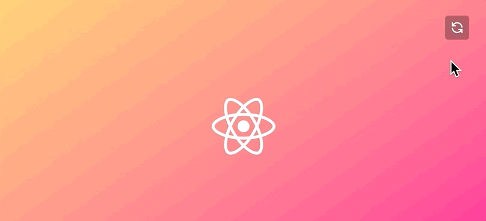


<br>

## 키프레임 모션

[키프레임(keyframes)](https://ko.dict.naver.com/#/entry/koko/496c0ede29b045b4a08ae0e689fa57ec)은 모션의 시작 점에서 끝 점 사이에 나열된 프레임을 말합니다. 요소의 모양이나 위치의 변화 포인트가 지정되며, 그 사이를 보완하여 매끄러운 모션을 만들어 냅니다. Framer Motion에서 모션을 적용하는 속성 값을 배열 데이터 유형으로 설정하면 키프레임 모션을 만들어 줍니다. 각 속성 별 키프레임의 개수는 일치하지 않아도 됩니다. Framer Motion이 자동 처리해주기 때문이죠. 😎

```jsx
(
  <Logo
    key={key}
    initial={{ x: 0, scale: 1, opacity: 0 }}
    animate={{
      scale: [1, 0.8, 1.1, 0.7, 1],
      opacity: [0, 0.3, 0.8, 0.4, 0.2, 0.7, 1],
    }}
    whileHover={{
      x: [-3, 3, -3, 3, -3, 3, 0],
    }}
    transition={{ duration: 0.6, type: 'spring', mass: 0.6 }}
  />
)
```

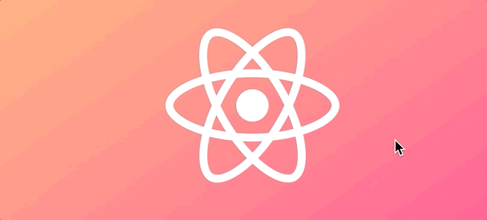

<br>

## 리핏 모션

모션을 반복(repeat)하도록 설정할 수 있습니다. 설정 된 숫자 값만큼 반복 하도록 설정하거나, 무한(`Infinity`) 반복 값을 설정할 수도 있습니다. 반복 유형(repeat type)에 따라 모션의 방향이 다르게 설정됩니다. (`loop` | `reverse` | `mirror`)

```jsx
(
  <Logo
    key={key}
    initial={{ y: 0 }}
    animate={{
      y: [-5, 5, 0],
    }}
    transition={{
      duration: 1,
      type: 'spring',
      stiffness: 300,
      repeat: Infinity,
      repeatType: 'mirror',
    }}
  />
)
```

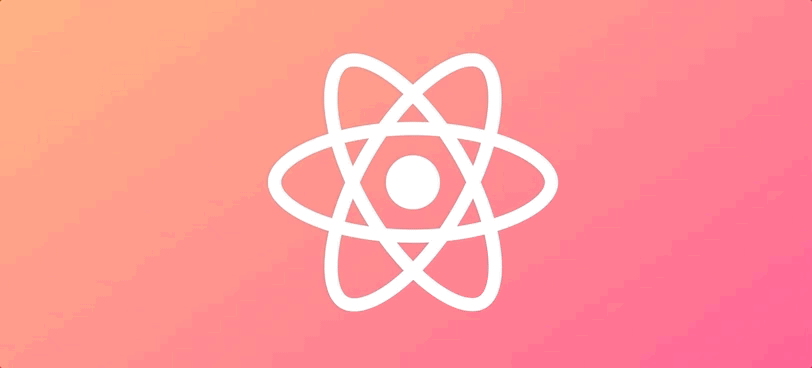

<br>

## AnimatePresence 컴포넌트

[AnimatePresence](https://www.framer.com/api/motion/animate-presence/)는 컴포넌트가 React 트리에서 제거 될 때 모션이 적용되도록 설정해줍니다. React는 모션과 관련된 라이프 사이클을 제공하지 않으므로 Framer Motion은 `exit`를 제공합니다. 언마운트 될 때 컴포넌트에 알리며, 모션이 완료될 때까지 언마운트를 지연 처리합니다.

```jsx
import { motion, AnimatePresence } from 'framer-motion'

function App() {
  const [key, setKey] = React.useState(0)
  const [visible, setVisible] = React.useState(true)

  React.useEffect(() => {
    window.setTimeout(() => {
      setVisible(false)
    }, 3000)
  }, [])

  return (
    <Container>
      <AnimatePresence>
        {visible && (
          <Logo
            key={key}
            initial={{ y: 0 }}
            animate={{
              y: [-5, 5, 0],
            }}
            exit={{ opacity: 0, scale: 0 }}
            transition={{
              duration: 3,
              type: 'spring',
              stiffness: 300,
            }}
          />
        )}
      </AnimatePresence>
    </Container>
  )
}
```

<br>

**AnimatePresence 컴포넌트를 사용하지 않은 경우, 언마운트 전 `exit` 모션** (바로 사라짐)

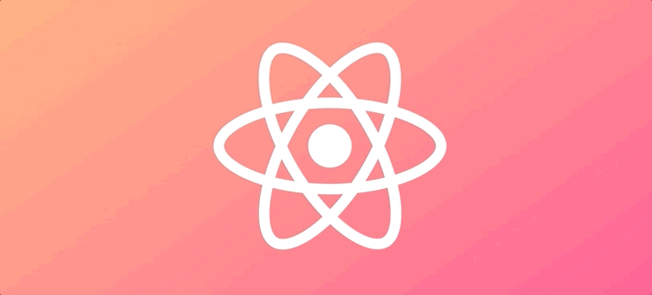

**AnimatePresence 컴포넌트를 사용한 경우, 언마운트 전 `exit` 모션** (부드럽게 사라짐)

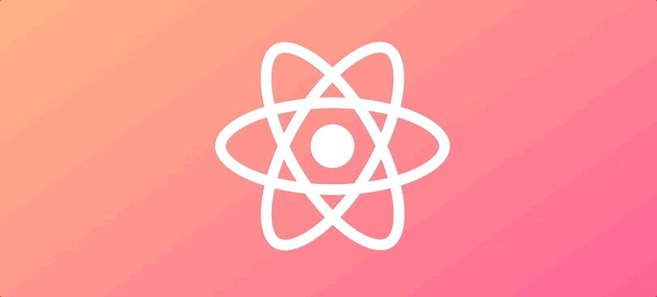

<br>

## 페이지 전환 모션

AnimatePresence 컴포넌트와 `end` 속성을 사용하면 컴포넌트가 언마운트 하기 전에 모션을 처리할 수 있으므로 페이지 루트(route) 전환 시 모션을 적용할 수 있습니다. 그러기 위해선 루트의 전체 설정을 AnimatePresence 컴포넌트로 래핑해야 합니다.

```jsx
import { AnimatePresence } from 'framer-motion'


function App() {
  return (
    <AnimatePresence>
      <Switch>
        <Route path="/" exact component={HomePage} />
        <Route path="/movies" component={MovieListPage} />
        <Route path="/movie/:id" component={MovieDetailPage} />
        <RouteGuard path="/bookmarks" component={BookmarkPage} />
        <Route path="/page-not-found" component={PageNotFound} />
        <Redirect to="/page-not-found" />
      </Switch>
    </AnimatePresence>
  )
}
```

이 설정만으로 루트 모션이 작동하지는 않습니다. 페이지가 언제 전환될 지 모르기 때문입니다. 그러므로 페이지가 전환 됨을 알 수 있도록 (`location.pathname` 변경) React Router로부터 `useLocation` 훅을 가져와 사용해야 합니다.

```jsx
import { AnimatePresence } from 'framer-motion'
import { Switch, Route, Redirect, useLocation } from 'react-router-dom'
```

`useLocation` 훅으로부터 현재 페이지 경로 정보를 가져와 [Switch](https://reactrouter.com/web/api/Switch/location-object) 컴포넌트의 `location` 속성에 연결해 페이지가 언제 변경(언마운트) 되는 지 알려줘야 합니다. 그리고 `key` 속성 값으로 [`location.key`](https://reactrouter.com/web/api/location)를 설정해 React에 의해 재조정 될 수 있도록 설정합니다.

```jsx
function App() {
  const location = useLocation()

  return (
    {/* 
      exitBeforeEnter 속성을 설정하면 이전 페이지 모션이 완료된 이후, 
      다음 페이지 모션이 시작 됨 (참고: https://bit.ly/2R14lHt) 
    */}
    <AnimatePresence exitBeforeEnter>
      <Switch location={location} key={location.key}>
        <Route path="/" exact component={HomePage} />
        <Route path="/movies" component={MovieListPage} />
        <Route path="/movie/:id" component={MovieDetailPage} />
        <RouteGuard path="/bookmarks" component={BookmarkPage} />
        <Route path="/page-not-found" component={PageNotFound} />
        <Redirect to="/page-not-found" />
      </Switch>
    </AnimatePresence>
  )
}
```

이제 각 페이지 컴포넌트가 진입할 때와 나갈 때 모션을 정해주면 페이지 전환 간 모션이 적용됩니다. `pageVariants` 설정을 모든 페이지에서 불러와 적용하면 페이지에 일관된 페이지 전환 모션을 설정할 수 있습니다. 다른 방법은 MotionPage 컴포넌트를 만들어 모든 페이지의 컨테이너로 사용하면 일괄적으로 페이지 전환 모션을 손쉽게 제어가 가능합니다.

```jsx
import { motion } from 'framer-motion'


// 페이지 배리에이션
export const pageVariants = {
  hidden: { opacity: 0 },
  visible: { opacity: 1, transition: { delay: 0.5, duration: 0.5 } },
  slideOut: {
    x: '-100vw',
    transition: { ease: 'easeOut' }
  }
}


export default function HomePage({ history }) {
  return (
    {/* 페이지를 모션 요소로 만든 후, 배리에이션 상태 이름을 설정 */}
    <motion.div 
      className="home-page"
      variants={pageVariants}
      initial="hidden"
      animate="visible"
      exit="slideOut"
    >
      <Helmet>
        <title>홈 ← "나의 영화" 서비스</title>
      </Helmet>
      <Effects message="ENTER" className={effect} />
      <a
        href="#go-to-movies"
        onClick={(e) => {
          e.preventDefault()
          history.push('/movies')
        }}
      >
        
      </a>
    </motion.div>
  )
}
```

## React Router + Framer Motion 분석

[Framer Motion ╳ React Router](https://codesandbox.io/s/framer-motion-x-react-router-n7qhp?file=/src/index.js) 예제를 분석해보세요.
그리고 파이널 프로젝트에 멋진 페이지 전환 모션을 적용해길 바랍니다. 🎩


<br>
<br>