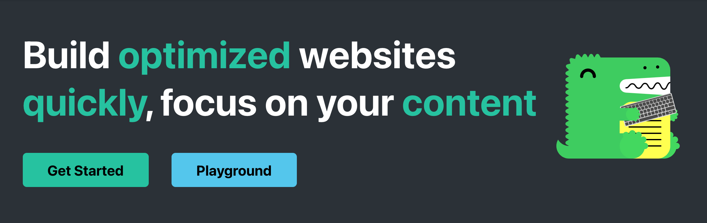
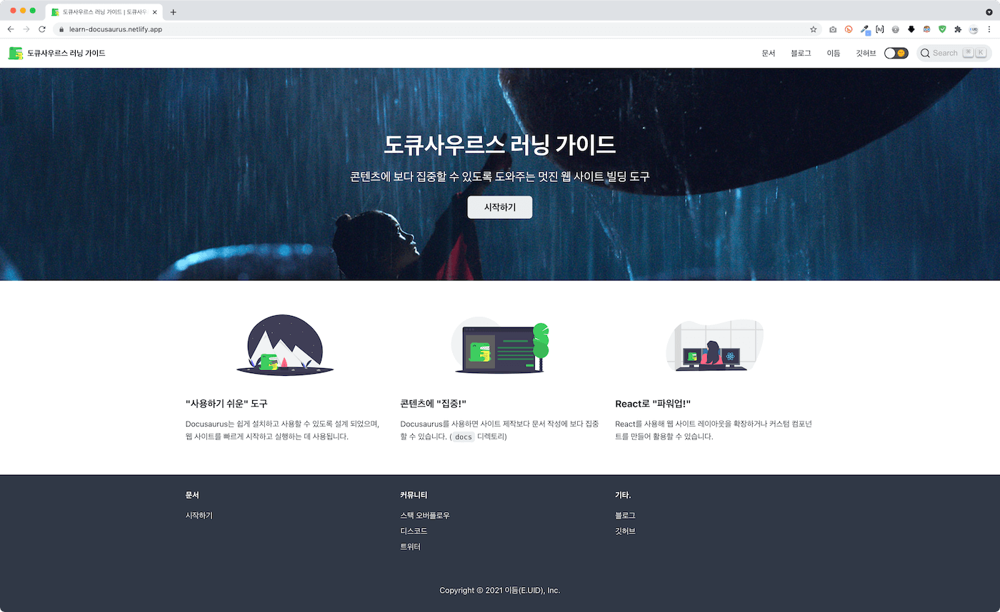

# Animating Accordion Component

[아코디언 컴포넌트](../20210405/README.md#아코디어-컴포넌트) 작성 글 참고 (**한나님 Turn**)

- React
- Framer Motion

 

# Routing (SPA)

[React Router](https://reactrouter.com/)를 사용해 React 싱글 페이지 애플리케이션을 구성 (**한나님 Turn**)

 

# Firebase 서비스

[Firebase](https://firebase.google.com/docs) 프로젝트 생성/구성/인증/데이터베이스 활용 (**한나님 Turn**)

- 프로젝트 구성
- 인증
- 데이터베이스

 

# Docusaurus

 [도큐사우르스(docusaurus)](https://docusaurus.io/)는 웹 사이트 구축보다, 콘텐츠 자체에 집중할 수 있도록 도와주는 웹 사이트 빌딩 도구입니다. Docusaurus v2를 사용하면 문서 웹 사이트 뿐만 아니라, 모든 종류의 웹 사이트 제작이 가능합니다.

특징 | 설명
--- | ---
Markdown 지원 | Markdown / MDX로 ​​문서(Document)와 블로그(Blog) 글을 작성하면 Docusaurus가 정적 HTML 파일을 제공합니다. MDX를 사용하면 Markdown 문서에 React 컴포넌트를 포함 할 수도 있습니다.
React 활용 | React를 사용해 프로젝트 레이아웃을 확장하거나 커스터마이징 할 수 있습니다. 헤더과 푸터 등 재사용 가능한 컴포넌트를 확장해 사용할 수 있습니다.
다국어 번역 | [Crowdin](https://crowdin.com/) 서비스를 사용하여 70개 이상의 언어로 번역된 문서를 제공할 수 있습니다.
콘텐츠 검색 | [Algolia 문서 검색](https://docsearch.algolia.com/apply/) 서비스를 사용해, 필요한 것을 손쉽게 찾을 수 있는 기능을 제공합니다.

 

다음의 경우, Docusaurus v2를 사용할 수 있습니다.

✅ [Jamstack](https://ko.wikipedia.org/wiki/%EC%86%94%EB%A3%A8%EC%85%98_%EC%8A%A4%ED%83%9D) 문서 사이트를 원합니다. 
✅ [싱글 페이지 애플리케이션(SPA)](https://ko.wikipedia.org/wiki/%EC%8B%B1%EA%B8%80_%ED%8E%98%EC%9D%B4%EC%A7%80_%EC%95%A0%ED%94%8C%EB%A6%AC%EC%BC%80%EC%9D%B4%EC%85%98) 제작이 요구됩니다. 
✅ [React](https://ko.reactjs.org)와 [MDX(Markdown + JSX)](https://mdxjs.com/)의 모든 기능을 사용하고자 합니다. 
✅ IE 지원이 필요하지 않습니다.

 

### 도큐사우르스 러닝 가이드

도큐사우르스를 사용해 제작된 [learn-docusaurus.netlify.app](https://learn-docusaurus.netlify.app/) 사이트를 통해 실습을 진행해봅니다.

