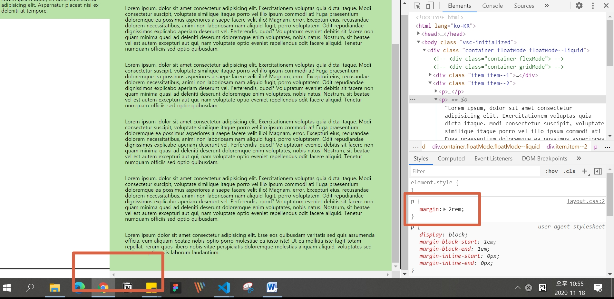

# QnA

## 목차

1. [`align-content`와 `justify-content`의 차이점?](#q1-질문)
1. [컨테이너 안의 아이템의 패딩공간이 컨테이너를 넘어갑니다 왜 그런가요?](#q2-질문)

## Q1. 질문

`align-content`와 `justify-content`의 차이점?

<details>
  <summary>상세 내용</summary>
  <br/>

</details>

<br/>

## Q2. 질문

컨테이너 안의 아이템의 패딩공간이 컨테이너를 넘어갑니다 왜 그런가요?

<details open>
  <summary>상세내용</summary>
  <br/>


```css
/* -------------- 기본 레이아웃 구성*/
body {
  margin: 3rem;
  box-sizing: border-box;
}

figure {
  position: relative;
}

img {
  width: 100%;
}

h1 {
  font-size: 4rem;
}

figcaption {
  font-size: 2rem;
}

button {
  position: absolute;
  background-color: rgb(173, 28, 118);
  color: #ffffff;
  font: bold 1.5rem spoqaHanSans;
  border: 0;
  border-radius: 4px;
  padding: 0.8rem;
}

.container {
  width: 130rem;
  height: 70rem;
  border: solid 3px darkblue;
  margin-left: auto;
  margin-right: auto;
}

.item {
  margin: 0;
  padding: 1rem;
}
/* -------------- floatMode*/
.floatMode::after {
  content: "";
  display: block;
  clear: both;
}

.floatMode .item {
  float: left;
  width: calc(33.3333% - (1rem * 2));
  height: 100%;
}
```

---



```css
/* -------------- 기본 레이아웃 구성*/
p {
  margin: 2rem;
}

.container {
  position: absolute;
  top: 0;
  right: 0;
  bottom: 0;
  left: 0;
  border: solid 3px #111111;
}

.item {
  padding: 1rem;
  background-color: rgb(185, 226, 169);
}

/* -------------- floatMode*/

.floatMode::after {
  content: "";
  display: block;
  clear: both;
}

.floatMode {
}

.floatMode .item--1 {
  /* position: fixed;
  top: 0;
  height: 867px; */
  float: left;
  width: 20rem;
}

.floatMode .item--2 {
  float: left;
  width: calc(100% - 20rem - (1rem * 4));
  height: 100%;
  overflow: scroll;
}
```

</details>

<br/>
