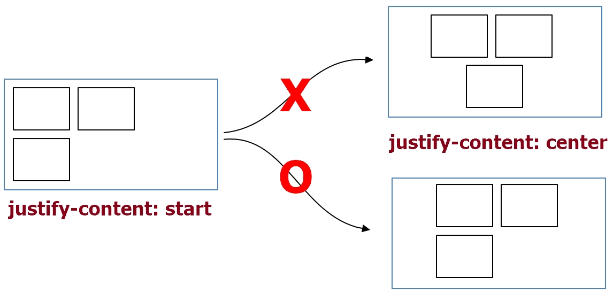

# QnA

## 목차

1. [`align-content`와 `justify-content`의 차이점?](#q1-질문)
1. [컨테이너 안의 아이템의 패딩공간이 컨테이너를 넘어갑니다 왜 그런가요?](#q2-질문)

## Q1. 질문

`align-content`와 `justify-content`의 차이점?

<details open>
  <summary>A1. 답변</summary>
  <br/>

| 속성                               | 공통점                                                                                                                                                   |
| ---------------------------------- | -------------------------------------------------------------------------------------------------------------------------------------------------------- |
| `justify-content`, `align-content` | 이 둘의 속성은 컨테이너 안에서 아이템들이 이동하는 축을 중심으로 이동한다. 단 아이템 박스가 전체로 이동하는 것이지 아이템이 가운데 정렬되는 것은 아니다. |



  <br />

| 속성            | 차이점                                                              |
| --------------- | ------------------------------------------------------------------- |
| justify-content | `flex-direction`에 설정된 주축을 중심으로 이동한다.                 |
| align-content   | `flex-direction`에 설정된 주축의 반대인 교차축을 중심으로 이동한다. |

</details>

<br/>

## Q2. 질문

컨테이너 안의 아이템의 패딩공간이 컨테이너를 넘어갑니다 왜 그런가요?

<details open>
  <summary>A2. 답변</summary>
  <br/>

A : `box-sizing`에 해답이 있다! 박스 사이징이 보더 박스가 아니기 때문이다. 그래서 아이템에 `padding`에 공간을 적용했을때 컨테이너를 넘쳐 났다.

- 해결방법
  - **주의!**
    - 공간 관련한 속성은 상속이 되지 않는다.
    - 가상요소에는 전체 선택자(`*`)가 적용되지 않는다. 그러므로 따로 적용해야 한다.

```css
/* 1. 해당 아이템에 box-sizing을 적용 하는 방법 */
item {
  box-sizing: border-box; /* 또는 padding-box */
}

/* 2. body에 적용하는 방법 */
body {
  box-sizing: border-box; /* 또는 padding-box */
}
body * {
  box-sizing: inherit; /* 상속 */
}

body::before,
body::after {
  box-sizing: inherit;
}
```


```css
/* -------------- 기본 레이아웃 구성*/
body {
  margin: 3rem;
  box-sizing: border-box;
}

figure {
  position: relative;
}

img {
  width: 100%;
}

h1 {
  font-size: 4rem;
}

figcaption {
  font-size: 2rem;
}

button {
  position: absolute;
  background-color: rgb(173, 28, 118);
  color: #ffffff;
  font: bold 1.5rem spoqaHanSans;
  border: 0;
  border-radius: 4px;
  padding: 0.8rem;
}

.container {
  width: 130rem;
  height: 70rem;
  border: solid 3px darkblue;
  margin-left: auto;
  margin-right: auto;
}

.item {
  margin: 0;
  padding: 1rem;
}
/* -------------- floatMode*/
.floatMode::after {
  content: "";
  display: block;
  clear: both;
}

.floatMode .item {
  float: left;
  width: calc(33.3333% - (1rem * 2));
  height: 100%;
}
```

---


```css
/* -------------- 기본 레이아웃 구성*/
p {
  margin: 2rem;
}

.container {
  position: absolute;
  top: 0;
  right: 0;
  bottom: 0;
  left: 0;
  border: solid 3px #111111;
}

.item {
  padding: 1rem;
  background-color: rgb(185, 226, 169);
}

/* -------------- floatMode*/

.floatMode::after {
  content: "";
  display: block;
  clear: both;
}

.floatMode {
}

.floatMode .item--1 {
  /* position: fixed;
  top: 0;
  height: 867px; */
  float: left;
  width: 20rem;
}

.floatMode .item--2 {
  float: left;
  width: calc(100% - 20rem - (1rem * 4));
  height: 100%;
  overflow: scroll;
}
```

</details>

<br/>
