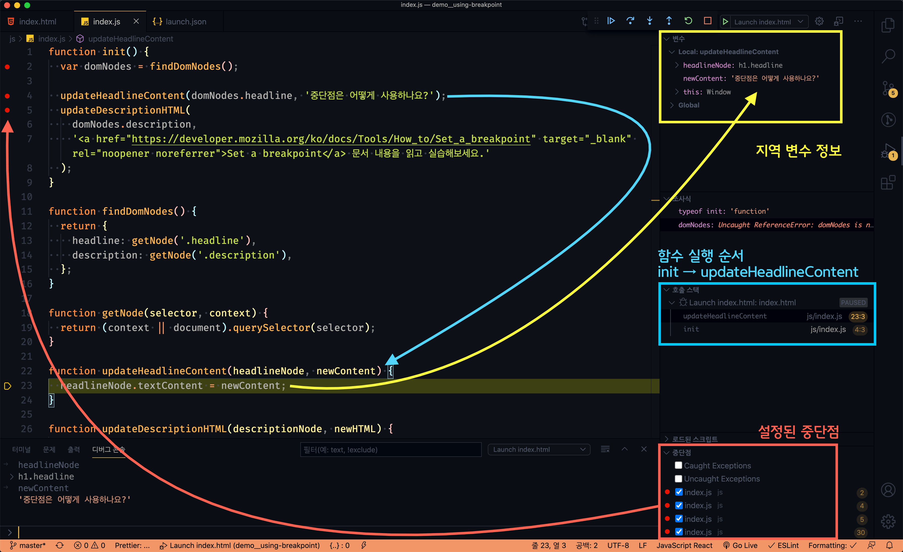

[← BACK](../README.md)

<br/>

# QnA

질문을 남겨주시면, 최선을 다해 답변하겠습니다. 🐧

## 목차

1. [JS 오류는 콘솔 패널에서 표시되므로 작업 할 때, 콘솔 패널을 확인하며 작업을 해야하나요?](#q1-질문)
1. [함수를 사용할 때 대문자 소문자를 구분해야 하나요?](#q2-질문)
1. [REPL은 뭘 말하는 건가요?](#q3-질문)
1. [`Function()`과 `function(){}`. 어떤 차이가 있는 건가요?](#q4-질문)
1. [`var` 키워드를 사용해서 선언한 변수가 객체가 되는 것인가요?](#q5-질문)
1. [숫자 값이 문자로 변경되는 경우를 방지하기 위해서는 `Number()`로 숫자를 입력해주면 되나요?](#q6-질문)
1. [`console.log()` 어떤 함수인가요?](#q7-질문)
1. [메서드(method)란 무엇인가요?](#q8-질문)
1. [참조(reference)가 무슨 뜻인가요?](#q9-질문)
1. [전달인자(arguments)와 매개변수(parameters)가 무엇인가요?](#q10-질문)
1. [`context` ?, `document`의 차이점은 무엇인가요?](#q11-질문)
1. [실습2에서 아래 연산식을 사용했을 때, 왜 getHour()의 값이 마이너스로 나오는지 모르겠습니다.](#q12-질문)
1. [프로그램에서 "파싱(parsing)"이란 무엇인가요?](#q13-질문)
1. [`var target = e.target;` 구문 해석을 어떻게 해야 할지 모르겠습니다.](#q14-질문)
1. [손 코딩 과제를 해야하는 이유가 뭔가요?](#q15-질문)
1. [개발자 도구에서 중단점(Breakpoint)을 사용하는 것을 봤습니다. 중단점은 어떤 기능을 하나요?](#q16-질문)
1. ['스크립트 의존성'으로 본다면 HTML 마크업 할 때 `index.js`, `helper.js`를 기본적으로 불러와야 하나요?](#q17-질문)
1. [스코프 체인(Scope Chain)은 정확히 무엇을 말하는 건가요?](#q18-질문)
<!-- 1. [](#q19-질문) -->

<br />

---

<br />

## Q18. 질문

스코프 체인(Scope Chain)은 정확히 무엇을 말하는 건가요?

<details>
  <summary>A18. 답변</summary>
  <br/>

  JavaScript에서 변수가 사용되면 JavaScript 엔진은 현재 범위에서 변수 값을 찾으려고 합니다. 
  변수를 찾을 수없는 경우 상위 범위을 조사하고 변수를 찾고, 전역 범위에 도달 할 때까지 계속 검색합니다.
  여전히 변수를 찾을 수 없는 경우 전역 범위에서 변수를 암시적으로 선언하거나, `ReferenceError` 오류를 반환합니다.

  ```js
  var globalVariable = '전역 변수';

  function outerLocalScope() {
    var variable = '지역 변수';
    
    function innerLocalScope() {
      console.log(variable);        // '지역 변수' (상위 범위에서 찾음)
      console.log(globalVariable);  // '전역역 변수' (전역 범위에서 찾음)
      console.log(lexicalVariable)  // ReferenceError (못찾음)
    }

    innerLocalScope();
  }

  outerLocalScope();
  ```
</details>

<br/>

## Q17. 질문

'스크립트 의존성'으로 본다면 HTML 마크업 할 때 `index.js`, `helper.js`를 기본적으로 불러와야 하나요?

<details>
  <summary>A17. 답변</summary>
  <br/>

  `index.js`는 `helper.js` 파일에 의존합니다. 쉽게 말해 `helper.js` 파일 코드에 작성된 함수를 
  `index.js`에서 실행합니다. 그러므로 `helper.js` 파일을 먼저 호출해야 하고, 이어서 `index.js` 파일을
  호출해야 프로그램이 정상적으로 실행됩니다. 작성 순서가 뒤바뀌면 프로그램은 오류를 발생시킵니다.

  ```html
  <script src="./js/helper.js"></script>
  <script src="./js/index.js"></script>
  ```
</details>

<br/>

## Q16. 질문

개발자 도구에서 중단점(Breakpoint)을 사용하는 것을 봤습니다. 중단점은 어떤 기능을 하나요?

<details>
  <summary>A16. 답변</summary>
  <br/>

  중단점(Breakpoint)는 말 그대로 코드 실행을 중단하여 진행 흐름을 살펴볼 때 사용합니다.
  코드가 실행 완료된 후 Console 패널을 통해 확인하는 `console.log()` 디버깅에 비해 
  면밀하게 코드가 작동하는 흐름을 확인하여 디버깅 할 수 있습니다.

  작성된 코드에서 오류가 발생한 경우, 오류가 의심되는 코드 라인에 중단점을 추가하고
  디버깅을 실행하면 설정된 중단점 마다, 함수가 호출되는 과정과 함수의 지역 변수 값을 
  확인하거나 디버그 콘솔을 통해 검토할 수 있습니다. → [코드 참고](../__DEMO__/demo__using-breakpoint)

  
</details>

<br/>

## Q15. 질문

손 코딩 과제를 해야하는 이유가 뭔가요?

<details>
  <summary>A15. 답변</summary>

  ### 손 코딩(Hand Write Coding)

  **"프로그래밍 언어를 배울 때, 손으로 코딩하면 어떤 장점이 있을까?"** 에 대해 생각해봅시다.

  - 프로그래밍을 배우기 시작해서 아직 작성하는 언어에 익숙하지 않습니다. 이런 경우 익숙한 모국어(예: 한국어)로 종이에 먼저 작성한 다음, 작성 정리된 사고(생각)를 컴퓨터에 앉아 프로그래밍 하는 훈련을 하는 것이 좋습니다.
  - 프로그래밍 개념에 대한 더 깊은 이해를 얻고자 한다면 최소한 배울 때 만큼이라도 코드를 손으로 작성해야 합니다. 언어를 익힐 때는 읽고, 듣고, 쓰는 것만큼 효과적인 것이 없기 때문입니다. 하지만 어느 정도 프로그래밍에 익숙해진다면 수백 줄이나 되는 코드를 일일이 손으로 작성할 필요는 없습니다. 손 코딩은 프로그래밍 패턴을 익히는 용도로 초반 훈련에 큰 도움이 됩니다.
  - 손으로 작성하는 만큼 속도는 느리지만, 주제에 대한 개념적 이해를 높이기 위해 손으로 쓰는 것이 타이핑 보다 우수합니다.
  - 입사 인터뷰 또는 그룹 프로젝트에서 언젠가 화이트보드나 종이에 코드를 작성할 가능성이 높습니다. 종종 코드 작성을 연습하지 않는 프로그래머는 이 때문에 고통을 받을 수 있습니다.
  [실제로 화이트보드나 종이에 글을 쓰는 방식으로 프로그래밍을 연습한 이들은 인터뷰 한 모든 회사(Google, Amazon 등)로부터 구인 제안을 받는데 도움이 되었다고 합니다.](https://www.quora.com/Should-beginning-programmers-hand-write-code-on-paper)

  
  
</details>

<br />

## Q14. 질문

`var target = e.target;` 구문 해석을 어떻게 해야 할지 모르겠습니다.

<details>
  <summary>A14. 답변</summary>
  <br />

  이벤트 리스너인 함수는 매개변수로 이벤트 객체를 전달 받습니다.
  이벤트의 객체는 여러 속성을 가지는데 그 중 `target` 속성을 변수 `target`에 참조하는 코드입니다.
</details>

<br />

## Q13. 질문

프로그램에서 "파싱(parsing)"이란 무엇인가요?

<details>
  <summary>A13. 답변</summary>
  <br />

  웹 브라우저 화면에 렌더링 할 때, HTML등 문서의 코드를 이해하고 사용할 수 있는 구조로 해석하는 것을 말합니다.
</details>

<br />

## Q12. 질문

실습2에서 아래 연산식을 사용했을 때, 왜 `getHour()`의 값이 마이너스로 나오는지 모르겠습니다.

```js
hour = hour < 12 && 12 - hour > 3 ? 0 + hour : hour - 12;
```

<details>
  <summary>A12. 답변</summary>
  <br />

  아래와 같이 연산식을 수행하면 기대하는 값이 나옵니다. 아래 연산식을 해석해보세요.

  ```js
  function getHour(hour) {
    return hour = hour < 12 && 12 - hour >= 3 ? '0' + hour : '' + hour;
  }

  getHour(9); // "09"
  getHour(12); // "12"
  ```
</details>

<br />

## Q11. 질문

`context` ?, `document`의 차이점은 무엇인가요?

<details>
  <summary>A11. 답변</summary>
  <br />

  - `context` : "범위"를 말합니다. 특정한 범위(예: `<section>`) 내에서 `selcetor`에 매칭(Matching)되는 요소를 찾을 때 설정합니다.
  - `document` : 문서 전체 범위에서 `selcetor`에 매칭되는 요소를 찾을 때 사용합니다.

  ```js
  function getNode(selector, context) {
    return (context || document).querySelector(selector);
  }
  ```
</details>

<br />

## Q10. 질문

전달인자(arguments)와 매개변수(parameters)가 무엇인가요?

<details>
  <summary>A10. 답변</summary>
  <br />

  함수 안에서 사용되는 변수를 "매개변수"라 하고, 함수 실행 시 전달되는 인자를 "전달인자"라고 부릅니다.
  아래 예시 코드를 참고하세요.

  ```js
  function sum (a, b, c) {
    // sum() 함수 안에 있는 `a, b, c`가 "매개변수"이다.
    // 매개변수는 함수 안에서만 접근이 가능하다. 

    // 매개변수를 사용하여 함수가 수행해야 하는 로직을 작성
    var total = a + b + c;

    // 매개변수 연산 결과 값 반환
    return total;
  }


  // 함수 실행과정에서 전달하는 값이 "전달인자"이다. 
  // `10, 9, 20`가 "전달인자"이다. 
  sum(10, 9, 20);
  ```
</details>

<br />

## Q9. 질문

참조(reference)가 무슨 뜻인가요?

<details>
  <summary>A9. 답변</summary>
  <br />

  - 참조란? 원본데이터를 가리키는 것과 유사합니다.
  - 원시 데이터 타입은 복사하여 값을 전달하고, 객체형 데이터 타입은 참조하여 값을 전달합니다.

  ```
  예) 9 = a = b 일때, a, b는 값은 9라는 값을 가리킨다.
  
  복사 : a = a + 2 // a = 11 이다. 이때 b의 값도 11로 바뀔거라고 생각하지만 복사는 각 객체의 값이 변해도 원본데이터에는 아무런 영향을 주지 않는다 그래서 b = 9이다. 
  
  참조 : 참조는  a = a + 2 // a = 11 일때 b = 11 이다. 이는 "복사"와 다르게 원본 데이터를 가리키는 객체 중에 하나가 변경되면 원본데이터의 값이 변경되기 때문이다.
  ```
</details>

<br />

## Q8. 질문

메서드(method)란 무엇인가요?

<details>
  <summary>A8. 답변</summary>
  <br />
  메서드란? "객체가 소유한 함수". 즉, "객체가 가진 기능"을 말합니다.
  
  - "<u>인간 객체의 기록을 남기는 능력</u>", "<u>새 객체의 날개짓</u>" 등
  - `.valueOf()`는 특정 객체의 <del>원시</del> 값을 출력하는 메소드
</details>

<br />

## Q7. 질문

`console.log()` 어떤 함수인가요?

<details>
  <summary>A7. 답변</summary>
  <br />

  브라우저에 기본 내장된 콘솔(Console) 패널에 기록(Log)을 남길 때 사용하는 함수입니다.

  ```js
  // [예시]
  var boy = '야망이 넘치는 소년의 손짓';
  console.log(boy);
  ```
</details>


<br />

## Q6. 질문

숫자 값이 문자로 변경되는 경우를 방지하기 위해서는 `Number()`로 숫자를 입력해주면 되나요?

<details>
  <summary>A6. 답변</summary>
  <br />

  결과를 보지 않고 먼저 `Number()` 함수를 사용하기 보다는, 문자 값과 숫자 값을 더한 연산의 결과 값을 확인하고 문서의 요소에 적용합니다.
</details>

<br />

## Q5. 질문

`var` 키워드를 사용해서 선언한 변수가 객체가 되는 것인가요?

<details>
  <summary>A5. 답변</summary>
  <br />

  - 변수 → "데이터를 보관하는 공간"
  - 객체 → "어떤 능력을 소유한 특정한 데이터"

  변수를 "선언"한다는 것은 <strong>"값을 기억하기 위한 공간을 만든다"</strong>는 의미입니다. 또한 변수를 선언한다고 하여 객체가 되는 것이 아닙니다.
  다시 설명하면 변수를 선언하는 것은 "주인이 없는 방을 만드는 것" 이고, 객체를 생성하여 "방의 주인"으로 밀어 넣는 것입니다. 하지만 방 주인은 언제든 바뀔 수 있습니다.

  ```js
  // 'cup'이라는 변수에 'object()'라는 일반 객체를 생성
  var cup = new object();
  ```
</details>

<br />

## Q4. 질문

`Function()`과 `function(){}`. 어떤 차이가 있는 건가요?

<details>
  <summary>A4. 답변</summary>
  <br />

  `Function()`은 생성자(Constructor) 함수, `function(){}`은 일반 함수 값(리터럴)을 말합니다.

  ```js
  // 일반적으로 함수 이름은 동사 형태로 작성합니다.
  function 라면끓이기() {
    물끓이기();
    스프넣기();
    면넣기('라면사리');
  }
  ```
</details>

<br />

## Q3. 질문

REPL은 뭘 말하는 건가요?

<details>
  <summary>A3. 답변</summary>
  <br />

  REPL(Read-Eval-Print Loop)은 사용자의 입력을 읽고(R), 실행(E)하고, 결과를 출력(P), 반복(L)하는 인터랙션 컴퓨터 프로그래밍 환경을 말합니다. 즉, 브라우저 개발 도구(DevTool)의 Console 패널에 사용자가 입력, 실행, 출력하는 반복 행위는 REPL이라고 볼 수 있습니다.
</details>

<br/>

## Q2. 질문

함수를 사용할 때 대문자 소문자를 구분해야 하나요?

<details>
  <summary>A2. 답변</summary>
  <br />

  JavaScript 프로그래밍에서는 대/소문자가 명확하게 구분됩니다. `Number()` 함수와 `number()` 함수는 전혀 다릅니다.
  
  ```js
  // 이 방법은 작동 됨
  Number(x) + Number(y)
  ```

  ```js
  // 이 방법은 오류 발생!
  number(x) + number(y)
  ```
</details>

<br />

## Q1. 질문

JS 오류는 콘솔 패널에서 표시되므로 작업 할 때, 콘솔 패널을 확인하며 작업을 해야하나요?

<details>
  <summary>A1. 답변</summary>
  <br />

  Node.js를 사용하면 코드 에디터에서 작업과 동시에 오류 확인이 가능하지만, 일반적인 JavaScript 개발 환경에서는 브라우저 Console을 통해 확인하는 것이 일반적인 방법입니다. HTML, CSS 코드를 확인하고 결과를 확인할 때 Elements, Computed 패널을 사용하는 것과 동일합니다.
</details>