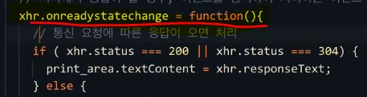
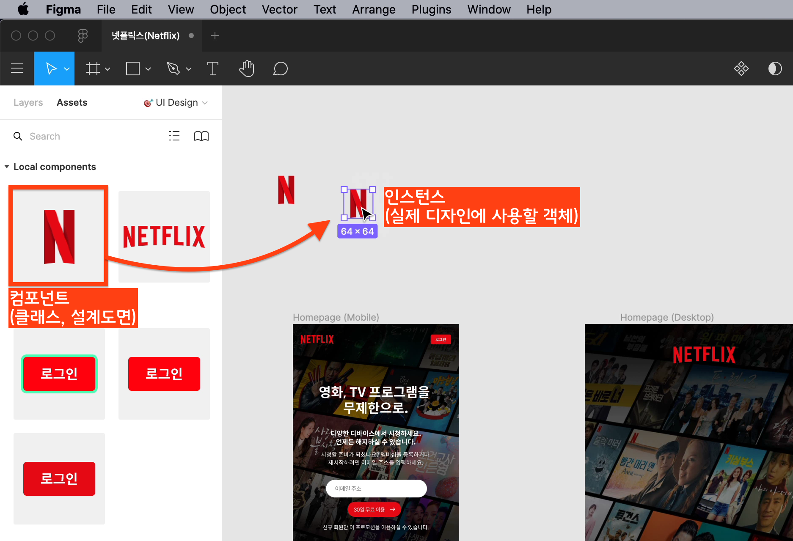
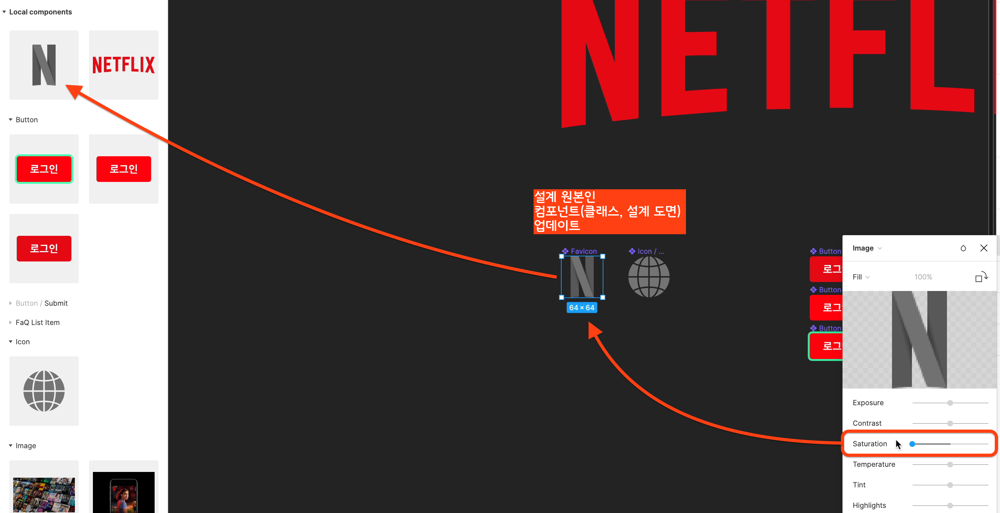
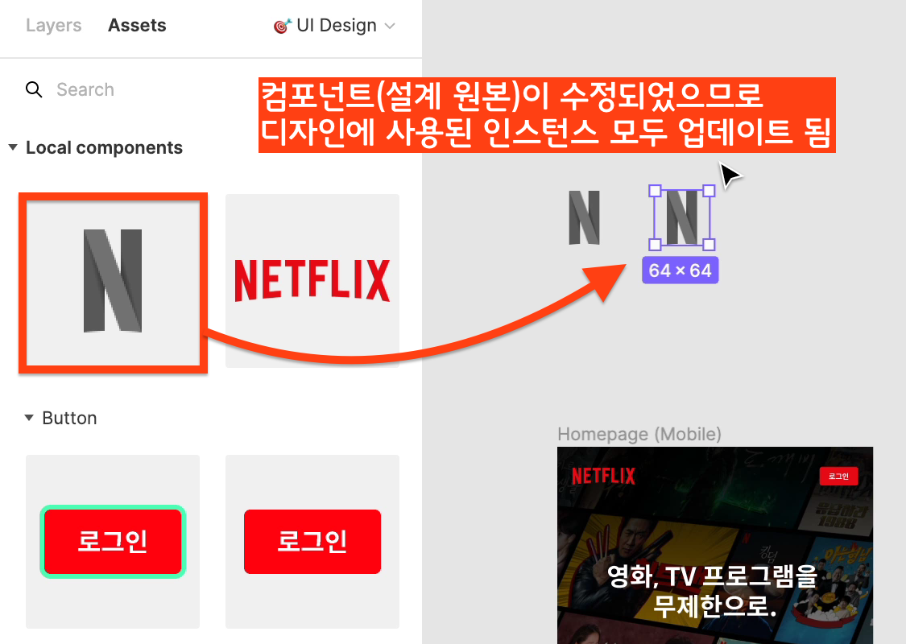
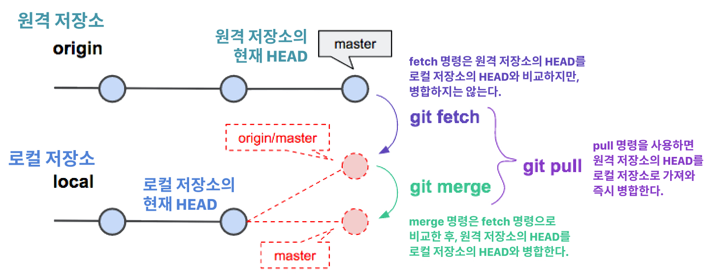

[← BACK](../README.md)

<br/>

# QnA

질문을 남겨주시면, 최선을 다해 답변하겠습니다. 🐧

## 목차

1. [JS 오류는 콘솔 패널에서 표시되므로 작업 할 때, 콘솔 패널을 확인하며 작업을 해야하나요?](#q1-질문)
1. [함수를 사용할 때 대문자 소문자를 구분해야 하나요?](#q2-질문)
1. [REPL은 뭘 말하는 건가요?](#q3-질문)
1. [`Function()`과 `function(){}`. 어떤 차이가 있는 건가요?](#q4-질문)
1. [`var` 키워드를 사용해서 선언한 변수가 객체가 되는 것인가요?](#q5-질문)
1. [숫자 값이 문자로 변경되는 경우를 방지하기 위해서는 `Number()`로 숫자를 입력해주면 되나요?](#q6-질문)
1. [`console.log()` 어떤 함수인가요?](#q7-질문)
1. [메서드(method)란 무엇인가요?](#q8-질문)
1. [참조(reference)가 무슨 뜻인가요?](#q9-질문)
1. [전달인자(arguments)와 매개변수(parameters)가 무엇인가요?](#q10-질문)
1. [`context` ?, `document`의 차이점은 무엇인가요?](#q11-질문)
1. [실습2에서 아래 연산식을 사용했을 때, 왜 getHour()의 값이 마이너스로 나오는지 모르겠습니다.](#q12-질문)
1. [프로그램에서 "파싱(parsing)"이란 무엇인가요?](#q13-질문)
1. [`var target = e.target;` 구문 해석을 어떻게 해야 할지 모르겠습니다.](#q14-질문)
1. [손 코딩 과제를 해야하는 이유가 뭔가요?](#q15-질문)
1. [개발자 도구에서 중단점(Breakpoint)을 사용하는 것을 봤습니다. 중단점은 어떤 기능을 하나요?](#q16-질문)
1. ['스크립트 의존성'으로 본다면 HTML 마크업 할 때 `index.js`, `helper.js`를 기본적으로 불러와야 하나요?](#q17-질문)
1. [스코프 체인(Scope Chain)은 정확히 무엇을 말하는 건가요?](#q18-질문)
1. [버튼을 클릭했을 시에 이미지가 우측 모서리 쪽으로 이동하는 현상을 어떻게 해결하나요?](#q19-질문)
1. [`git fetch`와 `git pull/push`는 어떤 차이가 있나요?](#q20-질문)
1. [`Web API`와 `DOM API`와 같은 건가요?](#q21-질문)
1. [인터페이스(Interface)는 객체의 유형을 말하는 건가요?](#q22-질문)
1. [`Element Node`와 `HTMLElement`와 다른 건가요?](#q23-질문)
1. [프로그래밍에서 인스턴스(instance)란 무엇인가요?](#q24-질문)
1. [정적(static) 메서드란 무엇인가요?](#q25-질문)
1. [서버의 호스트 환경과 클라이언트 환경의 차이가 무엇이가요?](#q26-질문)
1. [`callback` 함수란 무엇인가요?](#q27-질문)
1. [마크다운에 이미지를 삽입할 때 이미지 크기를 조절하는 방법이 있나요?](#q28-질문)
1. [메서드에 함수를 참조 시키면 어떻게 작동되나요?](#q29-질문)
1. [`ajax ~ then`문은 어떻게 작동하는 문법인가요?](#q30-질문)
1. [라이브러리는 이미 만들어진 함수를 말하는 건가요?](#q31-질문)
1. [옵션 객체란 무엇인가요?](#q32-질문)

<br />

---

<br />

## Q32. 질문

옵션 객체란 무엇인가요?

<details open>
  <summary>A32. 답변</summary>
  <br/>
  
  말 그대로 옵션(선택사항, options)을 설정할 때 사용되는 JavaScript 객체를 말합니다.
  예를 들어 jQuery `ajax()`를 사용해 비동기 통신을 요청할 때 다음과 같이 옵션 객체를 전달해 사용자가 임의로 설정할 수 있습니다.

  ```js
  jQuery
    .ajax({
      method: "POST",
      url: "server.php",
      data: { name: "김한나", location: "경기도 일산" }
    })
    .then(function(msg) {
      console.log(msg + "전송된 데이터가 저장되었습니다. ");
    });
  ```

  위 코드에서 전달된 옵션 객체를 분리해보면 다음과 같이 작성할 수 있습니다.

  ```js
  // jQuery.ajax()에 전달할 옵션 객체
  var options = {
    method: "POST",
    url: "server.php",
    data: { name: "김한나", location: "경기도 일산" }
  };

  // -----------------------------------------------------------------------

  jQuery
    // 옵션 객체(options)를 jQuery.ajax()에 전달해 비동기 통신 요청
    .ajax(options)
    // 서버로부터 응답 받으면 실행되는 콜백 함수 설정
    .then(function(msg) {
      console.log(msg + "전송된 데이터가 저장되었습니다. ");
    });
  ```
</details>

<br/>

## Q31. 질문

라이브러리는 이미 만들어진 함수를 말하는 건가요?

<details open>
  <summary>A31. 답변</summary>
  <br/>
  
  컴퓨터 과학 분야에서 [라이브러리(Library)](https://ko.wikipedia.org/wiki/%EB%9D%BC%EC%9D%B4%EB%B8%8C%EB%9F%AC%EB%A6%AC_(%EC%BB%B4%ED%93%A8%ED%8C%85))란? 
  **소프트웨어를 개발할 때 컴퓨터 프로그램이 사용하는 하부 프로그램의 모음**을 말합니다. 
  다시 말해 라이브러리는 "<u>미리 작성된 코드 모음</u>"으로 **함수**, **클래스**, **값**, **자료형** 등을 포함하는 사양을 말합니다. 

  아래는 Front-End 개발 분야에서 주로 사용되는 UI 라이브러리입니다.

  - [jQuery](https://jquery.com/)
  - [anime](https://animejs.com)
  - [React](https://reactjs.com/)

  아래는 Front-End, Back-End 개발 분야에서 주로 사용되는 Utility 라이브러리입니다.

  - [Lodash](https://lodash.com/)
  - [Moment](https://momentjs.com/)
</details>

<br/>

## Q30. 질문

`ajax ~ then`문은 어떻게 작동하는 문법인가요?

<details open>
  <summary>A30. 답변</summary>
  <br/>
  
  해당 질문은 `ajax` 라이브러리 코드를 설명해야 합니다.
  그러므로 지면 답변 보다는 밋업을 통해 이야기 드리는 것이 적합하다고 판단됩니다.
  그리고 해당 질문에 대한 답변은 ES6 Promise 영상 강의를 살펴보면 원리를 이해하기 보다 수월하니 먼저 시청해보세요.
</details>

<br/>

## Q29. 질문

메서드에 함수를 참조 시키면 어떻게 작동되나요?
`xhr.onreadystatechange`는 `xhr.status` 메서드의 값을 갖고 있지 않은데 어떻게 함수 안의  `if`문의 조건에 적용되는지 잘 모르겠습니다.



<details open>
  <summary>A29. 답변</summary>
  <br/>
  
  먼저 질문에 사용된 용어 정리가 필요하겠습니다. 
  메서드에 함수를 참조하는 것이 아니라, `xhr` 객체의 속성 `onreadystatechange`에 함수를 참조하는 것입니다.
  그리고 `xhr.status` 또한 `xhr` 객체의 속성입니다.

  `xhr`은 `XMLHttpRequest` 클래스를 사용해 생성된 인스턴스(객체)입니다.

  ```js
  const xhr = new XMLHttpRequest()
  ```

  생성된 객체 `xhr`의 속성 및 메서드를 확인하려면 다음 명령을 사용해 Console 패널에 결과를 출력해봐야 합니다.

  ```js
  console.dir(xhr)
  ```

  그러면 다음과 같은 결과를 출력합니다.

  ```js
  XMLHttpRequest
    onabort: null
    onerror: null
    onload: null
    onloadend: null
    onloadstart: null
    onprogress: null
    ontimeout: null
    onreadystatechange: null  // ← 이벤트 속성
    readyState: 0             // ← 상태 속성
    status: 0                 // ← 상태 속성
    statusText: ""            // ← 상태 속성
    response: ""              // ← 응답 결과 속성
    responseText: ""
    responseType: ""
    responseURL: ""
    responseXML: null
    timeout: 0
    upload: XMLHttpRequestUpload {onloadstart: null, onprogress: null, onabort: null, onerror: null, onload: null, …}
    withCredentials: false
    __proto__: XMLHttpRequest
  ```

  `xhr` 객체의 내부 구조를 살펴보면 **이벤트 속성**, **상태 속성**, **응답 결과 속성**을 소유하고 있음을 확인할 수 있습니다.
  그러므로 `onreadystatechange` 이벤트 속성에 연결된 함수 내부에서 `xhr` 객체의 상태 속성을 통해 비동기 통신 상태를 확인할 수 있는 것입니다.


</details>

<br/>

## Q28. 질문

마크다운에 이미지를 삽입할 때 이미지 크기를 조절하는 방법이 있나요?

<details>
  <summary>A28. 답변</summary>
  <br/>

Markdown 이미지 삽입 시, 직접 HTML 코드를 삽입하고
`width` 또는 `height` 속성 값을 단위 없이 설정하면 크기 조정이 가능합니다. :-)

```html

```

</details>

<br/>

## Q27. 질문

`callback` 함수란 무엇인가요?

<details>
  <summary>A27. 답변</summary>
  <!-- <br /> -->

### 콜백(Callback)

프로그래밍에서 콜백(Callback) 또는 콜 에프터 함수(Call-after Function)는 다른 코드(예 함수)에 넘겨주는 실행 가능한 코드(함수)를 말합니다.
콜백을 넘겨받는 코드는 전달 받은 콜백을 바로 실행하거나, 나중에 필요한 시점에 실행할 수 있습니다.
일반적으로 콜백을 전달할 때는 콜백 함수의 참조(또는 포인터), 함수 값(서브 루틴 또는 람다 함수) 형태로 넘겨줍니다.
**콜백은 코드를 재사용 할 때 유용**합니다.

**즉시 실행되는 콜백 함수 예**

```js
var hannaFamily = ["아버지", "어머니", "동생", "한나"];

// 함수 값을 전달해 가족 구성원을 순환할 때 전달된 콜백함수 실행
hannaFamily.map(function (member) {
  return member + " (행복 ♥)";
});
```

**특정 시점에 실행되는 콜백 함수 예**

```js
function init() {
  console.log("전달 될 콜백 함수");
}

// 함수 참조를 콜백으로 전달해 특정 시점에 실행
window.addEventListener("DOMContentLoaded", init);
```

</details>

<br />

## Q26. 질문

서버의 호스트 환경과 클라이언트 환경의 차이가 무엇이가요?

<details>
  <summary>A26. 답변</summary>
  <!-- <br /> -->

### Server

일반적으로 서버라 함은 **다른 프로그램에 서비스를 제공하는 컴퓨터 프로그램**을 말합니다.
서버 프로그램이 실행 중인 컴퓨터 하드웨어 역시 서버로 통용해 부릅니다. 웹 환경에서의 서버는
웹 서버이며 웹 클라이언트로부터 요청 받은 HTML, CSS, JavaScript, 이미지 등 파일을 제공하는 컴퓨터 프로그램을 말합니다.

### Client

클라이언트란? <b>서버에서 행하는 서비스에 접근하는 컴퓨터 하드웨어 장치 또는 소프트웨어(프로그램)</b>를 말합니다.
웹 환경에서 클라이언트는 웹 브라우저로 웹 서버에 HTML을 포함한 파일을 요청하고 응답받아 처리하는 프로그램 역할을 합니다.

### Host? Server?

인터넷 환경에서 호스트란? 인터넷을 통해 다른 컴퓨터들과 양방향 통신이 가능한 컴퓨터를 말합니다.
호스트는 특정한 호스트 번호를 가지며, 네트워크 번호와 합쳐져 고유의 [IP](https://ko.wikipedia.org/wiki/IP_%EC%A3%BC%EC%86%8C) 주소를 이루게 됩니다.
즉, 인터넷 환경에서의 맥락에서 호스트는 네트워크에 연결 된 하나의 노드라고 볼 수 있습니다.

#### ⚙️ 서버

- **물리적 장치** 또는 **소프트웨어 프로그램**일 수 있습니다.
- **호스트 컴퓨터에 설치**됩니다.
- **특정 서비스를 제공**합니다.
- **클라이언트만 지원**합니다.

#### 🎛 호스트

- **항상 물리적 컴퓨터 또는 장치**입니다.
- **서버 및 클라이언트 프로그램을 모두 실행** 할 수 있습니다.
- **특정 서비스를 제공**합니다.
- **여러 사용자와 장치를 지원**합니다.
</details>

<br />

## Q25. 질문

정적(static) 메서드란 무엇인가요?

<details>
  <summary>A25. 답변</summary>
  <br />

**정적 메서드**는 **클래스 메서드**로도 불립니다. [Q24 답변](#q24-질문)에서 다룬 **클래스와 연관된 메서드**를 말합니다.
쉽게 말해 **클래스가 소유한 함수**이며, 클래스가 소유한 멤버이므로 **클래스 메서드**라고 불립니다.

> 클래스의 함수이기 때문에 클래스(또는 정적) 메서드라고 불릴 뿐. 일반 함수와 사용하는 방법은 동일합니다.

```js
// 클래스: 설계 도면, 청사진)
class House {
  constructor(소유자, 종류, 면적) {
    this.소유자 = 소유자;
    this.종류 = 종류;
    this.면적 = 면적;
  }

  // 클래스 멤버(메서드)
  // 평방미터 → 평 변경 함수
  static m2Pyeong(m2 /* 평방미터(㎡) */) {
    // 3.3058㎡ 평방미터 = 1평
    // 85 평방미터를 평수로 계산하면
    // 85 ÷ 3.3058 = 약 26평(25.71평)
    return Math.ceil(m2 / 3.3058);
  }
}
```

클래스(정적) 메서드를 사용하는 예를 살펴봅시다. House 인스턴스 `한나의집`의 평방미터 값을 평수로 변경하고자
클래스 `House`의 정적 멤버 `m2Pyeong()` 메서드를 사용합니다. 예에서 살펴봤듯 **`m2Pyeong()` 함수는
클래스 `House`를 통해서만 접근할 수 있고 사용 가능합니다.**

```js
const 한나의집 = new House("김한나", "아파트", 105.785124);

// 105.785124 평방미터를 평수로 변경
let 한나의집_평수 = House.m2Pyeong(한나의집.면적); // 32평
```

클래스가 소유한 함수일 뿐, 일반 함수와 사용법이 동일해서 아래처럼 클래스를 통해 바로 접근, 사용할 수 있습니다.

```js
House.m2Pyeong(158.677686); // 48평
```

</details>

<br />

## Q24. 질문

프로그래밍에서 인스턴스(instance)란 무엇인가요?

<details>
  <summary>A24. 답변</summary>
  <!-- <br /> -->

### Figma의 컴포넌트와 인스턴스

이해를 돕기 위해 Figma 컴포넌트 시스템을 살펴봅시다.

Figma의 **컴포넌트**는 프로그래밍에서 **클래스(설계 도면)** 입니다.
설계(Design)된 컴포넌트는 실제 디자인 시안에 사용되는 것이 아닙니다. 실제 디자인 시안에서 사용되는 것은
**컴포넌트로부터 생성된 인스턴스**입니다. 인스턴스는 무한정 생산이 가능하며, **클래스의 복제품** 이라고 봐도 무방합니다.
Figma의 컴포넌트를 디자인 시안에 가져와 사용하는 방법은 Assets 패널에서 등록된 컴포넌트를 Drag & Drop 하면 됩니다.

  
  <br/>
  <br/>

컴포넌트 시스템이 UI 디자인에 매우 유용하고 필수적으로 사용되어야 하는 이유는 **생산성 향상**과 **일관성 있는 유지 보수**에 있습니다.
예를 들어 컴포넌트로부터 생성된 인스턴스 수십 개가 디자인에서 사용된다고 가정해보세요. 곳곳에서 사용되었지만 수정이 손쉽습니다.

  
  <br/>
  <br/>

모든 인스턴스는 컴포넌트(클래스)에 연결되어 있으므로 **컴포넌트(설계)를 수정(업데이트)하면 연결된 모든 인스턴스에 일괄 적용**됩니다.

  
  <br/>
  <br/>

### JavaScript의 클래스(생성자 함수)와 인스턴스(객체)

대부분의 프로그래밍이 그러하듯 JavaScript 또한 클래스와 인스턴스를 활용합니다. Figma의 컴포넌트 시스템에서 살펴본 것처럼
프로그래밍 하는데 있어 클래스와 인스턴스를 활용하면 생산성, 일관성, 유지보수, 재사용성 등을 설계에 반영하고 구현할 수 있습니다.

| 구분     | 설명             |
| -------- | ---------------- |
| 클래스   | 설계 도면에 해당 |
| 인스턴스 | 실제 구현된 객체 |

#### JavaScript Class

`House` 클래스는 소유자, 종류, 면적 정보를 생성과정에서 전달 받아 생성된 인스턴스의 멤버(속성, 메서드)로 설정합니다.

```js
// 클래스: 설계 도면, 청사진)
class House {
  constructor(소유자, 종류, 면적) {
    this.소유자 = 소유자;
    this.종류 = 종류;
    this.면적 = 면적;
  }
}
```

#### JavaScript Instance(Object)

`House` 클래스로부터 생성된 `한나의집`, `야무의집`은 인스턴스입니다. 그리고 인스턴스는 모두 `House` 클래스에 연결되어 있습니다.

```js
// 생성된 객체(인스턴스: 설계 도면을 토대로 만들어진 실체물)
const 한나의집 = new House("김한나", "아파트", 105.785124);
console.log(한나의집); // House {소유자: "김한나", 종류: "아파트", 면적: 105.785124}
```

```js
// 생성된 객체(인스턴스: 설계 도면을 토대로 만들어진 실체물)
const 야무의집 = new House("지훈", "주택", 158.677686);
console.log(야무의집); // House {소유자: "지훈", 종류: "주택", 면적: 158.677686}
```

#### `House` 클래스를 업데이트하면?

Figma 컴포넌트에서 살펴본 것처럼 `House` 클래스에 연결된 `한나의집`, `야무의집` 모두 업데이트 내용이 반영됩니다.

</details>

<br />

## Q23. 질문

`Element Node`와 `HTMLElement`와 다른 건가요?

<details>
  <summary>A23. 답변</summary>
  <!-- <br /> -->

### Node? Element? HTMLElement?

Element는 Document의 모든 요소 객체를 지칭하며
HTML 요소(`HTMLElement`), SVG 요소(`SVGElement`) 자식 인터페이스의 부모(상위) 인터페이스를 말합니다. 즉,
요소(`Element`)의 능력을 상속(물려 받아) HTML, SVG로 각각 확장(Extends)한 인터페이스가 `HTMLElement`, `SVGElement` 입니다.
아래 작성한 내용은 상위 인터페이스에서 하위 인터페이스의 상속 구조를 표현한 것입니다.

- Object - EventTarget `← Object 상속 후, 확장` - Node `← EventTarget 상속 후, 확장` - [**Element**](https://developer.mozilla.org/ko/docs/Web/API/Element) `← Node 상속 후, 확장` - [**HTMLElement**](https://developer.mozilla.org/ko/docs/Web/API/HTMLElement) `← Element 상속 후, 확장` - SVGElement `← Element 상속 후, 확장`
</details>

<br />

## Q22. 질문

인터페이스(Interface)는 객체의 유형을 말하는 건가요?

<details>
  <summary>A22. 답변</summary>
  <br />

인터페이스(Interface)는 **사용자가 기기를 쉽게 동작시키는데 도움을 주는 시스템을 의미**합니다.
즉, 사용자와 인터랙션(Interaction, 상호작용)하는 환경을 "인터페이스"라고 부릅니다. 예를 들어 TV, Smart Phone 인터페이스를 생각해보세요.

- **TV 인터페이스** → <u>리모컨 인터페이스</u>를 통해 TV를 컨트롤 (전원 ON/OFF, 채널 변경, 볼륨 조정 등)
- **Smart Phone 인터페이스** → <u>터치 인터페이스</u>를 통해 앱을 컨트롤 (앱 ON/OFF, 페이지 전환, 화면 확대/축소 등)
</details>

<br />

## Q21. 질문

`Web API`와 `DOM API`와 같은 건가요?

<details>
  <summary>A21. 답변</summary>
  <!-- <br /> -->

### Web API란?

[Web API](https://developer.mozilla.org/ko/docs/Web/%EC%B0%B8%EC%A1%B0/API)는 **웹 환경에서 다양한 개발(웹 애플리케이션, 데이터 관리 등)을 할 수 있도록 제공되는 API를 통칭하는 용어입니다.**

JavaScript 언어(코드)를 통해 API를 사용할 수 있고, 문서 객체 모델(DOM)에 접근하고 조작하는 일부터 WebGL, Web Audio와 같은
복잡한 그래픽, 오디오 이펙트를 만들어내는 일을 할 수도 있습니다.

- DOM API → `문서 객체에 접근, 조작하는 기능을 제공합니다.`
- Device API → `장치의 하드웨어를 조작하는 기능을 제공합니다. (예: 조명 센서, 배터리 상태, 진동 API 등)`
- Communication API → `다른 기기와 통신하는 기능을 제공합니다. (예: 네트워크 정보, 웹 알림, 단순 푸시 API 등)`
- Data Management API → `사용자의 데이터를 보관, 관리하는 기능을 제공합니다. (예: 파일 핸들 API, IndexedDB 등)`

### 결론

**DOM API**는 **Web API에 포함되는 하위(종속) API**이며, **웹 애플리케이션의 문서 객체에 접근, 조작하는 기능을 제공**합니다.

</details>

<br />

## Q20. 질문

`git fetch`와 `git pull/push`는 어떤 차이가 있나요?

<details>
  <summary>A20. 답변</summary>
  <br />

**원격 저장소(origin)의 HEAD**를 가져온(`fetch`) 다음, **로컬 저장소(local)의 HEAD**에 합치는(`merge`) 것을 동시에 수행하는 명령이 풀(`pull`) 입니다.
즉, `pull` 명령은 `fetch` + `merge` 명령을 합쳐 실행한 결과를 보여줍니다.

```
git pull  =  git fetch; git merge FEACH_HEAD
```

  <br/>

아래 그린 인포그래픽을 참고하면 이해하기 쉬울 겁니다.

  

### fetch, merge 명령

원격 저장소의 HEAD가 로컬 저장소의 HEAD 보다 1단계 앞에 있다고 가정했을 때,
원격 저장소의 HEAD와 로컬 저장소의 HEAD를 비교하여 변경 이력을 검토하기 위한 목적이라면 `fetch` 명령을 사용합니다.
비교 후에 원격 HEAD와 로컬 HEAD를 합치고 싶을 때 `merge` 명령을 사용하는 것입니다.

```sh
# 원격 저장소(origin)의 master 브랜치 HEAD를 가져와 로컬 저장소의 HEAD와 비교
git fetch origin master

# 원격 저장소(origin)의 master 브랜치 HEAD를 로컬 저장소의 HEAD에 병합
git merge origin master
```

### pull 명령

반면 비교(검토)가 목적이 아니라, 로컬 저장소에서 원격 저장소의 HEAD를 가져와 즉시 합치고자 한다면? `pull` 명령을 사용합니다.

```sh
# 원격 저장소(origin)의 master 브랜치 HEAD를 가져와 로컬 저장소의 HEAD에 병합
git pull origin master
```

</details>

<br />

## Q19. 질문

버튼을 클릭했을 시에 이미지가 우측 모서리 쪽으로 이동하는 현상을 어떻게 해결하나요?


<details>
  <summary>A19. 답변</summary>
  <br />

`border` 속성은 상태가 변경되어 테두리(border)가 그려질 때 박스 모델이 변경됩니다.
그러므로 이미지의 위치를 변경하지 않도록 하려면, 아웃라인(outline)을 그려야 합니다.
아래 작성된 예시 코드를 참고하여 실습해보길 바랍니다.

```css
/* 일반 스타일 --------------------*/
.photoGallery__button {
  /* outline: none; */
  width: 110px;
  height: 73px;
  margin-bottom: 10px;
  border: 0;
  padding: 0;
  filter: grayscale(100%);
}

/* 마우스 호버 --------------------*/
.photoGallery__button:hover {
  filter: grayscale(0%);
}

/* 키보드 포커스 --------------------*/
.photoGallery__button:focus {
  /* border: 3px solid #2E2828; */
  outline: 3px solid #2e2828;
  filter: grayscale(0%);
}
```

</details>

<br />

## Q18. 질문

스코프 체인(Scope Chain)은 정확히 무엇을 말하는 건가요?

<details>
  <summary>A18. 답변</summary>
  <br/>

JavaScript에서 변수가 사용되면 JavaScript 엔진은 현재 범위에서 변수 값을 찾으려고 합니다.
변수를 찾을 수없는 경우 상위 범위을 조사하고 변수를 찾고, 전역 범위에 도달 할 때까지 계속 검색합니다.
여전히 변수를 찾을 수 없는 경우 전역 범위에서 변수를 암시적으로 선언하거나, `ReferenceError` 오류를 반환합니다.

```js
var globalVariable = "전역 변수";

function outerLocalScope() {
  var variable = "지역 변수";

  function innerLocalScope() {
    console.log(variable); // '지역 변수' (상위 범위에서 찾음)
    console.log(globalVariable); // '전역역 변수' (전역 범위에서 찾음)
    console.log(lexicalVariable); // ReferenceError (못찾음)
  }

  innerLocalScope();
}

outerLocalScope();
```

</details>

<br/>

## Q17. 질문

'스크립트 의존성'으로 본다면 HTML 마크업 할 때 `index.js`, `helper.js`를 기본적으로 불러와야 하나요?

<details>
  <summary>A17. 답변</summary>
  <br/>

`index.js`는 `helper.js` 파일에 의존합니다. 쉽게 말해 `helper.js` 파일 코드에 작성된 함수를
`index.js`에서 실행합니다. 그러므로 `helper.js` 파일을 먼저 호출해야 하고, 이어서 `index.js` 파일을
호출해야 프로그램이 정상적으로 실행됩니다. 작성 순서가 뒤바뀌면 프로그램은 오류를 발생시킵니다.

```html
<script src="./js/helper.js"></script>
<script src="./js/index.js"></script>
```

</details>

<br/>

## Q16. 질문

개발자 도구에서 중단점(Breakpoint)을 사용하는 것을 봤습니다. 중단점은 어떤 기능을 하나요?

<details>
  <summary>A16. 답변</summary>
  <br/>

중단점(Breakpoint)는 말 그대로 코드 실행을 중단하여 진행 흐름을 살펴볼 때 사용합니다.
코드가 실행 완료된 후 Console 패널을 통해 확인하는 `console.log()` 디버깅에 비해
면밀하게 코드가 작동하는 흐름을 확인하여 디버깅 할 수 있습니다.

작성된 코드에서 오류가 발생한 경우, 오류가 의심되는 코드 라인에 중단점을 추가하고
디버깅을 실행하면 설정된 중단점 마다, 함수가 호출되는 과정과 함수의 지역 변수 값을
확인하거나 디버그 콘솔을 통해 검토할 수 있습니다. → [코드 참고](../__DEMO__/demo__using-breakpoint)


</details>

<br/>

## Q15. 질문

손 코딩 과제를 해야하는 이유가 뭔가요?

<details>
  <summary>A15. 답변</summary>

### 손 코딩(Hand Write Coding)

**"프로그래밍 언어를 배울 때, 손으로 코딩하면 어떤 장점이 있을까?"** 에 대해 생각해봅시다.

- 프로그래밍을 배우기 시작해서 아직 작성하는 언어에 익숙하지 않습니다. 이런 경우 익숙한 모국어(예: 한국어)로 종이에 먼저 작성한 다음, 작성 정리된 사고(생각)를 컴퓨터에 앉아 프로그래밍 하는 훈련을 하는 것이 좋습니다.
- 프로그래밍 개념에 대한 더 깊은 이해를 얻고자 한다면 최소한 배울 때 만큼이라도 코드를 손으로 작성해야 합니다. 언어를 익힐 때는 읽고, 듣고, 쓰는 것만큼 효과적인 것이 없기 때문입니다. 하지만 어느 정도 프로그래밍에 익숙해진다면 수백 줄이나 되는 코드를 일일이 손으로 작성할 필요는 없습니다. 손 코딩은 프로그래밍 패턴을 익히는 용도로 초반 훈련에 큰 도움이 됩니다.
- 손으로 작성하는 만큼 속도는 느리지만, 주제에 대한 개념적 이해를 높이기 위해 손으로 쓰는 것이 타이핑 보다 우수합니다.
- 입사 인터뷰 또는 그룹 프로젝트에서 언젠가 화이트보드나 종이에 코드를 작성할 가능성이 높습니다. 종종 코드 작성을 연습하지 않는 프로그래머는 이 때문에 고통을 받을 수 있습니다.
[실제로 화이트보드나 종이에 글을 쓰는 방식으로 프로그래밍을 연습한 이들은 인터뷰 한 모든 회사(Google, Amazon 등)로부터 구인 제안을 받는데 도움이 되었다고 합니다.](https://www.quora.com/Should-beginning-programmers-hand-write-code-on-paper)

  
  
</details>

<br />

## Q14. 질문

`var target = e.target;` 구문 해석을 어떻게 해야 할지 모르겠습니다.

<details>
  <summary>A14. 답변</summary>
  <br />

이벤트 리스너인 함수는 매개변수로 이벤트 객체를 전달 받습니다.
이벤트의 객체는 여러 속성을 가지는데 그 중 `target` 속성을 변수 `target`에 참조하는 코드입니다.

</details>

<br />

## Q13. 질문

프로그램에서 "파싱(parsing)"이란 무엇인가요?

<details>
  <summary>A13. 답변</summary>
  <br />

웹 브라우저 화면에 렌더링 할 때, HTML등 문서의 코드를 이해하고 사용할 수 있는 구조로 해석하는 것을 말합니다.

</details>

<br />

## Q12. 질문

실습2에서 아래 연산식을 사용했을 때, 왜 `getHour()`의 값이 마이너스로 나오는지 모르겠습니다.

```js
hour = hour < 12 && 12 - hour > 3 ? 0 + hour : hour - 12;
```

<details>
  <summary>A12. 답변</summary>
  <br />

아래와 같이 연산식을 수행하면 기대하는 값이 나옵니다. 아래 연산식을 해석해보세요.

```js
function getHour(hour) {
  return (hour = hour < 12 && 12 - hour >= 3 ? "0" + hour : "" + hour);
}

getHour(9); // "09"
getHour(12); // "12"
```

</details>

<br />

## Q11. 질문

`context` ?, `document`의 차이점은 무엇인가요?

<details>
  <summary>A11. 답변</summary>
  <br />

- `context` : "범위"를 말합니다. 특정한 범위(예: `<section>`) 내에서 `selcetor`에 매칭(Matching)되는 요소를 찾을 때 설정합니다.
- `document` : 문서 전체 범위에서 `selcetor`에 매칭되는 요소를 찾을 때 사용합니다.

```js
function getNode(selector, context) {
  return (context || document).querySelector(selector);
}
```

</details>

<br />

## Q10. 질문

전달인자(arguments)와 매개변수(parameters)가 무엇인가요?

<details>
  <summary>A10. 답변</summary>
  <br />

함수 안에서 사용되는 변수를 "매개변수"라 하고, 함수 실행 시 전달되는 인자를 "전달인자"라고 부릅니다.
아래 예시 코드를 참고하세요.

```js
function sum(a, b, c) {
  // sum() 함수 안에 있는 `a, b, c`가 "매개변수"이다.
  // 매개변수는 함수 안에서만 접근이 가능하다.

  // 매개변수를 사용하여 함수가 수행해야 하는 로직을 작성
  var total = a + b + c;

  // 매개변수 연산 결과 값 반환
  return total;
}

// 함수 실행과정에서 전달하는 값이 "전달인자"이다.
// `10, 9, 20`가 "전달인자"이다.
sum(10, 9, 20);
```

</details>

<br />

## Q9. 질문

참조(reference)가 무슨 뜻인가요?

<details>
  <summary>A9. 답변</summary>
  <br />

- 참조란? 원본데이터를 가리키는 것과 유사합니다.
- 원시 데이터 타입은 복사하여 값을 전달하고, 객체형 데이터 타입은 참조하여 값을 전달합니다.

```
예) 9 = a = b 일때, a, b는 값은 9라는 값을 가리킨다.

복사 : a = a + 2 // a = 11 이다. 이때 b의 값도 11로 바뀔거라고 생각하지만 복사는 각 객체의 값이 변해도 원본데이터에는 아무런 영향을 주지 않는다 그래서 b = 9이다.

참조 : 참조는  a = a + 2 // a = 11 일때 b = 11 이다. 이는 "복사"와 다르게 원본 데이터를 가리키는 객체 중에 하나가 변경되면 원본데이터의 값이 변경되기 때문이다.
```

</details>

<br />

## Q8. 질문

메서드(method)란 무엇인가요?

<details>
  <summary>A8. 답변</summary>
  <br />
  메서드란? "객체가 소유한 함수". 즉, "객체가 가진 기능"을 말합니다.
  
  - "<u>인간 객체의 기록을 남기는 능력</u>", "<u>새 객체의 날개짓</u>" 등
  - `.valueOf()`는 특정 객체의 <del>원시</del> 값을 출력하는 메소드
</details>

<br />

## Q7. 질문

`console.log()` 어떤 함수인가요?

<details>
  <summary>A7. 답변</summary>
  <br />

브라우저에 기본 내장된 콘솔(Console) 패널에 기록(Log)을 남길 때 사용하는 함수입니다.

```js
// [예시]
var boy = "야망이 넘치는 소년의 손짓";
console.log(boy);
```

</details>

<br />

## Q6. 질문

숫자 값이 문자로 변경되는 경우를 방지하기 위해서는 `Number()`로 숫자를 입력해주면 되나요?

<details>
  <summary>A6. 답변</summary>
  <br />

결과를 보지 않고 먼저 `Number()` 함수를 사용하기 보다는, 문자 값과 숫자 값을 더한 연산의 결과 값을 확인하고 문서의 요소에 적용합니다.

</details>

<br />

## Q5. 질문

`var` 키워드를 사용해서 선언한 변수가 객체가 되는 것인가요?

<details>
  <summary>A5. 답변</summary>
  <br />

- 변수 → "데이터를 보관하는 공간"
- 객체 → "어떤 능력을 소유한 특정한 데이터"

변수를 "선언"한다는 것은 <strong>"값을 기억하기 위한 공간을 만든다"</strong>는 의미입니다. 또한 변수를 선언한다고 하여 객체가 되는 것이 아닙니다.
다시 설명하면 변수를 선언하는 것은 "주인이 없는 방을 만드는 것" 이고, 객체를 생성하여 "방의 주인"으로 밀어 넣는 것입니다. 하지만 방 주인은 언제든 바뀔 수 있습니다.

```js
// 'cup'이라는 변수에 'object()'라는 일반 객체를 생성
var cup = new object();
```

</details>

<br />

## Q4. 질문

`Function()`과 `function(){}`. 어떤 차이가 있는 건가요?

<details>
  <summary>A4. 답변</summary>
  <br />

`Function()`은 생성자(Constructor) 함수, `function(){}`은 일반 함수 값(리터럴)을 말합니다.

```js
// 일반적으로 함수 이름은 동사 형태로 작성합니다.
function 라면끓이기() {
  물끓이기();
  스프넣기();
  면넣기("라면사리");
}
```

</details>

<br />

## Q3. 질문

REPL은 뭘 말하는 건가요?

<details>
  <summary>A3. 답변</summary>
  <br />

REPL(Read-Eval-Print Loop)은 사용자의 입력을 읽고(R), 실행(E)하고, 결과를 출력(P), 반복(L)하는 인터랙션 컴퓨터 프로그래밍 환경을 말합니다. 즉, 브라우저 개발 도구(DevTool)의 Console 패널에 사용자가 입력, 실행, 출력하는 반복 행위는 REPL이라고 볼 수 있습니다.

</details>

<br/>

## Q2. 질문

함수를 사용할 때 대문자 소문자를 구분해야 하나요?

<details>
  <summary>A2. 답변</summary>
  <br />

JavaScript 프로그래밍에서는 대/소문자가 명확하게 구분됩니다. `Number()` 함수와 `number()` 함수는 전혀 다릅니다.

```js
// 이 방법은 작동 됨
Number(x) + Number(y);
```

```js
// 이 방법은 오류 발생!
number(x) + number(y);
```

</details>

<br />

## Q1. 질문

JS 오류는 콘솔 패널에서 표시되므로 작업 할 때, 콘솔 패널을 확인하며 작업을 해야하나요?

<details>
  <summary>A1. 답변</summary>
  <br />

Node.js를 사용하면 코드 에디터에서 작업과 동시에 오류 확인이 가능하지만, 일반적인 JavaScript 개발 환경에서는 브라우저 Console을 통해 확인하는 것이 일반적인 방법입니다. HTML, CSS 코드를 확인하고 결과를 확인할 때 Elements, Computed 패널을 사용하는 것과 동일합니다.

</details>
