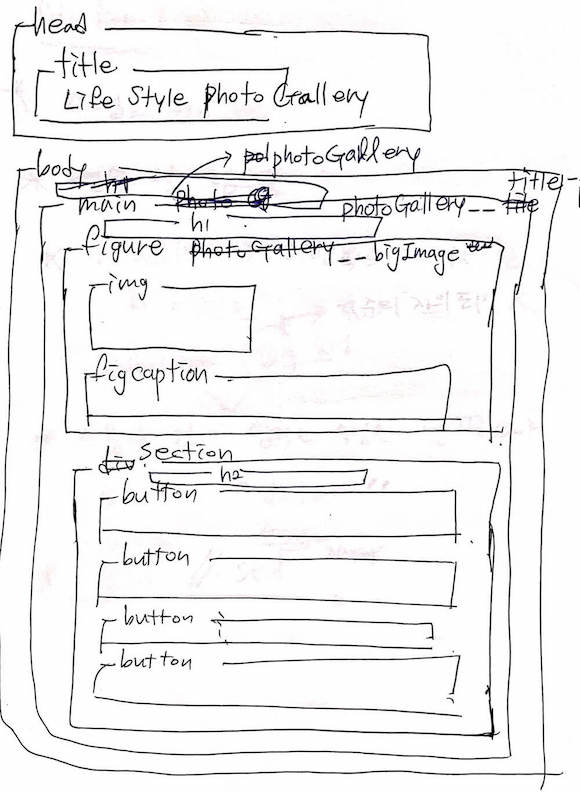
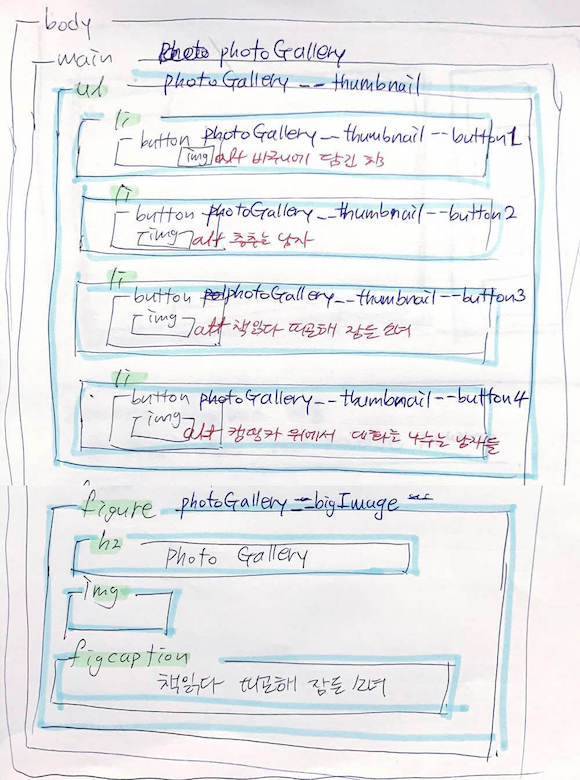

[← 뒤로가기](./README.md)

<br />

# QnA

<br/>


# TIL

8일차 학습을 통해 배운 내용을 정리합니다.

## HTML 마크업 구조 설계

* 기본적으로 수업에서는 HTML구조를 짤때 언어를 `ko-KR`로 지정한다. 그리고 타이틀 꼭꼭 작성하기!

### 첫 번째 마크업 구조 

* 문제점 
  + 리스트 요소보다 `<figure>`가 먼저 마크업 되면 'Tab'키보드로 접근할 때 목록이 아닌 큰 사진 부터 지정하게 되어 불편하다. 
* BEM 표기법 사용!!
  + `블록__요소--상태`



### 두 번째 마크업 구조 

* `Tab` 키보드로 접근할 때 목록에 먼저 선택될 수 있도록 마크업 순서 변경



### 고민한 부분

1. 큰 이미지 왼쪽 상단에 "Photo Gallery"를 body요소 안에 헤더 영역에 넣어줘야 할까? 아니면 큰 이미지 안에 같이 묶어서 마크업 해야 할까?
헤더 영역에 넣는다면 스타일은 어떻게 적용해야 할까?

## CSS 스타일 

1. `<figcaption>`의 이미지 위에 올릴 수 없을까?
    * `<position>`을 이용하여 배치

2. 이미지 제목 박스를 구현하기
    * max-width 값이 왜 적용되지 않는가? 안의 텍스트 크기 만큼만 너비가 지정됨
    * 사진 안에서 위치를 가운데로 지정하는 방법? 포지션 속성을 사용하기엔 반응형 디자인이 불가능함.
        + 결국 원래 마진 사이즈는 `280.5` 였으나 임의로 `280px`로 지정
        
        ```css
        /* 컨테이너 안에서 아이템 위치를 가운데로 지정하는 방법 */

        figcaption {
          /* 컨테이너 아래 쪽에서 가운데 정렬 */
          left: 50%;
          transform: translateX(-50%);

          /* 컨테이너 정 가운데 정렬 */
          left: 50%;
          top: 50%;
          transform: translate(-50%,-50%);
        }
        ```

3. figcaption 안의 텍스트 가운데 정렬
    +안의 텍스트가 위에 올라가 있어서 아래로 내리려고 `padding: 0;`을 지정했으나 원하던 값이 안나옴
  
    ```css
    figcaption {
      display: flex;
      justify-content: center;
      align-items: center;
    }
    ```

## JS 스크립팅

1. `currentTarget`!!!! 정말!!! 화가난다!!!! (`워워워... 진정하세요` 🐧)

2. 함수를 이용해서 개별로 큰 이미지에 뜨게 하는 함수

```js
// 객체에 이벤트 함수가 걸리는 것을 확인
function handleChangeBigPhoto1(e) {
  console.log(e.currentTarget);
  photoGalleryBigPhotoImage.setAttribute('src', './assets/bigPhoto-1.jpg');
}

photoGalleryButton[1].addEventListener('click', handleChangeBigPhoto1);
```