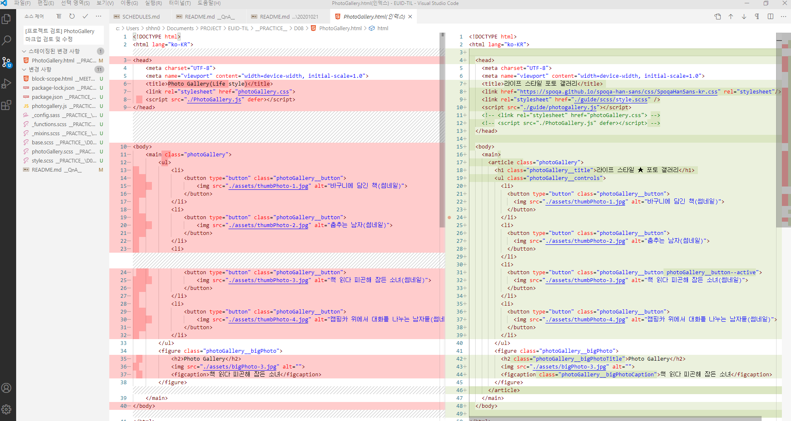
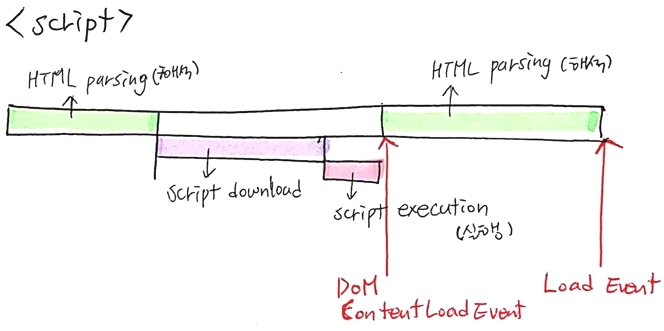
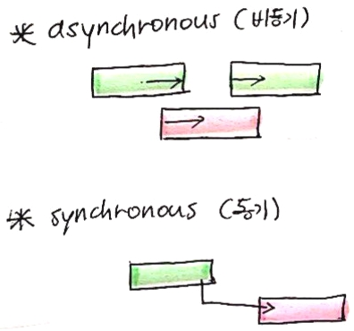
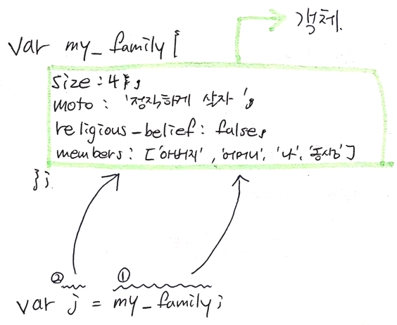
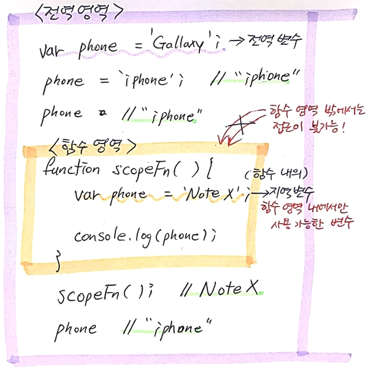
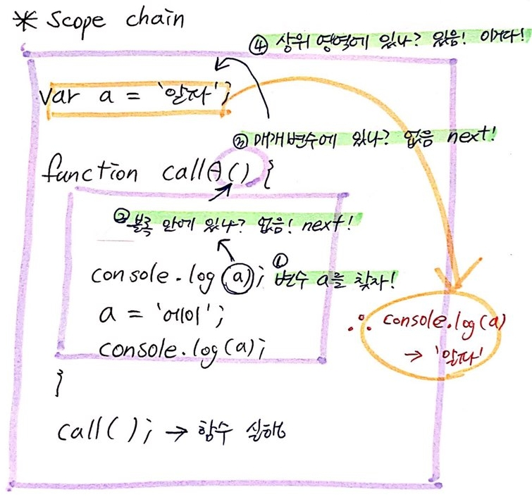

[← 뒤로가기](./README.md)

<br />

# QnA

> 앞으로 추가되는 질문은 향후 찾아보기 좋게 [QnA](../__QnA__/READMe.md) 섹션에 남겨주세요. 🐧

<del>1. 개발자 도구에서 Break Point(중단점)을 사용하는 것을 봤습니다. 중단점은 어떤 기능을 하나요?</del>

<del>
  2. '스크립트 의존성'으로 본다면 html을 마크업할 때 `index.js`와 `helperJS`를 기본적으로 입력해야하나요?(불러와야 하나요?)
</del>

<del>3. `scope chain`의 정의을 적자면 어떻게 적어야 할까요?</del>

<del>내가 찾은 답: 출력하려는 변수의 값이 해당 영역 내에 없을 경우 값을 찾기 위한 순서? 흐름?</del>

<del>4. [충돌 경험] 변경 사항 리스트를 보면 강사님이 변경하신 파일들입니다.(이미 커밋완료) 그런데 왜 제 변경사항으로 다시 뜰까요? 일단은 해당 파일을 원래 적으신 메세지 그대로 입력해서 커밋했습니다.</del>




<br/>


# TIL

9일차 학습을 통해 배운 내용을 정리합니다.


## 1. 스크립트 의존성(Dependecy)

* 의존성이란?
  * `helperJS`를 `index.js`보다 먼저 불러와야 `index.js`가 제대로 실행된다. 즉, `index.js`는 `helperJS`를 의존한다.

## 2. 브라우저의 HTML, CSS, JavaScript 해석 흐름

* `<script>`를 `<head>` 안에서 사용 시, HTML 해석이 멈추므로 사용자 경험(UX)을 고려했을 때 사용에 주의가 필요하다.
* 페이지가 로딩되는 시간이 길어질수록 사용자에게 최악의 UX를 제공하게 된다.
* `<script>`와 달리 `<link>`는 HTML의 파싱을 방해하지 않는다.
* [해석 흐름을 설명한 이미지 참고](https://www.growingwiththeweb.com/2014/02/async-vs-defer-attributes.html)


## 3.  Load 이벤트 

+ 이미지까지 모두 로드한 후 실행된다.
+ `Network`패널의 `load`와 이벤트 유형의 `load`는 같다. 
  - 예) `load`: 1.33초라고 할 때, 1.33초 후에 `init`함수를 실행해 달라!
  ```js
  window.addEventListener('load', init); // 1.09s
  ```

## 4. DOMContentLoaded 이벤트

+ 문서객체구조가 완성되면 실행된다. 

```js
document.addEventListener('DOMContentLoaded', init); // 0.2s
```




### 4-1. 가장 권장되는 `<script>`위치

* `<body>`의 끝자락에서 사용하는 것을 권장
  + HTML 해석(parsing)이 완료되면 바로 실행(페이지의 이미지는 `<script>`가 실행되고 다운 받아짐, `load` 이벤트와의 차이)


## 5. `async` 속성과 `defer` 속성 차이

* `<script>`코드를 `<head>` 내에서 불러온다면 `<head>`의 끝자락에 사용하는 것을 권장
* `<script>`보다 `<link>`가 나중에 마크업 되면 `<script>`가 다운되어 실행되는 동안<br/>`<link>`가 서버에 요청되지 않아 HTML 페이지는 구조만 보이게 된다.

### 5-1. `defer` 속성

* `defer` 연기시키다
* `defer` 속성을 사용하면 `<head>` 내에서 `<script>`를 사용해서 HTML 해석(parsing)이 지연되는 걱정없이 작동이 된다.
* `<script>`가 다운 되더라도 HTML 해석을 방해하지 않는다. 그리고 모든 것이 준비가 끝나면 `<script>`가 실행된다.

### 5-2. `async` 속성

* 비동기(Asynchronous)의 줄임말

## 6. 동기와 비동기

* 비동기 (asynchronous)
  + 기다림이 없음
  + 실행 중인 작업이 끝나지 않아도 동시에 다른 작업도 같이 실행할 수 있다. 
  + 붕뜨는 대기시간 즉, 버려지는 시간이 없다 
  + 예) `async`, `defer` 속성
* 동기 (synchronous)
  + 기다림이 있다
  + 동시에 실행 불가능하다. 한 작업이 끝이 나야 다른 작업을 할 수 있다.<br />
    다음 작없은 전의 작업이 끝날 때까지 대기해야 한다. 
  + 예) `<script>`



---

##### [참고]

* 개발자 도구(Devtools) → `Netwaork` 패널 → 필터 모두 체크!
* 페이지에 연결돤 HTML, CSS 파일 이미지 등을 확인 할 수 있으며, 그 파일들이 전부 로딩되는 데까지 걸린 시간을 확인 할 수 있다. 

<br />


* `20 requests` : 서버에 20개의 데이터를 요청했다. 
* `4.4 MB transrerred` : 4.4 MB 전송되었다. 
* `Finish 1.33s`: 현재 페이지를 사용자가 사용하는데 걸리는 시간이 1.33초이다. 
* `DOMContentLoaded 98ms` : DOMContentLoade에 걸린 시간 0.98초이다. 
* `Load 1.33s` : 전체 파일을 읽어들이는데 걸린 시간은 1.33초이다. 

---

## 7. JavaScript - 값 복사  VS  값 참조

### 7-1. 값 복사(pass by value) 

+ 원시 데이터 유형은 **복사**하여 값을 전달한다. 
+ 원시 데이터 유형은 변수가 가지고 있는 값을 다른 변수에 복사한다. 
  - `null`
  - `undefined`
  - `number`
  - `string`
  - `boolean`

```js
var repeating_count          = 3;                    // (number)
var display_headline_content = '값 복사 vs 값 참조';   // (string)
var is_toggle_menu           = false;               // (boolean)
```

* 값 복사의 특징
  + 불변(Immutable) 데이터의 경우, 그 값이 복사된다. 
  + 숫자 값, 문자 값, 불리언 값, `null`, `undefined`

* 검증!
  + 변수에 할당된 값이 변경되었을 때 다른 변수에 담긴 값이 변경되지 않았단 것은 값이 복사되었음을 의미한다.

#### [예시]

* `repeatting_count`는 원시 데이터인 숫자 값 `3`이 담긴 변수이다. 
  + 다르게 말하면 `repeatting_count`이라는 메모리에 `3`이 담긴 것이다.

  ```js
  var repeatting_count = 3;
  ```

* 숫자 값 `3`을 담고 있는 `repeatting_count`라는 변수를 `a`에 할당한다. 
  + `repeatting_count`값이 `a`에 **복사**된다. 
  + `repeatting_count`의 값은 숫자값 즉, 원시 데이터 이면서 동시에 불변 데이터이다. 불변 데이터는 값을 전달 할 때 **복사**되어 전달 한다. 
  ```js
  a = repeatting_count;

  a // 3
  ```

#### [확인]

* 그렇다면 `a`와 `repeatting_count`의 값은 같을까? 결국엔 **복사**되었기 때문에 같은 것 아닐까? 
  + A) 아니다! 값이 복사되었기 때문에 바로 눈에 보이는 것은 숫자 3으로 같이 보일 수 있으나 같지 않다. 
  `a`는 `repeatting_count`의 값을 복사한 **복사 값**이고 `repeatting_count`는 불변 데이터(원시 데이터) `3`을 갖고 있는 변수이다. 
  그래서 `a`의 값에 변화를 주어도 **복사 값** `a`의 값이 변하는 것이지 `repeatting_count`의 값은 변하지 않는다.

  ```js
  a                // 3
  a += 6           // 9

  a                // 9
  repeatting_count // 3
  ```

### 7-2. 값 참조(pass by reference)

* 객체 데이터 유형은 **참조**하여 값을 전달한다. 
* **참조한다** → 변화가 가능한 데이터를 담아준다.
* **참조** → '가리킨다.'는 의미와 유사.
  - `object`
  - `array`
  - `function`

* 값 복사의 특징 
  + 가변(mutable) 데이터의 경우 그 값이 참조한다. 
  + 객체 유형 (객체, 배열, 함수)

* 검증
  + 변수에 참조한 값이 변경되었을 때 다른 변수에 담긴 값이 변경되었다면 값이 참조되었음을 의미한다. 

#### [예시]

```js
var my_family = {
  size: 4,      
  moto: '정직하게 살자',
  religious_belief: false, 
  members: [ '아버지', '어머니', '나', '동생' ],
};
```

* ① `my_family` 변수는 **객체를 가리킨다.**
* ② `j` 변수에 `my_family` 변수가 할당(대입)되었기 때문에 `j` 변수는 **객체를 가리킨다.**
* 즉, `my_family`와 `j` 변수가 **가리키는 객체는 동일하다.**
* 그래서 어느 하나의 변수에 변화를 줬을 때, 각 변수는 하나의 데이터 값을 가리키므로 **값이 바뀔 때 결과는 동일하게 반영된다.**



#### [확인] 

* 변수 `m`에 변수 `j.size`를 할당해 준다면 `m`의 값은 원시 데이터 일까 객체 데이터 일까?
  + A) `j`객체지만 `size`라는 속성에 담긴 값은 숫자 6이라는 불변 데이터이다. 그렇기 때문에 `m`의 값은 숫자 값(원시 데이터) `4`이다.
  ```js
  var m = j.size;

  m // 4
  ```

#### [정리]

변수에 값(또는 변수)을 할당 할때 그 값이 원시 데이터라면 **값 복사**이고, 그 값이 객체 데이터라면 **값 참조**이다.


## 8. JavaScript - Scope(영역)

* 컴퓨터 프로그래밍에서 변수 영역은 **변수가 유효성을 갖는 영역**을 말합니다. 

### 8-1. 전역 영역(Global Scope)

* 가장 간단한 변수 영역은 소스 코드 상의 모든 곳에서 사용할 수 있는 전역 변수. 전역 변수는 많은 언어에서 나쁜 관습으로 취급 되지만, 그런 경우에도 함수 명이나 클래스 명은 대부분 전역에서 접근할 수 있다. 
* **이름공간(Namespace)**을 사용하면 전역 영역에서 변수나 함수명이 충돌하는 것을 막을 수 있다.

### 8-2. 전역 변수  vs  지역 변수

```js
var phone = 'Galaxy';
console.log('전역 변수', phone); // 'Galaxy'

function scopeFn() {
  var phone = 'iPhone';
  console.log('지역 변수', phone); // 'iPhone'
}
```



### 8-3. 네임스페이스(객체)

```js
var y9 = {};

// 전역을 오염시키지 않으려면, 네임스페이스 객체 활용
// 네임스페이스를 활용한 변수 대용
y9.phone = 'Galaxy Note 8';
// 네임스페이스를 활용한 함수 대용
y9.getPhone = function() {
  return this.phone;
};
```

### 8-4. 함수 영역(Function Scope)

* 대부분의 프로그래밍 언어와 달리 JavaScript는 함수 안에서만 유효한 지역 변수를 제공한다.
* 함수 영역에서 사용되는 지역 변수는 함수가 반환되면 더 이상 사용할 수 없다.
  + 음... 이해하기 쉽지 않다... 아래 [예시]의 첫 번째 예제 확인!
* 함수 영역 밖에서는 접근이 불가능!!! (보호된다)
* **함수 내에서 변수를 선언할 때 꼭! 반!드!시! `var`키워드 사용하기**

#### 8-4-1. 함수 영역 내에서 변수를 선언할 때 `var` 키워드를 사용하지 않는다면?

* 의도치 않은 문제를 만나게 된다. 만나고 싶지 않다면 따지지 말고 `var` 사용하기를... 
* 함수라는 지역 내에서 새로운 변수를 선언하지 않고 변수명을 사용했을 때 내부에서 `tablet`이라는 변수가 선언된 적이 없기 때문에 
결국 상위 영역 내에서 `tablet`을 찾게 되고 그래도 없다면 프로그램이 상위 영역에 변수를 만들게 된다. → 전역을 오염시키게 됨.
* 즉, 스크립트는 함수 내에 선언되지 않은 변수를 지역 변수로 처리 하지 않는다.

#### [예시]

```js
var a = '알파';  
console.log(a);  // [1] 알파

function callA() {
  // 외부와 단절된 독립된 공간(scope)
  // 함수가 실행될 때 이 공간은 생성된다.
  // 하지만 함수가 실행된 이후, 이 공간은 소멸된다.
  // 이 공간 내에서 선언된 변수는 다른 공간(상위 공간)에 영향을 끼치지 않는다.
  
  console.log(a);  // [2] undefined

  var a = '에이';

  console.log(a);  // [3] 에이
}

callA();

console.log(a);  // [4] 알파
```

### 8-5. Hoist 

* 변수는 원래 먼저 선언이 되어 있어야 하는데 만약 없으면 오류를 유발한다. 하지만  자바스크립트는 선언된 변수가 없다면 영역 내의 선언된 다른 변수를 상위로 끌어올리려고 한다. 
* 끌어올리는 이 동작을 `hoist`라고 한다. (**둘리의 호잇! 호잇! 절대 잊어버리지 않을껄?ㅎㅎ**)

#### [확인] 왜 [2]의 값은 `undefined`가 나왔을까?

* 변수 선언 부분이 함수 영역(Scope)의 최상위로 끌어올려지는 Hoist 현상이 발생하기 때문이다.

```js
function callA() {
  // 변수 `a`에 할당된 값이 없기 때문에 `undefined`가 나옴
  // Hoist 됨
  var a; 

  console.log(a);  // [2] undefined
  
  a = '에이';
  
  console.log(a);  // [3] 에이
}
```

### 8-6. 블록 영역(Block Scope)

* 알골과 그의 자손인 C, 그리고 그에 영향을 받은 많은 현대 언어들은 블록 단위 지역 변수를 지원한다.
* 블록 문 내부에 선언된 변수는 블록 영역에서만 접근 가능.
* `ES5`에서는 블록 영역을 지원하지 않지만 `ECMAScript 2015`(ES6, 표준이 되는 문서)에서는 블록 영역을 **선택적**으로 지원할 수 있다.  
  + `ES5`에서는 `function`을 제외한 모든 `문`은 전부 블록 문이 만들어지지 않는다. 
  + `ES6`에서 부터는 `let` 키워드 지원하는데 `let`을 사용하면 해당 `문`은 블록 영역을 지정해 줄 수 있다. 

  ```js
  var radio = '보는 라디오';
  console.log('전역 변수:', radio); // '보는 라디오'

  if ( true ) {
    // var radio = '듣는 라디오'; // 블록 영역 형성 X
    let radio = '듣는 라디오';    // 블록 영역 형성 O
    console.log('지역 변수:', radio); // '듣는 라디오'
  }

  console.log(radio); // '보는 라디오'
  ```

### 8-9. 스코프 체인(Scope Chain)

* 위의 `hoist`예제와 달리 함수 영역 안에 `var`키워드로 선언된 변수가 없는 경우이다.
* 이때 프로그램은 변수의 값을 찾으려고 하는데 값을 찾아가는 흐름은 아래의 사진과 같다.
* 함수 블럭 → 매개변수 → 상위 영역
* 찾고자 하는 참조 혹은 값이 없을 경우 `RefferenceError` 발생.




## 9. 기타

* `scope`의 몇몇 파트는 도저히 글로 설명을 쓸 자신이 없어서 그림으로 설명을 대체 했다.<br/>노가다는 시간도 오래 걸리고 힘들지만 **그림이 눈에 훨씬 잘들어온다.**

* 의도치 않았으나 여러번 다시 그리는 바람에 손코딩으로 반복을 했다.<br/>**역시 손으로 쓰는게 기억에 훨씬 오래 남는다.** (공책에 공부한 티가나니 나쁘지 않다. 다만 내 손은 아프지만...)

* 그리다보니 **알록달록 형광펜으로 더 예쁘게 하고 싶은 욕심이 생겼다.**<br/>이러다가 나도 나중에 TIL에 이모티콘 넣는 순간이 올지도 모르겠다. 귀찮은 작업이지만 이쁜걸? 