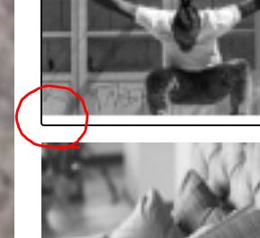

[← 뒤로가기](./README.md)

<br />

# QnA

**1. 버튼을 클릭했을 시에 이미지가 우측 모서리 쪽으로 이동하는 현상**

**2. `photoGalleryButtons[]`의 순서를 0-3으로 각각 다르게 입력해도 `e.currentTarget`은 [3]번 버튼만 출력된다.**

**3. 이미지 클릭시 캡션 텍스트가 바뀌게 하는 이벤트**

# TIL

10일차 학습을 통해 배운 내용을 정리합니다.

# PhotoGallery 실습 과제

## 1. HTML 마크업

* [질문] 본문의 제목을 화면에서 숨기고 스크린 리더 사용자에게만 읽어주게 하는 방법은 어떤 건가요? 
```html
<h1 class="photoGallery__title">라이프 스타일 ★ 포토 갤러리</h1>
```
  + 내가 생각한 방법 (하지만 틀렸음)    
    1.`display: none;` 
      화면에서는 렌더링 되지 않지만 보조기기 사용자에게 보이지도 들리지도 않음
    2. `aria-hidden: true`
      의미가 없는 컨텐츠를 보조기기가 읽어주지 않게 만드는 것일 뿐 화면에 렌더링 되며 내가 원하는 방식으로 구현되지 않음

## 2. Sass
```html
    <!-- <link rel="stylesheet" href="./PhotoGallery.scss"> -->
```

## 3. CSS 스타일
* 이번 예제는 반응형웹이 아니다.

### 3-1. `h1`과 `figcaption`에 포지션을 속성을 공통으로 주려고 아래 처럼 따로 중복 선택을 해서 속성을 주었다. 
  + [개선방안] 한 요소에 적용한 속성을 다른 곳에 빼서 입력하면 어떤 배치속성을 주었는지 헷갈릴 뿐아니라 나중에 유지보수가 어려워진다. 한 요소에 적용한 속성은 한 곳에 몰아서 입력하기 분산하면 나만 고생.
```css
h2, figcaption {
    position: absolute;
}

h2 {
  margin: 0;
  background: #fff;
}
```

### 3-2. `<ul>`, `<li>` 등 리스트의 점 없애는 방법
```css
list-style: none;
```

### 3-3. [질문] 버튼 요소에 `border: 0;`을 적용했지만 여전히 버튼 안에 남아있는 공백을 없애는 방법
```css
.photoGallery__button {
    padding: 0;
    border: 0;
}
```

<br>

#### [해결] 버튼 요소에 `outline: 0;` 적용한다. 
```css
.photoGallery__button {
    border: 0;
    outline: 0;
}
```
### 3-4. [질문] 버튼을 클릭했을 시에 이미지가 우측 모서리 쪽으로 이동하는 현상
  + 이런건 어떻게 검색해야 할지도 모르겠다... ㅜㅜ 


## 5. JS 

### 5-1. [질문] `photoGalleryButtons[]`의 순서를 0-3으로 각각 다르게 입력해도 `e.currentTarget`은 [3]번 버튼만 출력된다.

### 5-2. [질문] 이미지 클릭시 캡션 텍스트가 바뀌게 하는 이벤트
* 아래의 `.textContent`을 사용해보았다. [3]버튼을 클릭했을 때 `caption`의 텍스트는 바뀌지만, 바뀌고 나서는 다른 버튼을 클릭해도 여전히 "캠핑카 위에서 대화를 나누는 남자들"로만 나온다. 
```js
function handleChangeCapTionText1(e) {
    // console.log(e.currentTarget);
    document.querySelector('.photoGallery__bigPhotoCaption').textContent="캠핑카 위에서 대화를 나누는 남자들";
}

photoGalleryButtons[1] = button.addEventListener('click', handleChangeCapTionText1);
```

## 6. [개념정리] CSS - 이미지 필터 효과
### 6-1. `filter` 속성
  + contrast() : 이미지 대비 조정
    + 0% 완전히 회색 이미지, 100% 이미지가 그대로 유지, 100% 이상도 가능 대비가 더 큰 이미지가 생성
  + grayscale() : 이미지를 흑백으로 변환
    + 0% 이미지가 그대로 유지, 100% 완전히 픅백 이미지

[MDN [filter]] (https://developer.mozilla.org/ko/docs/Web/CSS/filter)