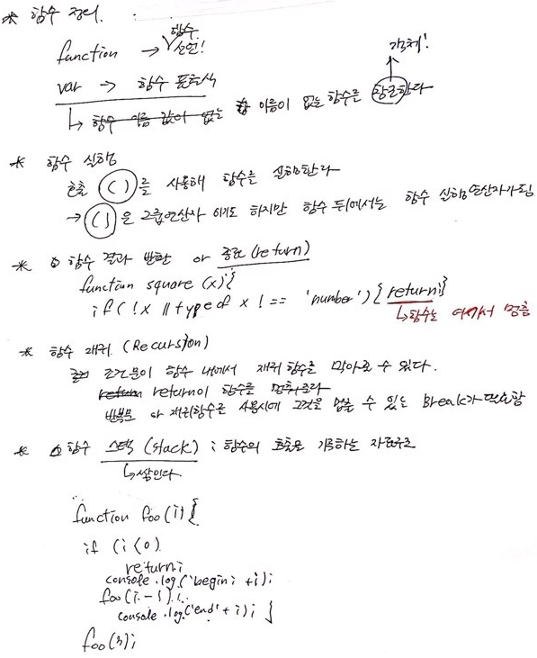
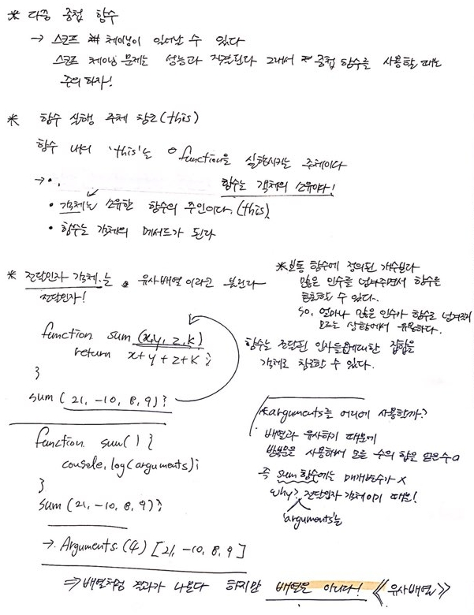
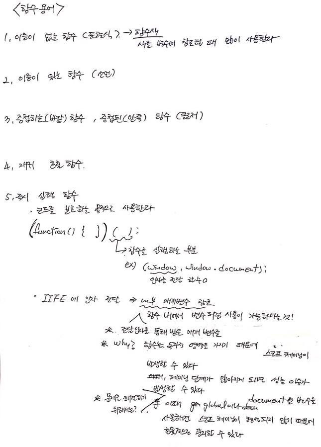
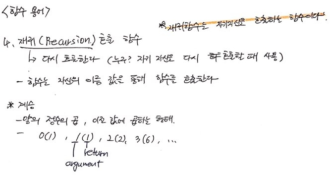
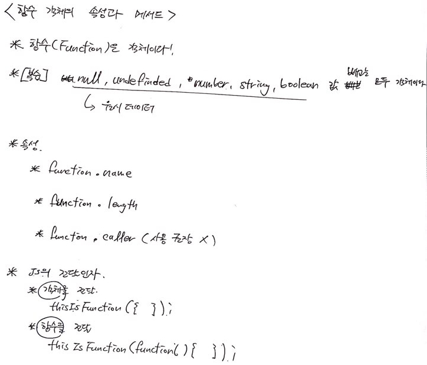
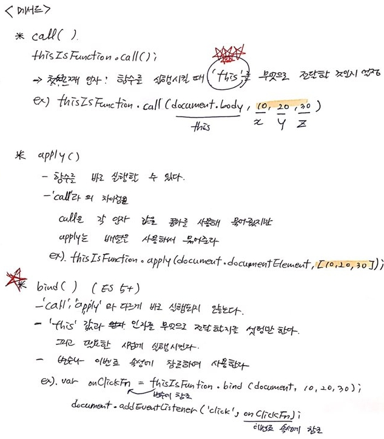

[← 뒤로가기](./README.md)


<br/>

# TIL

12일차 학습을 통해 배운 내용을 정리합니다.

## 1. 함수 객체
* 함수 정의, 함수 실행, 함수 재귀, 함수 스택


### 1-1. 함수 재귀
* 함수 내에서 자기 자신을 [재귀적(再歸的)](https://dic.daum.net/word/view.do?wordid=kkw000220472&supid=kku000278142)으로 호출하는 함수
```JS
var condition = 10;
function callMe() {
  // 조건 변수가 충족하면 함수 종료
  if (condition-- > 0) { return; }
  // 조건 변수 값이 조건에 충족하지 않으면 재귀 호출
  callMe();
}
```
<br>

* 다중 중첩 함수, 함수 실행 주체 참조(`this`), `arguments`, 유사 배열


## 2. 함수 용어



### 2-1. `this`
* `this`가 가리키는 컨텍스트는 **함수를 실행시키는 주체(대상)** 이다.

### 2-2. `arguments`
* 전달인자를 집합 객체의 형태로 함수에 전달된 인자들의 집합을 말함.
* 단, 유사 배열(like Array Object)이며 진짜 배열객체(Array)가 아니다.

### 2-3. 배열(Array)과 유사배열(like Array Object)의 차이점
* 배열 객체는 내장되어 있는 속성을 사용할 수 있으나 유사배열은 사용할 수 없다.
  + 예) `.pop()`, `.push()` 등
<br>

* JS와 DOM API 그리고 라이브러리
  + DOM API : `HTMLCollection`, `NodeList`, `getAttribute()`, `setAttribute()` 등
  + JS : `Array`, `Object`, `Function`
  + 라이브러리 : jQuery Library

## 3. 함수 객체의 속성


## 4. 함수 객체의 메서드



## 5. DOM API란?
* `API` : 웹 환경에서 작동하는 애플리케이션(프로그램)을 개발(프로그래밍)하기 위한 환경(방법)
  + 예) 문서의 객체에 접근하고, 접근한 객체에서 다른 형제나 부모에 접근하는 행위
  + 예) 접근한 객체의 속성을 변경 하거나 이벤트는 행위
  + 예) `React API`, `Node API` 등등

* `DOM` : `Document Object Model`(문서 객체 사이의 관계)
  + 문서 객체 요소들간의 부모, 자식, 형제 관계(Model)를 말한다.  

* `DOM API` : 웹에서의 네이티브 개발 환경
  + 웹의 문서(`Document`)에 접근하고 접근한 문서 객체에 속성을 변경하거나, 이벤트를 연결하는 기능을 사용하는 환경을 말한다. 
  + 여기서 중요한 건 `DOM`은 **웹에서 사용되는 네이티브 환경**이다.  

## 6. 공부 메모 
* [Headings Map](https://chrome.google.com/webstore/detail/headingsmap/flbjommegcjonpdmenkdiocclhjacmbi) 확장은 문서의 제목 순서가 잘 지켜졌는지 확인할 수 있음 -> 시멘틱 마크업의 첫 걸음!
