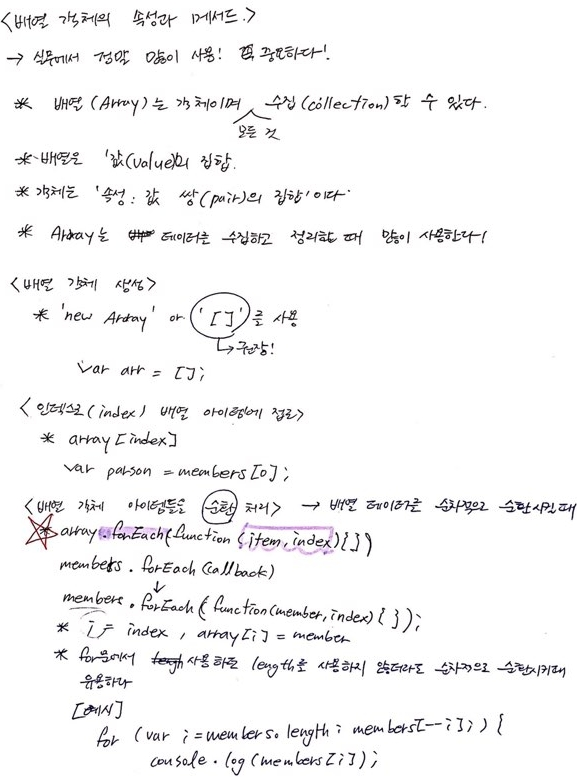
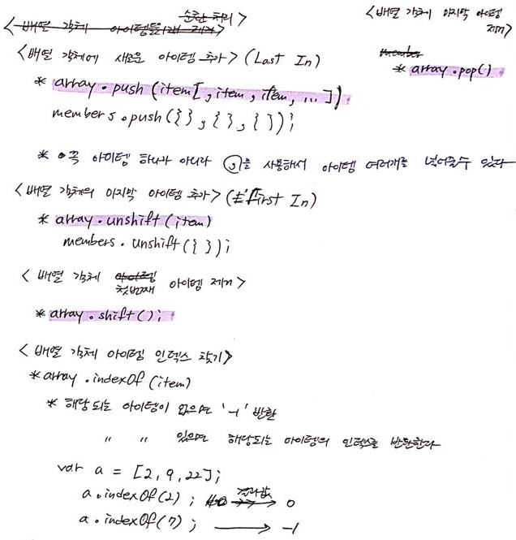
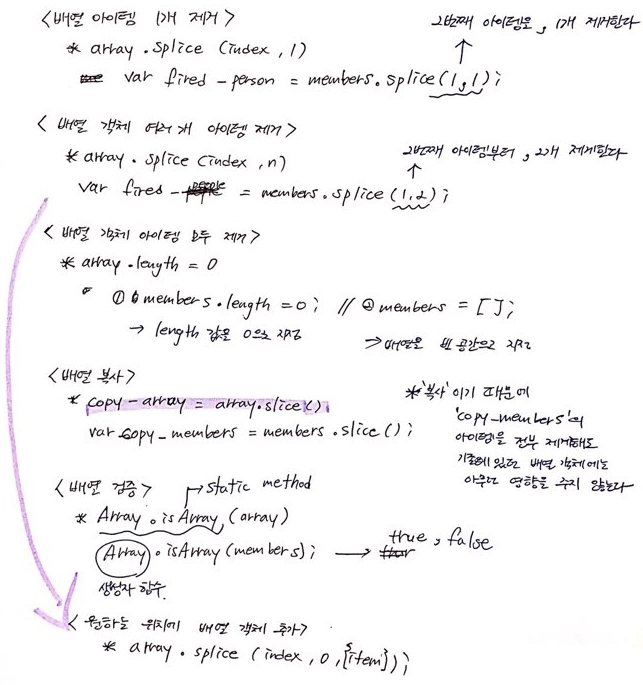
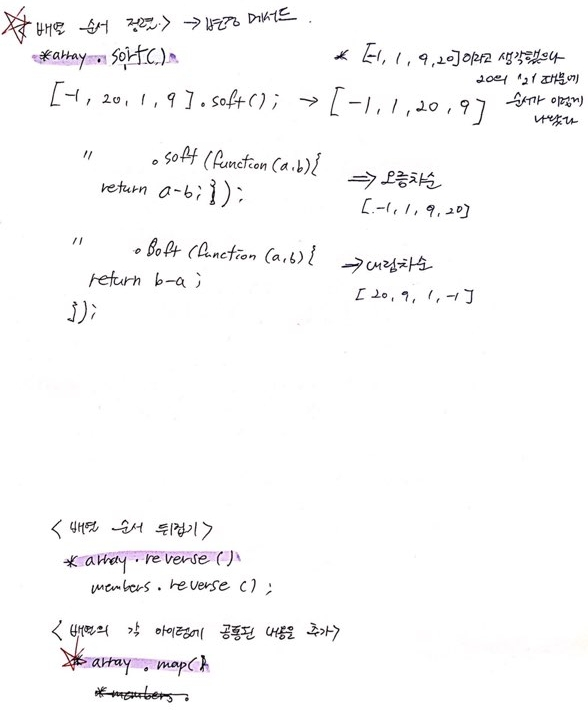
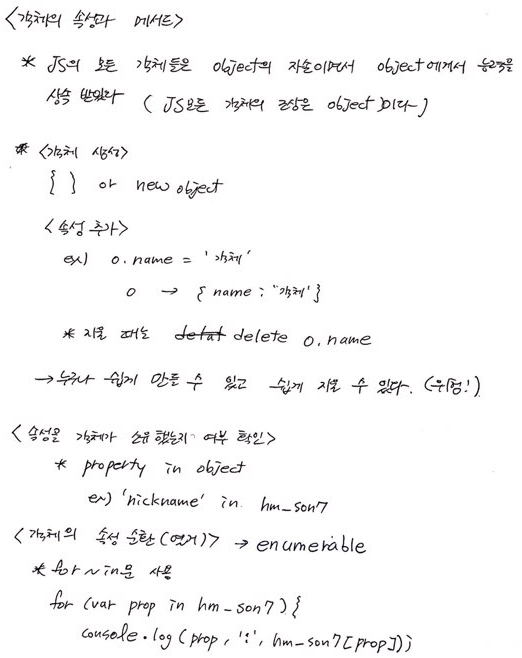
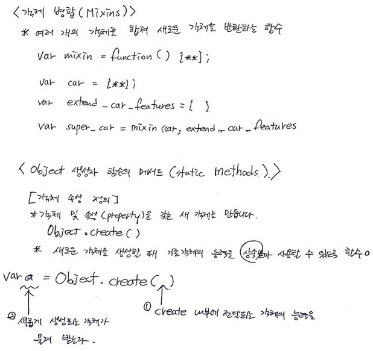
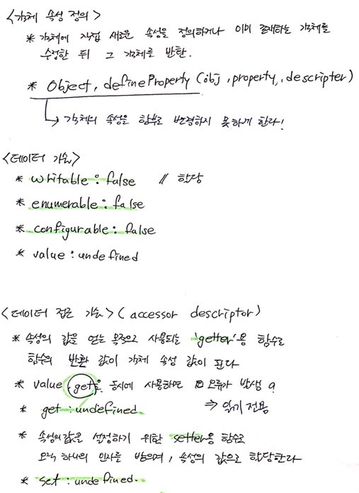
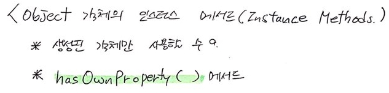

[← 뒤로가기](./README.md)

<br/>

# TIL

13일차 학습을 통해 배운 내용을 정리합니다.

## 1. 배열 객체

### 1-1. 배열 객체, `.forEach()`

```js
var countBrand = ["하나", "둘", "둘", "넷"];
var countBrandEach = function (item, index) {
  console.log("i = ", index);
  console.log("array[i] = ", item);
};

countBrand.forEach(countBrandEach);

// for문으로 바꿔보기
for (var i = 0; i < countBrand.length; i++) {
  console.log("i = " + i);
  console.log("countBrand[i] = " + item);
}
```

```js
var myFavoriteBeverage = [
  { 스타벅스: "허니 자몽 블랙티" },
  { 이디야: "화이트 초콜릿" },
  { 공차: "자몽 그린티" },
  { 쥬씨: "오렌지 파인애플" },
  { 갬성카페: "사진에 이쁘게 나오는 음료" },
];
var myFavoriteBeverageEach = function (beverage, index) {
  console.log(beverage);
  console.log(index);
};

myFavoriteBeverage.forEach(myFavoriteBeverageEach);

//for문으로 바꿔보기
for (var i = 0; i < myFavoriteBeverage.length; i++) {
  console.log(myFavoriteBeverage[i]);
}
```



<br/>

### 1-2. `.push()`, `.unshift()`, `.shift()`, `.indexOf()`

```js
countBrand.push("셋", "여섯", "아홉"); // ["하나", "둘", "둘", "넷", "셋", "여섯", "아홉"]
countBrand.unshift("열", "열하나", "일곱"); // ["열", "열하나", "일곱", "하나", "둘", "둘", "넷", "셋", "여섯", "아홉"]

var tenItem = countBrand.shift(); // "열" 추출 됨
console.log(countBrand); // ["열하나", "일곱", "하나", "둘", "둘", "넷", "셋", "여섯", "아홉"]

var nineItem = countBrand.pop(); // "아홉" 추출 됨
console.log(countBrand); // ["열하나", "일곱", "하나", "둘", "둘", "넷", "셋", "여섯"]

var orderOfDulItem = countBrand.indexOf("둘"); // 3 반환 (값이 중복될 경우, 가장 먼저 매칭되는 인덱스 반환)
```

```js
myFavoriteBeverage.push({디저트 : "스콘 또는 치즈케익"});

myFavoriteBeverage.unshift({제일 좋아하는 것 : "아메리카노"});

var americano = myFavoriteBeverage.shift();
// [{ 이디야: "화이트 초콜릿" }, { 공차: "자몽 그린티" }, { 쥬씨: "오렌지 파인애플" }, { 갬성카페: "사진에 이쁘게 나오는 음료" }]

var dessert =  myFavoriteBeverage.pop();
// [{ 스타벅스: "허니 자몽 블랙티" }, { 이디야: "화이트 초콜릿" }, { 공차: "자몽 그린티" }, { 쥬씨: "오렌지 파인애플" }]

var findCafe = myFavoriteBeverage.indexOf({ 스타벅스: "허니 자몽 블랙티" });
```



<br/>

### 1-3. `.splice()`, `.length = 0`, `.slice(), `.isArray()`

```js
var elevenItem = countBrand.splice(0, 1); // ["열하나"] 반환 (⚠️ 원본 배열 업데이트)
console.log(countBrand); // ["일곱", "하나", "둘", "둘", "넷", "셋", "여섯"]

var cloneCountBrand = countBrand.slice(); // 배열 복제
console.log(cloneCountBrand); // ["일곱", "하나", "둘", "둘", "넷", "셋", "여섯"]
cloneCountBrand.length = 0; // [], 아이템 모두 비움

console.log(countBrand); // ["일곱", "하나", "둘", "둘", "넷", "셋", "여섯"]

countBrand.splice(1, 0, "백", "원오원 응?", "백둘"); // [] 반환 (제거된 것이 없음)
console.log(countBrand); // ["일곱", "백", "원오원 응?", "백둘", "하나", "둘", "둘", "넷", "셋", "여섯"]

Array.isArray(document.documentElement.children); // false, HTMLCollection 유사배열은 배열이 아니므로
```



<br/>

### 1-4. `.sort()`, `.reverse()`, `.map()`

```js
var numbers = [3, 9, 6, 1, -10, 101];

numbers.sort(); // [-10, 1, 101, 3, 6, 9]

numbers.sort(function (x, y) {
  return x - y;
});

console.log(numbers); // [-10, 1, 3, 6, 9, 101] (⚠️ 원본 업데이트 됨)

numbers.sort(function (x, y) {
  return y - x;
});

console.log(numbers); // [101, 9, 6, 3, 1, -10] (⚠️ 원본 업데이트 됨)

var names = ["김한나", "지훈", "김데레사", "임은섭", "심재완", "김지만"];

names.sort(function (n1, n2) {
  return n1 < n2 ? -1 : n1 > n2 ? 1 : 0;
});

console.log(names); // ["김데레사", "김지만", "김한나", "심재완", "임은섭", "지훈"] (⚠️ 원본 업데이트 됨)

names.reverse();

console.log(names); // ["지훈", "임은섭", "심재완", "김한나", "김지만", "김데레사"]

var namesCode = names.map(function (name, index) {
  return (
    '<span class="personName" data-index="' +
    (index + 1) +
    '">' +
    name +
    "</span>"
  );
});

console.log(namesCode); // ["<span class="personName" data-index="1">지훈</span>", "<span class="personName" data-index="2">임은섭</span>", "<span class="personName" data-index="3">심재완</span>", "<span class="personName" data-index="4">김한나</span>", "<span class="personName" data-index="5">김지만</span>", "<span class="personName" data-index="6">김데레사</span>"]

console.log(names); // ["지훈", "임은섭", "심재완", "김한나", "김지만", "김데레사"] (⚠️ 원본 업데이트 안 됨)
```



<br/>

### 배열 객체에서 많이 사용되는 메서드

MDN 문서를 시간내서 읽어보자! (암기할 필요는 없음. 자주 사용하면 자연스레 기억 됨)

- [forEach()](https://developer.mozilla.org/ko/docs/Web/JavaScript/Reference/Global_Objects/Array/forEach)
- [map()](https://developer.mozilla.org/ko/docs/Web/JavaScript/Reference/Global_Objects/Array/map)
- [sort()](https://developer.mozilla.org/ko/docs/Web/JavaScript/Reference/Global_Objects/Array/sort)
- [filter()](https://developer.mozilla.org/ko/docs/Web/JavaScript/Reference/Global_Objects/Array/filter)
- [find()](https://developer.mozilla.org/ko/docs/Web/JavaScript/Reference/Global_Objects/Array/find)
- [findIndex()](https://developer.mozilla.org/ko/docs/Web/JavaScript/Reference/Global_Objects/Array/findIndex)
- [indexOf()](https://developer.mozilla.org/ko/docs/Web/JavaScript/Reference/Global_Objects/Array/indexOf)
- [every()](https://developer.mozilla.org/ko/docs/Web/JavaScript/Reference/Global_Objects/Array/every)
- [some()](https://developer.mozilla.org/ko/docs/Web/JavaScript/Reference/Global_Objects/Array/some)
- [reduce()](https://developer.mozilla.org/ko/docs/Web/JavaScript/Reference/Global_Objects/Array/reduce)
- [slice()](https://developer.mozilla.org/ko/docs/Web/JavaScript/Reference/Global_Objects/Array/slice) : 새롭게 잘라낸다 // 복제할 때 유용
- [splice()](https://developer.mozilla.org/ko/docs/Web/JavaScript/Reference/Global_Objects/Array/splice) : 원본을 수정 또는 제거
  - 사용에 주의 필요
  - 해결 방법? 원본을 복제(slice)한 다음 수정 // 참조
- [isArray()](https://developer.mozilla.org/ko/docs/Web/JavaScript/Reference/Global_Objects/Array/isArray)
- [from()](https://developer.mozilla.org/ko/docs/Web/JavaScript/Reference/Global_Objects/Array/from) : 유사 배열을 배열로 만들어주는 메서드

<br/>

---

<br/>

## 2. 객체 / 상속

- JS의 모든 객체들은 `object`의 자손이면서 `object`에게서 능력을 상속받았다. (JS의 모든 객체의 조상은 `object`이다.)

### 2-1. 객체, `property in object`, `for ~ in`문

### 예제

```js
// 손홍민 선수 정보를 담은 객체 생성
// 출처: https://goo.gl/VxH57C
var hm_son7 = {
  birth: "1992년 7월 8일",
  name: "손홍민",
  nationality: "대한민국",
  hometown: "춘천",
  nickname: ["소니", "손세이셔널"],
  hobby: ["독서", "게임"],
  height: "182cm",
  weight: "77kg",
  job: "프로 축구선수",
  position: "윙어",
  club: "토트넘 핫스퍼(Tottenham Hotspur) F.C.",
  picture: "https://goo.gl/GK11yQ",
  sns: {
    facebook: "https://www.facebook.com/heungminsonofficial",
    instagram: "https://www.instagram.com/hm_son7",
  },
};
```

### 객체 생성

- `{}` 또는 `new object`을 사용해서 객체를 생성한다.

```js
var hm_son7 = {};
```

### 속성 추가 / 제거

- 객체의 속성을 추가하거나 제거하기는 너무나도 쉽다. 즉, 누구나 내 데이터를 지우고 추가 할 수 있다는 얘기도 된다. 위험하다.

```js
// 속성 제거
delete hm_son7.hometown;

// 속성 추가
hm_son7.hometown = "춘천";
```

### 속성을 객체가 소유했는지 확인하기

```js
"nickname" in hm_son7; // true
```

- 왜 객체의 속성을 쌍/홑따옴표로 감싸줄까?
  - `typeof`기능을 사용해서 속성의 `type`을 확인해보면 `string`이라는 값이 나온다. 이는 객체의 `key`도 문자데이터라는 것이다.
  ```js
  typeof key; // 'string'
  ```

### 객체의 속성 순환(열거 enumerate)

- for ~ in문 사용

```js
for (var property in hm_son7) {
  console.log(property);
}
```



<br/>

### 2-2. 객체 병합, `.create()`



<br/>

### 2-3. `.defineProperty()`



<br/>

### 2-4. `.preventExtensions()`, `.seal()`, `.freeze()`


<br/>

### 2-5. `.hasOwnProperty()`


<br/>
