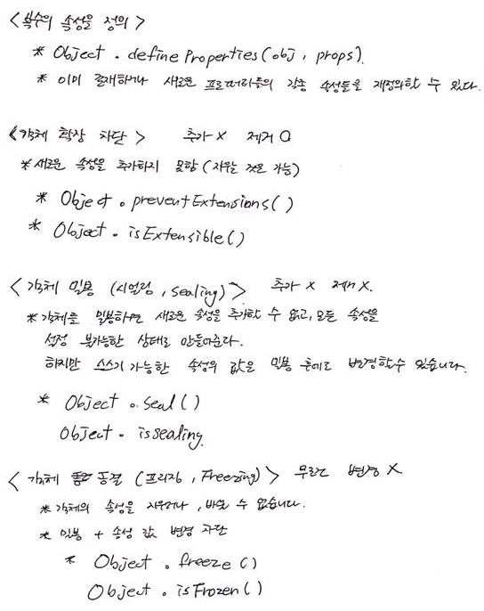

[← 뒤로가기](./README.md)

 

# TIL

13일차 학습을 통해 배운 내용을 정리합니다.

## 1. 배열 객체

### 1-1. 배열 객체, `.forEach()`

### 1-2. `.push()`, `.unshift()`, `.shift()`, `.indexOf()`

### 1-3. `.splice()`, `.length = 0`, `.slice(), `.isArray()`

### 1-4. `.sort()`, `.reverse()`, `.map()`

### 배열 객체에서 많이 사용되는 메서드

- forEach()
- map()
- sort()
- filter()
- find()
- findIndex()
- indexOf()
- every()
- some()
- reduce()
- slice()  : 새롭게 잘라낸다 // 복제
- splice() : 원본을 수정 또는 제거 
  + 사용에 주의 필요 
  + 해결 방법? 원본을 복제(slice)한 다음 수정 // 참조
- isArray()
- from() : 유사 배열을 배열로 만들어주는 메서드

---

 

## 2. 객체 / 상속

### 2-1. 객체, `property in object`, `for ~ in`문

### 2-2. 객체 병합, `.create()`

### 2-3. `.defineProperty()`

### 2-4. `.preventExtensions()`, `.seal()`, `.freeze()`

### 2-5. `.hasOwnProperty()`
