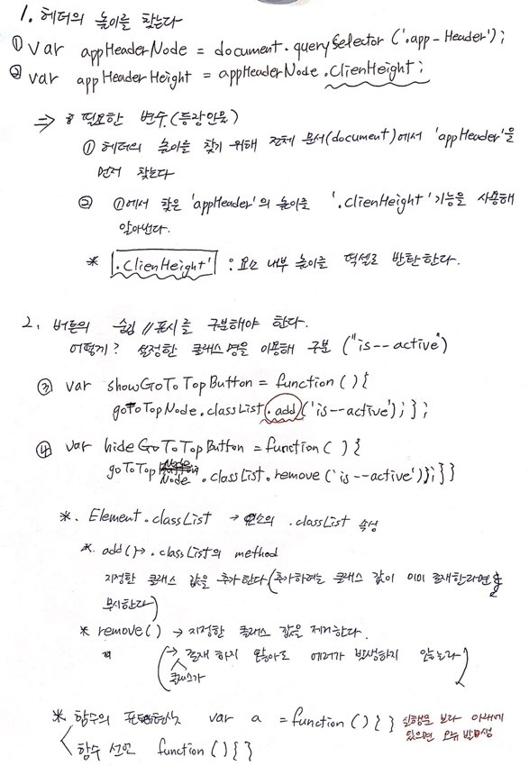
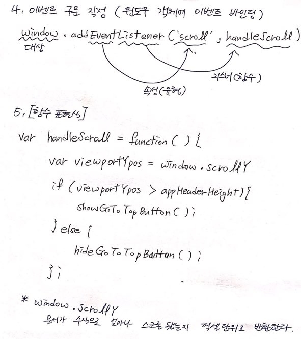

[← 뒤로가기](./README.md)

<br/>

# TIL

14일차 학습을 통해 배운 내용을 정리합니다.

## 20201031 오프라인 수업 정리

### 함수 미션 풀어보기

```
  - 미션 1-1. 평방미터(㎡, square meter) → 평(坪, pyeong) 함수를 작성해보세요. (참고: 3.3058㎡ = 1평)
  - 미션 1-2. 작성한 함수를 사용해 26평(坪)이 몇 평방미터(㎡)인지 계산해보세요.
  - 미션 2-1. 평(坪) → 평방미터(㎡) 함수를 작성해보세요.
  - 미션 2-2. 작성한 함수를 사용해 158.6784평방미터(㎡)가 몇 평(坪)인지 계산해보세요.
  - 미션 3-1. 평방미터(㎡) ↔ 평(坪) 함수를 작성해보세요. (조건에 따라 전달된 값을 평(坪) 또는 평방미터(㎡)로 반환)
  - 미션 3-2. 작성한 함수를 사용해 32평(坪) 값을 전달해 평방미터 값을 구해보세요.
  - 미션 3-3. 작성한 함수를 사용해 330.58 평방미터(㎡) 값을 전달해 평(坪) 값을 구해보세요.
```

<details open>
  <summary>[미션 1-1, 1-2] 평방미터 값을 평수 값으로 반환하는 유틸리티 함수</summary>
  <br>

- "내가 작성한 함수"가 틀린 이유 : 문제에서 요구하는 것은 **평수 값**이다. 하지만 내가 작성한 함수에서 나오는 결과 값은 **평방미터 값**이다.
- 값을 반환 할때는 구하려는 값의 단위를 같이 반환 값에 넣지 않는다. <br>
  예) `return peyung + '평';`
- `A값을 B로 변환한다`에서 "변환"의 의미로 `2`를 입력해 주기도 한다.

  ```js
  // (1평 = 3.3058평방미터) 기준이 되는 상수 선언
  const SQUARE_METERS_PER_PYEONG = 3.3058;

  // 평방미터 값을 평수 값으로 반환하는 유틸리티 함수
  function squareMeter2pyeong(squareMeterValue) {
    return squareMeterValue / SQUARE_METERS_PER_PYEONG;
  }
  ```

  ```js
  [내가 작성한 함수]
  function houseSize(peyung) {
  return 3.3058 * peyung;
  }

  houseSize(peyung);
  ```

</details>

<details open>
  <summary>[미션 2-1, 2-2] 평수 값을 평방미터 값으로 반환하는 유틸리티 함수</summary>
  <br>

- 상수 값을 함수 안에 지정하면 다른 함수에서는 사용할 수 없다. 밖에다 선언하기!
- 상수는 관례적으로 대문자로 이름 설정하기

```js
function pyeong2squareMeter(pyeongValue) {
return pyeongValue \* SQUARE_METERS_PER_PYEONG;
}

var result1 = squareMeter2pyeong(158.6784); // 몇 평 ???
var result2 = pyeong2squareMeter(result1);

console.log('result1:', result1); // 48 평
console.log('result2:', result2);
```

```js
[내가 작성한 함수]
function pyeong2squareMeter(pyeongValue) {
return pyeongValue * 3.3058;
}

pyeong2squareMeter(pyeongValue);

/* 3.3058을 상수 값을 설정하기 */
function pyeong2squareMeter(pyeongValue) {
  const squareMeter = 3.3058;
  return pyeongValue * squareMeter;
}

// 상수 값을 함수 안에 지정하면 다른 함수에서는 사용할 수 없다. 밖에다 선언하기
// 상수는 관례적으로 대문자로 이름 설정하기
const SQUARE_METERS_PER_PYEONG = 3.3058;

function pyeong2squareMeter(pyeongValue) {
  return pyeongValue * squareMeter;
}
```

</details>

<details open>
  <summary>[미션 3-1] 평방미터(㎡) ↔ 평(坪) 함수를 작성해보세요. (조건에 따라 전달된 값을 평(坪) 또는 평방미터(㎡)로 반환)</summary>
  <br>

- 프로그래밍 사고의 힘(조건에 따른 변수를 만들 수 있어야 한다)
- "내가 작성한 함수"가 틀린 이유 : 해당 함수는 `if ~ else if`를 사용하여 조건 안에 또 다른 조건을 만들 필요는 없다.

```js
function toggleFloorSpaceValue(value, isPyeongValue) {
  if (isPyeongValue) {
    // 조건 1. 값이 평수인 경우
    return pyeong2squareMeter(value);
  } else {
    // 조건 2. 값이 평방미터인 경우
    return squareMeter2pyeong(value);
  }

  // 3항식
  return isPyeongValue ? pyeong2squareMeter(value) : squareMeter2pyeong(value);
}

// 미션 3-2. 작성한 함수를 사용해 32평(坪) 값을 전달해 평방미터 값을 구해보세요.
var pV1 = toggleFloorSpaceValue(32, true);
// 미션 3-3. 작성한 함수를 사용해 330.58 평방미터(㎡) 값을 전달해 평(坪) 값을 구해보세요.
var pV2 = toggleFloorSpaceValue(158.6784);

console.log(pV1 /* 평방미터 */, pV2 /* 평 */);
```

```js
[내가 작성한 함수]
var squareMeter2pyeong = function (squareMeterValue) {
return squareMeterValue / 3.3058;
};

var pyeong2squareMeter = function (pyeongValue) {
  return pyeongValue * 3.3058;
};

function houseSize(squareMeterValue, pyeongValue) {
  if (pyeongValue === false) {
    return squareMeter2pyeong();
  } else if (squareMeterValue === false) {
    return pyeong2squareMeter();
  }
}
```

</details>

### 이디야 페이지 상단으로 올리는 버튼 예제

- 페이지를 상단으로 올리는 버튼 만들기
- 버튼이 바로 뜨지 않고 스크롤이 내려가면 표시, 올라가면 숨김 기능을 갖고 있는 조건으로 만들기

```js
[예제];
var appHeaderNode = document.querySelector(".app-header");
var appHeaderHeight = appHeaderNode.clientHeight;
var showGoToTopButton = function () {
  goToTopNode.classList.add("is--active");
};
var hideGoToTopButton = function () {
  goToTopNode.classList.remove("is--active");
};

var handleScroll = function () {
  var viewportYpos = window.scrollY;
  if (viewportYpos > appHeaderHeight) {
    console.log("goToTopButton 활성화");
    showGoToTopButton();
  } else {
    console.log("goToTopButton 비 활성화");
    hideGoToTopButton();
  }
};

window.addEventListener("scroll", handleScroll);
```

#### 함수를 작성하기 전 생각해야 할 것

- **하려고 하는 일(함수)에 어떤 등장인물(변수)를 출연시킬 것인가?**

#### 이디야 예제 코드 해설

1. 내가 하려고 하는 것!

   - 사용자가 스크롤을 내리면 `goToTopButton`이 나왔으면 좋겠다.

2. 하고자 하는 것이 실행되는 기준(순간)이 언제인가?

   - 사용자가 스크롤를 헤더 높이보다 더 아래로 내렸을 때 버튼이 나왔으면 좋겠다.
   - 필요한 변수 : 헤더의 높이을 알아내는 변수

3. 2번의 조건이 실행되기 위해서 필요한 다른 조건이 있는가?

   - 버튼을 표시 / 감춤 할 수 있는 기능이 필요하다. 헤더 높이보다 높은 곳에 스크롤이 있을 때는 버튼이 감춰져야 하기 때문이다.
   - 방법 : 버튼이 표시 / 감춤 되었을 때 스타일링을 확인하고 해당 스타일링의 선택자의 클래스 값을 추가/ 제거 하는 방법을 사용한다.
   - 확인 : 버튼 표시 클래스 값 = `is--active`
   - 필요한 변수 : `is--active` 클래스 값을 추가하는 변수/ `is--active` 클래스 값을 제거하는 변수




- 왜 `var viewportYpos = window.scrollY;` 구문은 함수 밖에 선언하지 않고 함수 영역 안에 선언하는가?
  - 밖에 선언한다면 : `window.scrollY`에는 처음 페이지가 열렸을 때의 값인 `0`만을 가지게 된다.
  - 안에 선언한다면 : 사용자가 이벤트 유형인 `scroll`을 할때마다 함수가 실행되면서 `scroll`의 값이 변수에 할당된다.

## 정리

1. 함수를 작성할 때

   - 내가 반환하려는 결과 값을 무엇으로 할 것인지를 확인하기
   - 만들려는 함수에서 사용되는 변수는 연극의 **등장인물**이다. 어떤 인물(변수)를 등장시킬지 먼저 생각하기

1. 제발!!!!!!!!!! **문자 값!**!!!!!! 쌍 따옴표!! 작은 따옴표!!

1. `A값을 B로 변환한다` 할 때 "변환"의 의미로 `2`를 입력해 주기도 한다.

## 손코딩 과제


