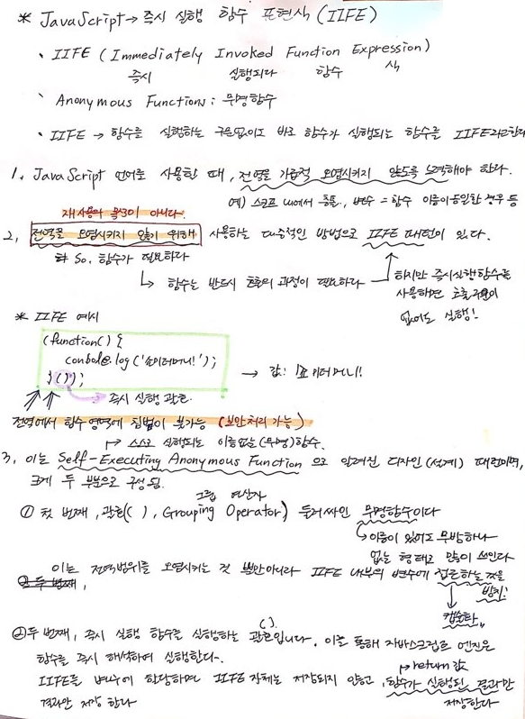

[← 뒤로가기](./README.md)

<br/>

# 밋업에서 질문하기

1. `goToTopNode`는 html객체의 클래스 이름인가?
   `var appHeaderNode = document.querySelector(".app-header");` `appHeaderNode`변수 처럼 선언해 준적이 없는데? 어떻게 `goToTopNode` 객체에 메서드가 적용이 되는 것인가?

```js
var showGoToTopButton = function () {
  goToTopNode.classList.add("is--active");
};
```

1. `var viewportYpos = window.scrollY;`에서 `pos`는 무슨의미인가? (혹시 `position`)

# TIL

15일차 학습을 통해 배운 내용을 정리합니다.

## IIFE 즉시 실행 함수

## 강의 내용 정리




<br>

## FAQ

- 왜 IIFE 패턴을 사용해야 할까?
- 즉시 실행 함수 안에 `return`이 있으면 왜 `return`값이 즉시 실행 함수 결과 값으로 나올까?
- "전역을 오염시킨다" 라는 것은 무슨 뜻일까?
  

### 고민해보기

- 10초 후 함수가 실행되었을 때 결과 값이 `undefined`가 나올 것이라고 생각했다. 함수가 실행되고 나면 함수 블록은 더 이상 존재하지 않고 소멸된다고 생각했기 때문이다. 하지만 결과 값은 `outerFunction`으로 나왔다. 왜일까?
- "클로저"를 배우기 전에 고민해보자!
  

## 참고

[즉시 실행 함수 표현(IIFE, Immediately Invoked Function Expression)](https://developer.mozilla.org/en-US/docs/Glossary/IIFE)
