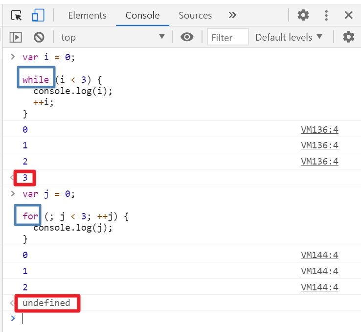
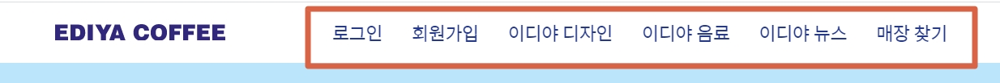
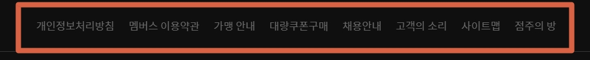
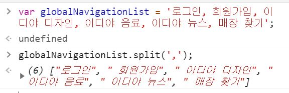
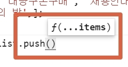
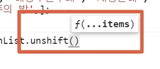
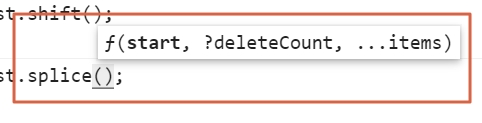
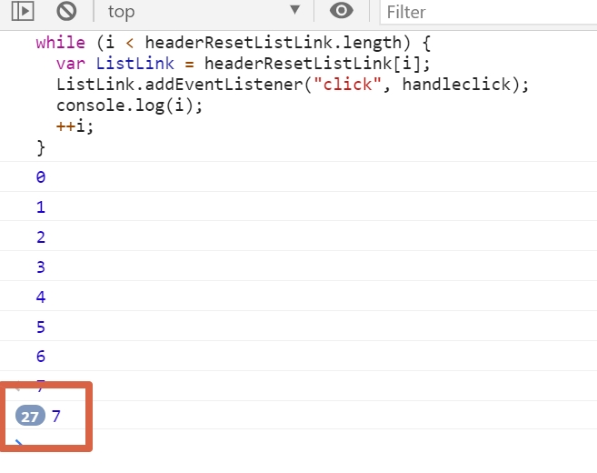

[← 뒤로가기](./README.md)

<br/>

# TIL

14일차 학습을 통해 배운 내용을 정리합니다.

## 20201031 오프라인 수업 정리

<br />

## `Node.js` 환경에서 `js` 디버깅 하는 방법

1. 실행하려는 파일의 폴더를 에디터로 열기
   

1. 터미널에 `node` + `디버깅 하려는 파일명` 입력
   

1. 터미널에 `code .` 입력하여 새 창에 해당 폴더 열기
   

1. 중단점 지정 하기 <br />
   

1. `실행` 버튼 선택 후 `실행 및 디버그` 클릭
   

1. `node.js` 선택 <br />
   

1. 디버깅 실행 전체 화면
   

## `Web`환경과 `Node.js`환경 비교하기

- **`js` 파일을 디버깅할 때 왜 `Web`환경(Chorme)이 아닌 `Node.js`환경에서 실행하는가?**

| 구분      | 차이                                                                                                                                     | 문제                                                                                                                             |
| --------- | ---------------------------------------------------------------------------------------------------------------------------------------- | -------------------------------------------------------------------------------------------------------------------------------- |
| `Web`     | `js`를 독립적으로 실행할 수 없다. <br />`html`에 `js`파일을 불러와서 `html`을 실행시키는 형태로 `js`를 구동해야 한다.                    | html`에 불러온 여러 `js`파일은 하나의 파일 처럼 합쳐진다. 만약 각각의 파일에 선언한 변수의 이름이 같다면 전역 스코프는 오염된다. |
| `Node.js` | `js`를 독립적으로 실행할 수 있다. <br /> `Node.js`는 각 `js`파일을 독립적으로 관리하기 때문에 `js`파일을 단독으로 구동하기에 문제가 없다 | -                                                                                                                                |


## 수업 전 질문

- **같은 구간을 반복하는 "문"인데 왜 콘솔패널 마지막에 나오는 값이 다른가요?**
- 질문한 값 **(`3`, `undefined`)은 중요하지 않다.** 해당 값이 나오는 것은 브라우저 콘솔패널의 오류(?)이다. 집중해야 할 것은 그 값이 아닌 해당 **반복문이 출력하는 값이 중요하다.** 그래서 반복문을 공부하는 과정에서는 콘솔 패널보다. 중단점을 사용해 디버그하는 방법으로 공부하는 것을 추천한다.
  

## 배열 객체 실습하기

- 배열 가지고 놀기 (반복 처리 + 배열 메서드)
- 참조형 데이터인 배열을 복사해 안전하게 활용하기
- 배열(집합) + 이벤트 핸들링
- [[MDN]배열 메서드](https://bit.ly/ArrayReference)

```
1. 배열 생성 (글로벌, 푸터 내비게이션 / 음료 메뉴 리스트)
2. 특정 배열 아이템을 변수에 할당
3. 배열 아이템 순환하여 Console 패널에 출력
4. 새로운 아이템 추가 (앞 또는 뒤 아이템)
5. 아이템 제거 (앞/뒤 또는 특정 순서에 위치한 아이템)
6. 특정 아이템의 순서 추출
7. 새로운 아이템을 배열의 특정 순서 위치에 추가
8. 배열 복사
9. 배열 아이템에 접근 (첫번째, 특정 순서, 마지막 번째 아이템)
10. 배열 → 문자 → 배열 (메서드 체이닝)
10-1. 문자 -> 배열 -> 문자
```

### 1. 배열 생성 (글로벌, 푸터 내비게이션 / 음료 메뉴 리스트)

- **배열 생성 시 `id` 꼭 만들어줘야 한다!** <br />
  왜? 나중에 배열의 객체의 갯수가 엄청 많아졌을 때 원하는 객체를 `id`로 찾을 수 있다.
- 음료 메뉴 리스트 배열에 이름이 한국어, 영어 두 개 이다. 이 경우 `name`이라는 `key`로 `value`(`ko`, `en`)를 묶어 줄 수 있다.

<br />




```js
// 글로벌 내비게이션
var globalNavigationList = [
  // {id, link, text}
  { id: "gnav-1", link: "/views/login.html", text: "로그인" },
  { id: "gnav-2", link: "/views/signup.html", text: "회원가입" },
  { id: "gnav-3", link: "/views/design.html", text: "이디야 디자인" },
  { id: "gnav-4", link: "/views/beverage.html", text: "이디야 음료" },
  { id: "gnav-5", link: "/views/news.html", text: "이디야 뉴스" },
  { id: "gnav-6", link: "/views/store.html", text: "매장 찾기" },
];

// 푸터 내비게이션
var footerNavigationList = [
  "개인정보처리방침",
  "멤버스 이용약관",
  "가맹 안내",
  "대량쿠폰구매",
  "채용안내",
  "고객의 소리",
  "사이트맵",
  "점주의 방",
];

// 음료 메뉴 리스트
var beverageMenuList = [
  // 음료 정보 객체
  // 고유 식별자(Identify, ID)
  // 음료 종류(category)
  // 음료 이름(name)
  // - 한글 이름(korean)
  // - 영문 이름(english)
  {
    id: "beverage-1",
    category: "쉐이크",
    name: {
      ko: "초코 묻고 더블",
      en: "choco shake",
    },
  },

  {
    id: "beverage-2",
    category: "쉐이크",
    name: {
      ko: "밥대신 라이스",
      en: "rice shake",
    },
  },

  {
    id: "beverage-3",
    category: "쉐이크",
    name: {
      ko: "치즈가 쿠키했대",
      en: "cheese shake",
    },
  },
];
```

```js
[내가 작성한 배열]

// 글로벌 내비게이션
var globalNavigationList = ['로그인', ' 회원가입', ' 이디야 디자인', ' 이디야 음료', ' 이디야 뉴스', ' 매장 찾기',];

// 푸터 내비게이션
var footerNavigationList = ['개인정보처리방침', '멤버스 이용약관', '가맹 안내', '대량쿠폰구매', '채용안내', '고객의 소리', '사이트맵', '점주의 방',];

// 음료 메뉴 리스트
var beverageMenuList = [
   {
      name: '초코 묻고 더블',
      category: '쉐이크',
      enNmae: 'choco shake',
   }
```

#### `.split()` 메소드 사용하여 쉽게 배열 만들기



### 2. 특정 배열 아이템을 변수에 할당

```js
var firstLinkItem = globalNavigationList[2];
```

### 3. 배열 아이템 순환하여 Console 패널에 출력

```js
// footerNavigationList를 순환(Loop)하여 각 아이템을 Console에 출력해보세요.
// while, do ~ while, for
for (var z = 0; z < footerNavigationList.length; ++z) {
  var item = footerNavigationList[z];
  // console.log(item);
}
```

### 4. 새로운 아이템 추가 (앞 또는 뒤 아이템)

- `.unshift()` : 배열의 맨 앞에 아이템 추가
- `.push()` : 배열의 맨 뒤에 아이템 추가
- `...items` : 여러 개의 아이템을 추가 할 수 있다.
  
  

  ```js
  footerNavigationList.unshift("이디야 어플 사용방법");
  footerNavigationList.push("디저트 공모전", "음료 공모전");
  // console.log(footerNavigationList);
  ```

### 5. 아이템 제거 (앞/뒤 또는 특정 순서에 위치한 아이템)

- `.pop()` : 맨 뒤에 아이템 제거
- `.shift()` : 맨 앞에 아이템 제거
- `.splice()` : 특정 순서에 아이템 추가/ 제거

  - `start` : 추가/ 제거를 시작하려는 인덱스 번호
  - `deleteCount` : 제거하려는 아이템 갯수 (`0` 입력시에 아이템 추가)
    

  ```js
  [예시];
  // 맨 뒤에서 2번째에 있는 아이템 1개를 제거
  footerNavigationList.splice(footerNavigationList.length - 2, 1);
  ```

### 6. 특정 아이템의 순서 추출

- `.indexOf()` : 배열에서 아이템 찾기
  - 해당 아이템이 있으면 인텍스 번호 반환
  - 해당 아이템이 없으면 `-1` 반환
- `.findIndex()`
- `.lastIndexOf()`

### 7. 새로운 아이템을 배열의 특정 순서 위치에 추가

- `.splice(startIndex, removeCount, addItems)`

  ```js
  footerNavigationList.splice(2, 3, "한나", "두나", "세나");
  ```

### 8. 배열 복사

- `.slice()`

  ```js
  var cloneFNL = []; // footerNavigationList를 복사할 배열

  // 배열1을 순환해서 배열2에 각 아이템을 동일한 인덱스에 복사할 수 있다.
  // while문
  var i = 0;

  while (i < footerNavigationList.length) {
    cloneFNL[i] = footerNavigationList[i];
    i++;
  }

  // for문
  for (i = 0; i < footerNavigationList.length; i++) {
    cloneFF[i] = footerNavigationList[i];
  }

  // slice()를 사용하면 한 문장으로 해결
  cloneFNL = footerNavigationList.slice();
  ```

### 9. 배열 아이템에 접근 (첫번째, 특정 순서, 마지막 번째 아이템)

```js
var lastLinkItemOfFooterNavigation =
  footerNavigationList[footerNavigationList.length - 1];
```

### 10. 배열 → 문자 → 배열 (메서드 체이닝)

#### 10-1. 문자 -> 배열 -> 문자

```js
var friendsString = "한나 두나 세나";
var friendsArray = friendsString.split(" ");
// friendsArray // ["한나", "두나", "세나"]
friendsString = friendsArray.join(" + "); // "한나 + 두나 + 세나"

"한나 두나 세나".split(" ").join(" + "); // "한나 + 두나 + 세나"
```

## 이디야 예제

- 하고자 하는 일

  - `<link>`요소를 클릭 했을 때 인텍스 번호가 패널에 기록된다.

  ```js
  function render() {
  // 내비게이션 링크 수집(접근)
  var globalNavLinks = document.querySelectorAll('.app-navigation a');

  // click이벤트에 연결된 함수(재사용) 정의(표현식)
  var handleClick = function (i) {
     return function (event) {
        event.preventDefault();
        console.log('index:', i);
     };
  };

  // 노드리스트(집합)
  // 집합에는 이벤트를 걸 수 없다!!
  for (let i = 0, l = globalNavLinks.length; i < l; ++i) {
     var linkEl = globalNavLinks[i];
     // 링크 요소에 click 이벤트를 연결하고 싶다.
     linkEl.addEventListener('click', handleClick(i));
  }

  // 문서의 로드가 끝난 시점에 함수를 실행
  window.addEventListener('load', render);
  ```

  ```js
  [내가 만든 함수]
  var appHeader = document.querySelector(".app-header");
  var headerResetListLink = appHeader.querySelectorAll("a");

  var handleclick = function (e) {
  e.preventDefault();
  return console.log(i);
  };

  var i = 0;

  while (i < headerResetListLink.length) {
  var ListLink = headerResetListLink[i];
  ListLink.addEventListener("click", handleclick);
  console.log(i);
  ++i;
  }
  ```

  <details>
    <summary>내가 만든 함수 결과</summary>
    <br />

  - 글로벌 내비게이션의 어떤 링크를 눌러도 계속해서 `i`의 마지막 값인 `7`이 계속~ 반복해서 나온다.
  - 이유는 'JS의 클로저' 현상 때문이라고 한다.
    - 수업에서 맛보기로 클로저를 공부한 것을 정리해보면, 클로저는 한마디로 **여전히 값을 기억하고 있는 현상**이다.이미 실행이 끝나서 소멸되어야 할 함수 안의 값이 여전히 기억되고 있다는 것이다. 왜???? 왜!!!! 일단, 내가 이해한 것은 여기까지... 많이 어려워 보이지만 감사하게도 내가 이해할 때까지 내 수준에 맞춰서 강사님이 설명해 주신다. 공부하면서 정리를 잘 해야겠다. 클로저 TIL은 분명히 다시 보러 올테니

  

</details>
<br />

#### 함수 실행 시점 정하기

- 간혹 `js` 파일이 예상보다 늦게 불러와져서 화면에 바로 렌더링 안되는 경우가 있다. 이때! 당황하지 않고 아래의 이벤트를 걸어준다! 이제 배웠으니 할 수 있지?!

  - `DOMContentLoaded`
  - `load`
  - `.setTimeout()`

  ```js
  // 문서만 해석이 끝난 시점에 함수를 실행하는 경우 (defer 속성과 유사)
  window.addEventListener("DOMContentLoaded", render);

  // 문서의 로드가 끝난 시점에 함수를 실행하는 경우
  window.addEventListener("load", render);

  // 시간을 사용자가 제어해서 임의로 함수를 실행하는 경우
  window.setTimeout(render, 1000);
  ```

## 오늘의 느낀 점

- 매번 오프라인 수업 전 날만 되면 긴장을 한다. 이제까지 공부한 것을 시험보는 기분이기 때문이다. 이번에도 배열에 관한 수업이라 배열 메서드를 한참 보고 갔지만 수업만 시작하니 머릿속이 새하얘졌다. 매번 하는 지겨운 소리 "공부 했는데..." 부끄럽다. 이런 마음을 느끼며 복습을 하니 그 개념은 머리에 속 박힌다. 그래도 똑같은 상황이 반복되지 않기 위해서 복습을 시간 날 때 하는 것이 아니라 시간을 만들어서 해야겠다. 계획적으로.
- 그래도 돌아오면서 기분이 좋았던 것은 함수를 내가 만들었다는 것! 물론 클로저를 이해하지 못해서 정작 원하는 결과값은 나오지 않았지만 그래도 링크를 눌렀을 때 인덱스 번호가 나와줘서 감동이었다ㅜㅜ
- 역시 실습은 재밋당 룰루랄라~~ 원하는 값이 나오면 더 재밋겠지? 더 열심히 하자!
