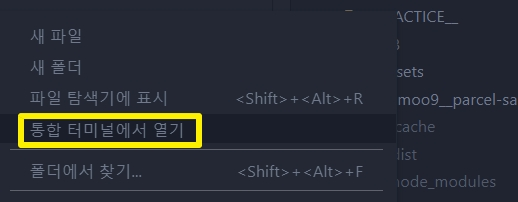
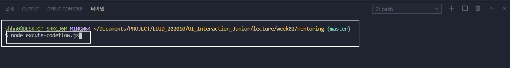
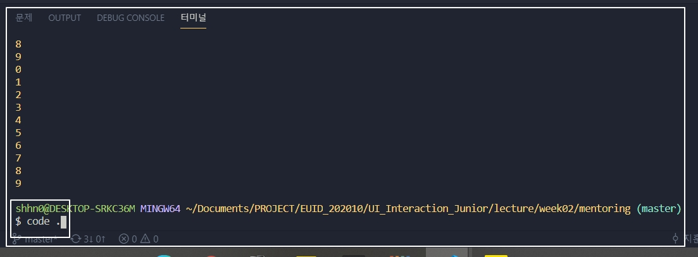
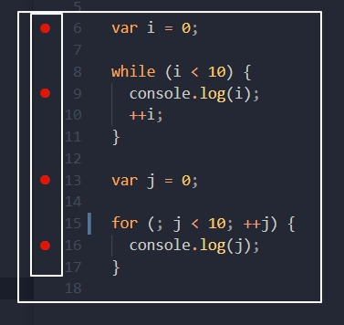
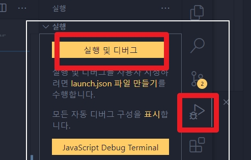
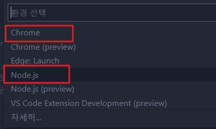
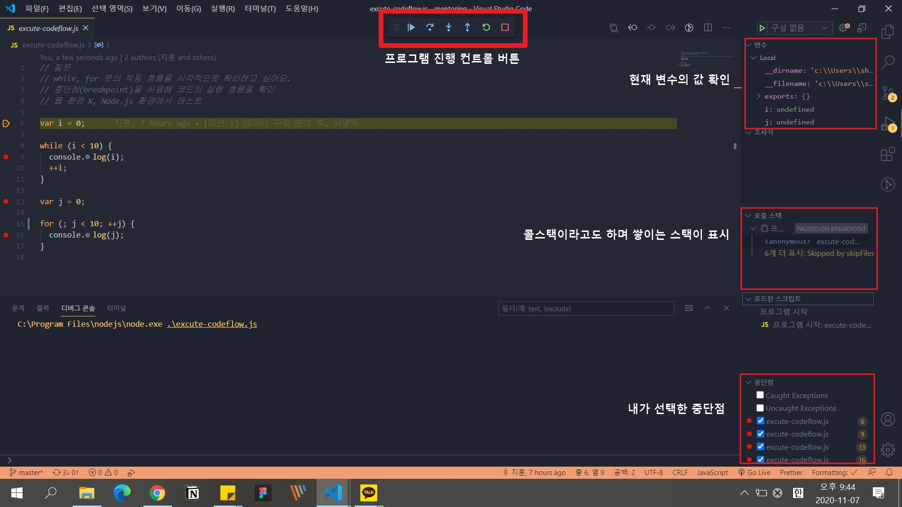
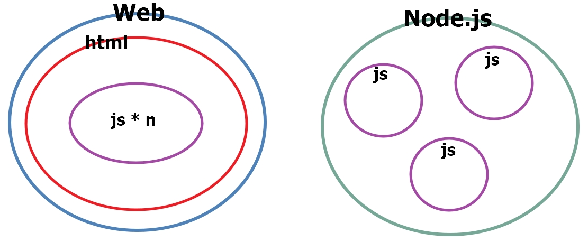

[← 뒤로가기](./README.md)

 

# TIL

14일차 학습을 통해 배운 내용을 정리합니다.

## 20201031 오프라인 수업 정리

 

## `Node.js` 환경에서 `js` 디버깅 하는 방법

1. 실행하려는 파일의 폴더를 에디터로 열기
   

1. 터미널에 `node` + `디버깅 하려는 파일명` 입력
   

1. 터미널에 `code .` 입력하여 새 창에 해당 폴더 열기
   

1. 중단점 지정 하기  
   

1. `실행` 버튼 선택 후 `실행 및 디버그` 클릭
   

1. `node.js` 선택  
   

1. 디버깅 실행 전체 화면
   

## `Web`환경과 `Node.js`환경 비교하기

- **`js` 파일을 디버깅할 때 왜 `Web`환경(Chorme)이 아닌 `Node.js`환경에서 실행하는가?**

| 구분      | 차이                                                                                                                                     | 문제                                                                                                                             |
| --------- | ---------------------------------------------------------------------------------------------------------------------------------------- | -------------------------------------------------------------------------------------------------------------------------------- |
| `Web`     | `js`를 독립적으로 실행할 수 없다.  `html`에 `js`파일을 불러와서 `html`을 실행시키는 형태로 `js`를 구동해야 한다.                    | html`에 불러온 여러 `js`파일은 하나의 파일 처럼 합쳐진다. 만약 각각의 파일에 선언한 변수의 이름이 같다면 전역 스코프는 오염된다. |
| `Node.js` | `js`를 독립적으로 실행할 수 있다.   `Node.js`는 각 `js`파일을 독립적으로 관리하기 때문에 `js`파일을 단독으로 구동하기에 문제가 없다 | -                                                                                                                                |

## 공부 메모

- `node.js`의 `.js`는 `JavaScript`이다.
