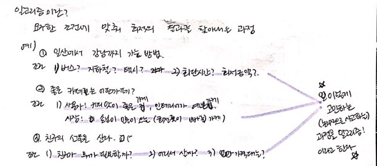

[← 뒤로가기](./README.md)

<br/>

# 밋업에서 질문하기?

---

## 클로저 질문

1. `독립적인 변수를 참조하는 함수`? 독립적인 변수가 뭔가요? (아래의 예제에서)

```Js
function numberGenerator() {

  var num = 1;

  function updateNumber() {
    console.log(num++);
  }

  return updateNumber;
}

var number = numberGenerator();

for (var i = 0; i < 10; ++i) {
  number();
}
```

1. `Environment Record`란 무엇인가요?
   함수의 스텍과 같은 개념인가요? 어휘 환경에서 쌓이는 스텍?

1. `moar(15)`에서 전달인자가 왜 `c`에 전달되는가??
   사진

## JS의 클로저(Closure)

- Js의 큰 관문 중의 하나 함수를 정복하고 배열을 정복했다면 이제 보스를 정복해야한다. 클로저를 무찌르자!

### 클로저(Closure)란?

- JavaScript의 매우 강력한 특성으로 독립적인 변수를 참조하는 함수를 말한다.
  즉, 클로저에 정의된 함수는 그것이 작성된 환경을 '기억'한다.
- 함수 내부에 있는 또 따른 함수가 본인의 영역이 아닌 상위 영역(상위 함수 영역) 실행 콘텍스트에 접근하는 것을 말한다.


- 클로저는 한 마디로 정의 내릴 수가 없다.  
  왜? `Hoist`와 마찬가지로 js 프로그램의 **현상**을 말하는 것이기 때문이다. js 공식 문서에도 정확하게 정의 내린 문서는 없다.
- 그럼 누가 이름을 붙였나?  
  아주 예전에 누군가가 `Hoist`, `Closure`라는 이름으로 붙여 부르기 시작하면서 부터이다.

### 어휘 환경(Lexical Environment)

- 함수 밖에서 실행된 함수를 참조하고 있는 변수가 기억하고 있는 값이 선언된 영역을 말한다.

#### 환경 기록(Environment Record)

- 어휘 환경(Lexical Environment)에서 기억되는 메모리이다.
- 위의 사진을 참고하자면 어휘 환경에서 기억되는 메모리는 `var num = 1`이다.

### 컨텍스트(context)

- 영역, 범위라고도 한다. 예를들어 내가 "학교"에 있다면 내 컨텍스트는 "학교"이다. 만약 카페에서 일을 하고 있다면 내 현재 실행 컨텍스트는 카페이다.

#### 실행 컨텍스트

- 어떠한 대상이 일을 하는 영역(또는 범위)

#### 함수 실행 컨텍스트

- 함수가 가지는 `function scope`라고 생각하면 이해가 쉽다.
- 매개변수에 전달 받은 값을 함수 블럭에 전달하여 변수에 할당하고 조건을 실행하고 값을 반환하는 등, 함수가 일하는 모든 영역을 함수 실행 컨텍스트이다. 즉, 함수가 실행되어 종료될 때까지의 영역(context)을 말한다.

- 모든 함수에는 실행 컨텍스트가 있다. 실행 컨텍스트는 해당 함수 내의 변수와 해당 부모 환경에 대한 참조를 의미하는 환경으로 구성된다. 상위 환경에 대한 참조는 내부 함수가 작성된 범위 외부 또는 내부에서 호출되는지 여부에 관계없이 상위 범위의 모든 변수를 모든 내부 함수에 사용할 수 있게 한다.
- 따라서 함수가 사실상 환경(해당 환경에 정의된 변수)에 대한 참조를 가지고 있기 때문에 함수가 이 환경(또는 영역(scope))을 "기억"하는 것처럼 보인다!
- 모든 실행 컨텍스트에는 어휘 환경(Lexical Environment)이 있습니다. 이 어휘 환경은 식별자 바인딩(즉, 변수 및 관련 값)을 보유하고 있으며 외부 환경에 대한 참조도 가지고 있다.

- 각 환경이 접근 할 수 있는 일련의 식별자를 "범위(Scope)"라고 합니다. 이러한 범위를 "스코프 체인(Scope Chain)"을 통해 계층적 환경 체인에 중첩 할 수 있다.

## 클로저의 목적

- 전역을 오염시키지 않고 자기만의 공간을 만들어 외부에서 접근하지 못하게 막는다.
<details>
  <summary>노트 필기</summary>


</details>

1. 함수를 실행시키면 `5, 4, 3...` 처럼 내가 원하는 값이 나오지 않고 `5`만 나온다.

   - 왜? 함수는 새로 실행될 때마다 선언된 변수의 처음 할당된 값을 기억하기 때문이다.

   ```js
   function countDown() {
     var number = 5;
     return console.log(number--);
   }

   countDown();
   ```

   <details>
     <summary>결과 보기</summary>

   

   </details>

   <br />

1. 숫자가 카운트다운 되게 하기 위해 함수 영역 안에 있던 변수를 전역으로 꺼냈다.

   - 하지만 전역에 선언된 변수는 전역을 오염시킨다. 옳지 못한 방법

   ```js
   var number = 5;

   function countDown() {
     return console.log(number--);
   }

   countDown();
   ```

   <details>
     <summary>결과 보기</summary>

   

   </details>

   <br />

1. 전역의 오염을 막기 위해 클로저 함수로 함수 영역을 만들어 외부에서 아무도 접근하지 못하게 만든다.

   ```js
   function generateCountDown(i) {
     var number = i;

     function countDown() {
       return console.log(number--);
     }

     return countDown;
   }

   var countDown5 = generateCountDown(5);

   countDown5();
   ```

   <details>
     <summary>결과 보기</summary>

   

   </details>

<br />

## 클로저 함수가 진행되는 흐름

```Js
function numberGenerator() {

  var num = 1;

  function updateNumber() {
    console.log(num++);
  }

  return updateNumber;
}

var number = numberGenerator();

for (var i = 0; i < 10; ++i) {
  number();
}
```

<details>
  <summary>결과 값</summary>


</details>

<details>
  <summary>노트 필기</summary>


<br />


<br />


</details>

## 가비지 컬렉션 (Garbage Collection)

- 뜻 풀이 그대로 "쓰레기 수집"이다. 웹에서 메모리를 관리하는 기법 중에 하나이다. 프로그램이 동적으로 할당했던 메모리 영역 중에서 필요없게 된 영역을 제거해 버리는 기능이다.
- `JavaScript`프로그램에 적용해서 보자면 함수의 실행이 끝나면 해당 함수는 가비지 컬렉터에 의해 소멸된다. 하지만 `Closure`가 함수의 어휘 환경(`Lexical Environment`)이 사라지는 것을 막고 환경 메모리(`Environment Record`)에 저장된 값을 기억하고 있다.
- [[MDN]자바스크립트의 메모리관리](https://developer.mozilla.org/ko/docs/Web/JavaScript/Memory_Management)

## 공부 메모

### 알고리즘이란?

- 목적(목표)에 맞는 최적의 결과를 찾아내는 과정을 말한다.
- 예시

  - 일산에서 강남까지 가는 방법

  1. 무엇을 타고 갈 수 있을까? 버스, 지하철, 택시
  1. 어떤 기준으로 이동수단을 선택하는가? 시간, 금액

  <br />

  - 좋은 카페의 기준

  1. 사용자: 커피의 맛, 인테리어
  1. 사장: 위치, 회전율

  <br />

  - 친구의 선물을 살 때

  1. 친구가 무엇을 필요로 할까?
  1. 어디서 살까?
  1. 가격대는 얼마로 할까?

- 위의 예시처럼 하나의 목적을 달성하기 위해 여러가지 조건을 기준 삼아 최적의 방법을 찾아내는 과정을 알고리즘이라고 한다.

<details>
  <summary>노트 필기</summary>



</details>

### CallBack Function

- CallBack Function란?
  - 함수를 연결하고 나중에 호출되는 함수를 말한다.
  ```js
  [예시];
  ```

### JavaScript의 구동 원리 (CallBack Function)


