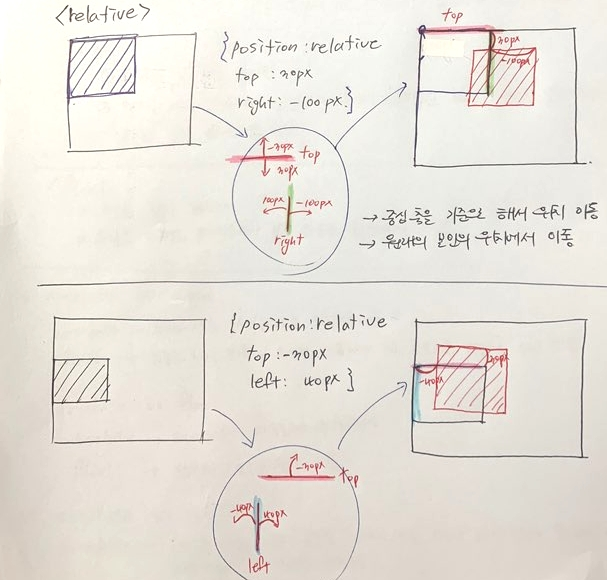
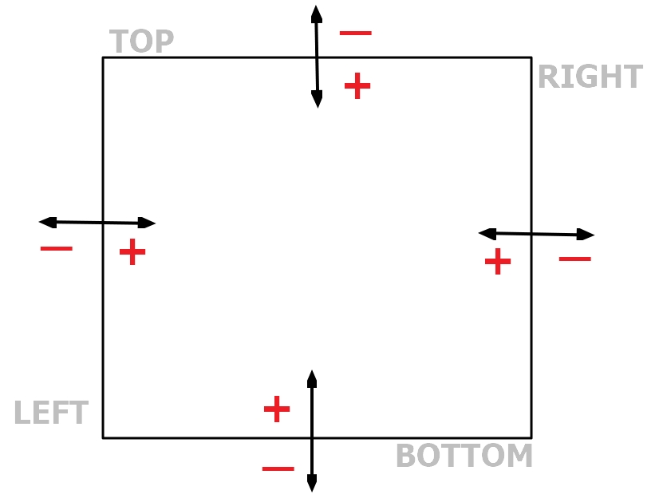

[← 뒤로가기](./README.md)

 

# TIL

## 20201111 오프라인 수업 정리

### 좋은 프론트엔드 개발자의 자격 요건

- 프론트엔드 개발자는 모든 사용자를 고려하는 설계자가 되야 한다.
- 구조를 탄탄하고 의미적으로 구성할 수 있어야 한다. (HTML)
- **디자이너가 만든 비주얼을 화면에 구성할 수 있는 표현 능력이 가능해야 한다. (CSS)**
- 사회적 약자 계층도 이용할 수 있도록 서비스를 만들어야 한다. (accessibility)

## CSS Layout - position

- 떠있는(부유) 요소를 만들거나 스크롤에 상관없이 동일한 위치에 자리한 요소를 만들때 포지션 속성을 사용한다.
- `position` 유형
  - `static`
  - `relative`
  - `absolute`
  - `fixed`
  - `sticky`

### [relative]

- top, right, bottom, left의 중심축을 기준으로 위치를 이동한다.
- 원래 본인의 위치를 기억하고 그 자리에서 이동하기 때문에 자연스러운 흐름을 유지하며 컨텐츠의 위치를 이동시킬때 사용한다.

### [absolute]

- 부모요소를 설정하지 않았을 때

  - 사용자가 보는 `viewport`를 기준으로 위치가 설정된다.

- 부모요소를 설정했을 때

  - 부모요소의 위치를 기준으로 위치가 설정된다.
  - 부모요소는 어떻게 지정하는가?  
    부모로 지정해 주고 싶은 요소에 기본값(`static`)을 제외한 다른 속성을 지정해 주면 된다. 대부분 `absolute`의 부모요소로는 `relative`를 사용하는 편이다.
    - 왜? `relative`는 본인의 위치를 기억하기 때문에 `absolute`처럼 뒤의 요소가 인식을 못하여 위로 올라오려는 불상사가 생기지 않고 자연스러운 흐름으로 위치 설정이 가능하기 떄문이다.

- 특징
  - 스크롤이 내리면 사라진다.
  - 위에 말했던 바 처럼 뒤에 마크업된 요소가 `absolute`로 설정한 요소의 공간을 인식하지 못하기 때문에 위로 올라오려고 한다.

### [fixed]

- 부모 요소를 찾지 않는다.
- 스크롤을 내려도 사용자가 보는 `viewport` 위치에 고정된다.

### `absolute` VS `fixed`, `float`, `relative`

| 유형     | 차이점                                                                      |
| -------- | --------------------------------------------------------------------------- |
| absolute | 부모요소를 찾는다./ 부모요소를 지정할 수 있다.                              |
| fixed    | 부모요소를 찾지 않는다./ 사용자가 보는 viewport를 기준으로 위치를 설정한다. |

| 유형     | 차이점                            |
| -------- | --------------------------------- |
| absolute | 페이지에서 자유롭게 위치 조정가능 |
| float    | 단순히 좌/우로만 위치 설정 가능   |

| 유형     | 차이점                                                                                      |
| -------- | ------------------------------------------------------------------------------------------- |
| absolute | float 처럼 자신의 공간을 뒤에 오는 요소가 인식하지 못하게 해서 다른 요소가 그 자리를 차지함 |
| relative | 박스 본인이 갖고 있는 공간을 그대로 지키며 위치 이동                                        |

### [sticky]

- 인터넷 익스플로어 미지원
- 스크롤을 내려도 원하는 위치에 고정 시킬 수 있다.
