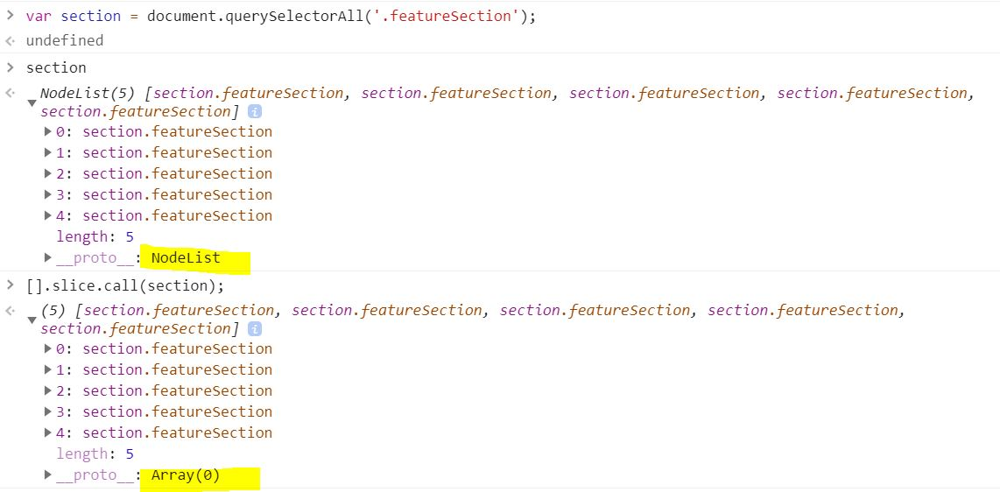
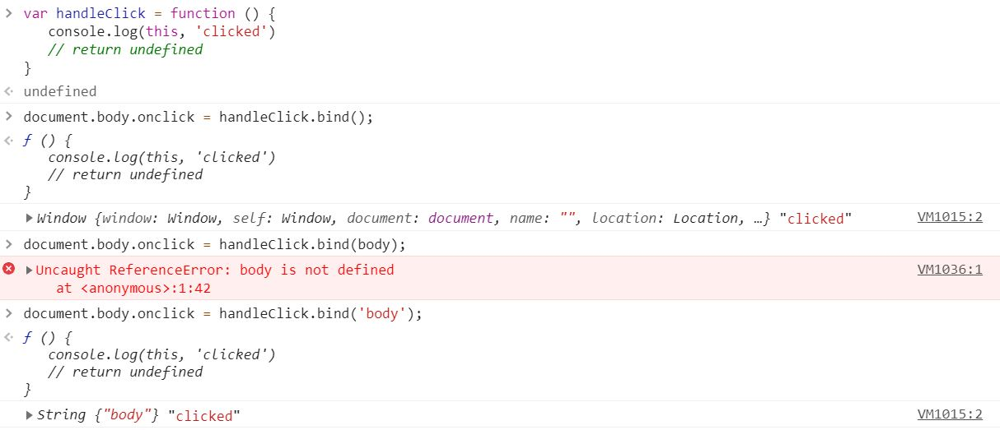
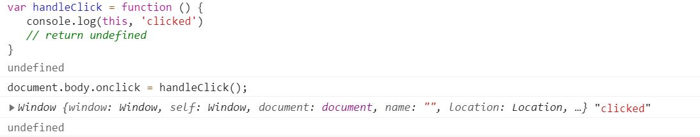
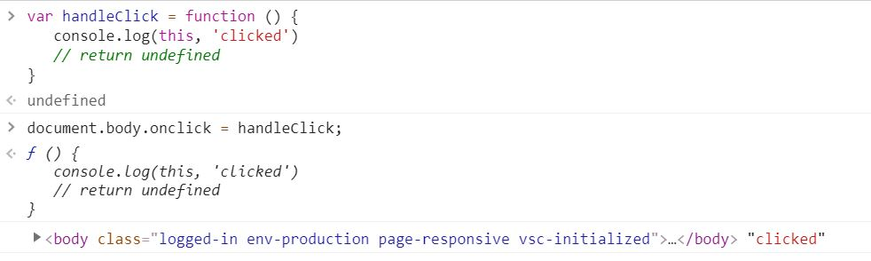

[← 뒤로가기](./README.md)

<br/>

# 질문하기

1. `[].slice.call()` 해당 구문이 어떻게 작동되는지 알고 싶습니다. `call()`의 `this`인자가 어떻게 빈 배열에 들어가게 되는 건가요?
   

1. 왜 `bind()`메서드를 사용했을 때 `this`가 `body`로 변경되지 않나요?
   (해결하고 나서 TIL 추가로 작성하기)
   

# TIL

## 20201114 오프라인 수업 정리

## 함수 객체 메서드

- 정리 하고 나서 `TIL-D12` 함수객체 파일에 내용 병합하기!

### `call()` 메서드

- 아직 함수 객체 메서드와 친하지 않다. `this`참조를 변경한다는 것이 익숙하지 않다. 쉬운 예시를 보면서 다시 한번 복습하자!

```js
var 인간 = {
  이름: "김한나",
  생각한다: function () {
    console.log(this);
    return this.이름 + "는 생각한다";
  },
};
인간.생각한다();
// output : {이름: "김한나", 생각한다: ƒ}
// "김한나는 생각한다"

var 공룡 = {
  이름: "티라노사우르스",
  공격한다: function () {
    console.log(this);
  },
};

인간.생각한다.call(공룡);
//  output : {이름: "티라노사우르스", 공격한다: ƒ}
// "티라노사우르스는 생각한다"
```

- `call()`메서드를 사용해서 인간의 생각한다에 참조된 `this`를 "공룡"으로 변경하였다. **일시적**으로 `this`를 변경하는 기능을 가진다.

### `apply()` 메서드

- `call()`메서드와 매우 비슷한 기능을 갖고 있다.

### `bind()` 메서드

- `call()`과 `apply()`메서드와 다른 점은 함수가 바로 실행되지 않는다는 점이다. 일단 변경할 `this`를 첫 번째 인자에 지정해둔 다음 사용자가 워하는 시기에 실행될 수 있도록한다. 이벤트 구문을 사용할 때 `bind()`를 많이 사용한다.

### 이벤트 구분 비교하기

- 아래의 구문의 **`this`는 `window`이다.** 아래 이벤트 구문을 사용해서 이벤트가 실행될 때 `this`가 어떻게 변화하는지 확인하자!

```js
var handleClick = function () {
  console.log(this, "clicked");
  // return undefined
};

handleClick();
// output :  Window {window: Window, self: Window, document: document, name: "", location: Location, …} "clicked"

// on* 이벤트 속성에 할당 가능한 값
//  -> null, function()
```

1. 함수 실행문을 참조할 경우

   - `()`은 함수 실행 구문이다. 함수가 실행되어 버리면 함수의 결과값은 `undefined`가 나온다.(`return`을 따로 지정해 주지 않았기 때문이다.) 그 결과값(`undefined`)이 `onclick`할당이 되는데 `on*`이벤트 속성에 할당 가능한 값은 `null`, `function()` 뿐이기 때문에 **이벤트가 바인딩되지 않는다.**

   ```js
   document.body.onclick = handleClick();
   ```

   <details>
      <summary>결과 값 확인</summary>
      
      

   </details>

1. 함수를 참조하는 경우(옳은 방법)

   - 흔히 알고 있는 이벤트 구문이다. 이벤트 바인딩이 잘 된다.
   - `this`는 `body`로 변경

   ```js
   document.body.onclick = handleClick;
   ```

   <details>
      <summary>결과 값 확인</summary>
      
      

   </details>

1. `bind()`메서드를 사용하는 경우

   ```js
   document.body.onclick = handleClick.bind();
   ```

   <details>
      <summary>결과 값 확인</summary>

   

   </details>

### `use strict`를 사용하는 이유?

- 흔히 발생하는 코딩 실수를 잡아내는데 용이하다. 즉, 실수를 했을 때 오류가 발생한다.
- 오류가 어떠야 디버깅을 할때 편하다. 내가 어디서 실수 했는지 알 수 있음

```js
   function () {
      'use strict';
   }
```

## 왓챠 예제
