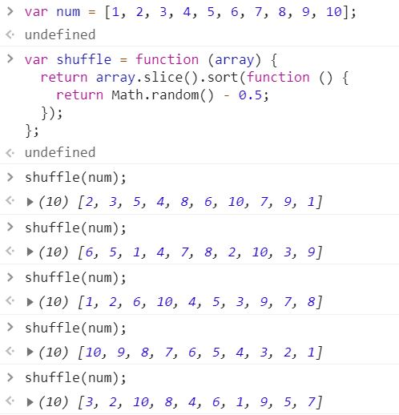
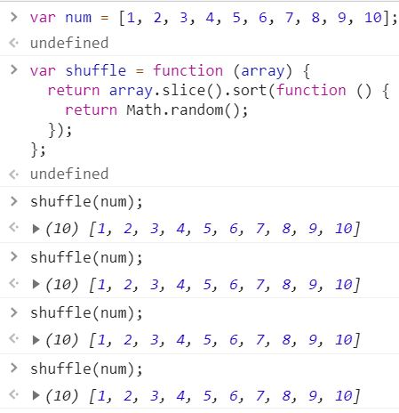
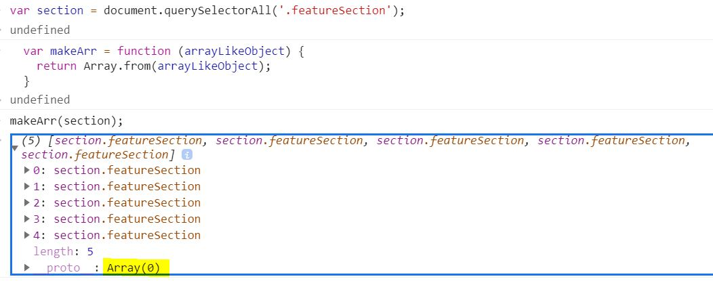

[← 뒤로가기](./README.md)

<br/>

# 질문하기

1. `[].slice.call()` 해당 구문이 어떻게 작동되는지 알고 싶습니다. `call()`의 `this`인자가 어떻게 빈 배열에 들어가게 되는 건가요?
   

1. 왜 `bind()`메서드를 사용했을 때 `this`가 `body`로 변경되지 않나요?
   (해결하고 나서 TIL 추가로 작성하기)
   

1. 아래의 함수에서 `-0.5`는 어떤 기능을 해주나요?

   - `Math.random()`을 사용해도 랜덤으로 숫자가 정렬되지 않는 이유는 왜 그런가요?
   - `Math.random()` 실습을 같이 해보고 싶어요!

   ```js
   // 배열의 아이템을 뒤섞어서 새로운 배열 반환
   var shuffle = function (array) {
     return array.slice().sort(function () {
       return Math.random() - 0.5;
     });
   };
   ```

   <details open>
   <summary>결과 값 확인</summary>
   - `Math.random() - 0.5` 구문에서 `- 0.5`가 있을 떄와 없을 때의 차이점

   
   

   </details>

# TIL

## 20201114 오프라인 수업 정리

## 함수 객체 메서드

- 정리 하고 나서 `TIL-D12` 함수객체 파일에 내용 병합하기!

### `call()` 메서드

- 아직 함수 객체 메서드와 친하지 않다. `this`참조를 변경한다는 것이 익숙하지 않다. 쉬운 예시를 보면서 다시 한번 복습하자!

```js
var 인간 = {
  이름: "김한나",
  생각한다: function () {
    console.log(this);
    return this.이름 + "는 생각한다";
  },
};
인간.생각한다();
// output : {이름: "김한나", 생각한다: ƒ}
// "김한나는 생각한다"

var 공룡 = {
  이름: "티라노사우르스",
  공격한다: function () {
    console.log(this);
  },
};

인간.생각한다.call(공룡);
//  output : {이름: "티라노사우르스", 공격한다: ƒ}
// "티라노사우르스는 생각한다"
```

- `call()`메서드를 사용해서 인간의 생각한다에 참조된 `this`를 "공룡"으로 변경하였다. **일시적**으로 `this`를 변경하는 기능을 가진다.

### `apply()` 메서드

- `call()`메서드와 매우 비슷한 기능을 갖고 있다.

### `bind()` 메서드

- `call()`과 `apply()`메서드와 다른 점은 함수가 바로 실행되지 않는다는 점이다. 일단 변경할 `this`를 첫 번째 인자에 지정해둔 다음 사용자가 워하는 시기에 실행될 수 있도록한다. 이벤트 구문을 사용할 때 `bind()`를 많이 사용한다.

### 이벤트 구분 비교하기

- 아래의 구문의 **`this`는 `window`이다.** 아래 이벤트 구문을 사용해서 이벤트가 실행될 때 `this`가 어떻게 변화하는지 확인하자!

```js
var handleClick = function () {
  console.log(this, "clicked");
  // return undefined
};

handleClick();
// output :  Window {window: Window, self: Window, document: document, name: "", location: Location, …} "clicked"

// on* 이벤트 속성에 할당 가능한 값
//  -> null, function()
```

1. 함수 실행문을 참조할 경우

   - `()`은 함수 실행 구문이다. 함수가 실행되어 버리면 함수의 결과값은 `undefined`가 나온다.(`return`을 따로 지정해 주지 않았기 때문이다.) 그 결과값(`undefined`)이 `onclick`할당이 되는데 `on*`이벤트 속성에 할당 가능한 값은 `null`, `function()` 뿐이기 때문에 **이벤트가 바인딩되지 않는다.**

   ```js
   document.body.onclick = handleClick();
   ```

   <details>
      <summary>결과 값 확인</summary>
      
      

   </details>

1. 함수를 참조하는 경우(옳은 방법)

   - 흔히 알고 있는 이벤트 구문이다. 이벤트 바인딩이 잘 된다.
   - `this`는 `body`로 변경

   ```js
   document.body.onclick = handleClick;
   ```

   <details>
      <summary>결과 값 확인</summary>
      
      

   </details>

1. `bind()`메서드를 사용하는 경우

   ```js
   document.body.onclick = handleClick.bind();
   ```

   <details>
      <summary>결과 값 확인</summary>

   

   </details>

### `use strict`를 사용하는 이유?

- 흔히 발생하는 코딩 실수를 잡아내는데 용이하다. 즉, 실수를 했을 때 오류가 발생한다.
- 오류가 어떠야 디버깅을 할때 편하다. 내가 어디서 실수 했는지 알 수 있음

```js
   function () {
      'use strict';
   }
```

## 왓챠 예제

### 유틸리티 함수 만들기

#### 유사 배열을 배열로 변경하는 함수

- 해당 유틸리티 함수를 만드는 목적 : 배열의 메서드를 사용하고 싶다. 단, 기존의 배열을 손상하지 않고 새로운 배열로 반환하고 싶다.
- 유사배열 : `HTMLCollection`, `NodeList`, `arguments`

1. `Array.from()` 사용하여 만들기

   - 단점 : `IE` 호환성에 문제가 있다. 모든 브라우저에 호환될 수 있도록 안전한 유틸리티 함수를 만들어야 한다.

   ```js
   var makeArr = function (arrayLikeObject) {
     return Array.from(arrayLikeObject);
   };
   ```

   <details>
     <summary>결과 값 확인</summary>

   

   </details>

1. `slice()`와 `call()` 사용하기

   - 브라우저 호환성 문제 없다.

   ```js
   var makeArray = function (arrayLikeObject) {
     return [].slice.call(arrayLikeObject);
   };
   ```

   <details>
     <summary>결과 값 확인</summary>

   

   </details>

#### 셔플 함수

- 왓챠의 메인페이지는 페이지를 새로고침 할 때마다 배경 이미지가 바뀐다. 셔플을 사용해서 매번 페이지가 로드 될 때마다 랜덤으로 이미지가 선택되어 페이지 배경으로 로드된다.
- 해당 함수를 만들기 위해 사용되는 기능

  - [`slice()`](https://developer.mozilla.org/ko/docs/Web/JavaScript/Reference/Global_Objects/Array/slice)메서드를 사용해서 기존의 배열이 손상되지 않도록 복사하여 새로운 배열을 생성 한다
  - [`sort()`](https://developer.mozilla.org/ko/docs/Web/JavaScript/Reference/Global_Objects/Array/sort)메서드를 사용해서 배열의 아이템들을 정열한다.
  - [`Math.random()`](https://developer.mozilla.org/ko/docs/Web/JavaScript/Reference/Global_Objects/Math/random)메서드를 사용해서 랜덤으로 아이템이 선택되게 한다.

  <br />

  ```js
  // 배열의 아이템을 뒤섞어서 새로운 배열 반환
  var shuffle = function (array) {
    return array.slice().sort(function () {
      return Math.random() - 0.5;
    });
  };
  ```

   <details>
     <summary>결과 값 확인</summary>
   - `Math.random() - 0.5` 구문에서 `- 0.5`가 있을 떄와 없을 때의 차이점

  

  

   </details>

#### 동적으로 스타일 규칙 추가하는 함수

- 기존의 CSS에 직접적으로 스타일을 추가 하는 방식이 아닌 함수를 사용해서 동적으로 스타일 규칙을 추가하는 함수를 만든다.
- 해당 함수를 만들기 위해 사용되는 기능

```js
// insertStyleRules() : 동적으로 스타일 규칙 추가

var insertStyleRules = (function (style) {
  "use strict";

  var sheet = document.head.appendChild(style).sheet;

  // 클로저 함수
  return function (selector, rules) {
    var cssRulesString = Object.keys(rules)
      .map(function (key) {
        var value = rules[key];
        return key + ":" + value;
      })
      .join(";");

    sheet.insertRule(
      selector + "{" + cssRulesString + "}",
      sheet.cssRules.length
    );
  };
})(document.createElement("style")); // <style></style>
```

## 공부 메모

- 크롬 깃허브 파일 트리 사이드바 토글 단축키
  - `Ctrl` + `Shift` + `S`
- 사이드바 찾기 단축키
  - `Shift` + `S`
