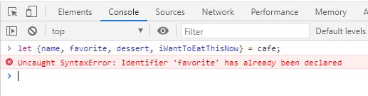
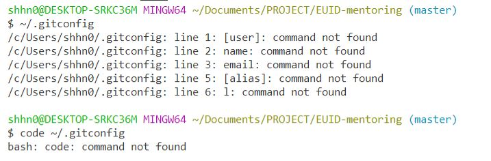

[← 뒤로가기](./README.md)

<br/>

# TIL

21일차 학습을 통해 배운 내용을 정리합니다.

## 객체 지향 프로그래밍 용어 정리

아래의 용어는 객체 지향 프로그래밍(`Java`, `C#` 등)에서 사용하는 용어이다. `JavaScript`에서도 많이 보던 용어들 이지만 의미가 완전히 같지 않고 `JavaScript`에서 사용하지 않는 용어도 있다.

- `Class` -객체 속성(Properties)을 정의합니다. ( 예: 설계 도면 )
- `Object` - Class의 인스턴스(Instance) 입니다. ( 예: 설계 도면을 통해 구현된 실제 제품 )
- `Property` - 객체의 속성을 말합니다. ( 예: color 등과 같은 명사 형태 )
- `Method` - 객체의 기능을 말합니다.( 예: walk() 등과 같은 동사 형태 )
- `Constructor` - 인스턴스 생성 순간에 호출 실행되는 메서드입니다.
- `Inheritance` - Class는 다른 Class로 부터 속성들을 상속받을 수 있습니다. (Super Class ⇒ Sub Class)
- `Encapsulation` - Class는 해당 객체의 속성, 메서드 만 정의할 수 있습니다. (외부 접근 불가)
- `Abstraction` - 복잡한 상속, 메서드, 객체 속성의 결합은 반드시 현실 모델을 시뮬레이션할 수 있어야 합니다.
- `Polymorphism` - 다른 Class 들이 같은 메서드나 속성으로 정의될 수 있습니다.

## 구조 분해 할당 Destructuring Assignment

구조 분해 할당은 객체나 배열의 아이템을 변수에 할당하는 것이다. `ES5`에서는 따로 변수 선언을 해주어야 했지만 `ES6`에서는 훨씬 짧고 간편한 방법으로 아이템을 변수에 할당 할 수 있다.

[[MDN] 구조 분해 할당](https://developer.mozilla.org/ko/docs/Web/JavaScript/Reference/Operators/Destructuring_assignment)

### 배열 구조 분해 할당

배열의 아이템을 각 변수에 할당하는 방법을 `ES5`와 `ES6`를 비교하여 알아보자

- 기존의 `ES5`에서는 각 아이템을 `var` 키워드를 사용해 변수 선언을 통한 방법으로 변수에 할당했지만 `ES6`에서 부터는 배열을 구조 분해해서 각 변수에 아이템을 할당할 수 있다.

```js
// --------------------- ES5
var members = ["한나", "야무", "두나"];

var hanna = members[0];
var yamoo = members[1];
var duna = members[2];

console.log(hanna); // 한나
console.log(yamoo); // 야무
console.log(duna); // 두나

// --------------------- ES6
const [ha, ya, du] = ["한나", "야무", "두나"];

console.log(ha); // 한나
console.log(ya); // 야무
console.log(du); // 두나
```

- 특정 아이템만 선택해서 변수에 할당하고 싶다면 아래의 코드처럼 공백을 사용한다.

```js
// --------------------- ES6
const [ha, , du] = ["한나", "야무", "두나"];

console.log(ha); // 한나
console.log(du); // 두나
```

### 객체 구조 분해 할당

```js
// --------------------- ES5
var obj = {
  type: "Object",
  collection: "key: value",
  isItTheParentOfAllObjects: true,
};

var type = obj.type;
var collection = obj["type"];
var isItTheParentOfAllObjects = obj.isItTheParentOfAllObjects;

// 질문 후에 결과 값 다시 입력
console.log(type);
console.log(collection);
console.log(isItTheParentOfAllObjects);

// --------------------- ES6
let { type, collection, isItTheParentOfAllObjects } = obj;

console.log(type); // 'Object'
console.log(isItTheParentOfAllObjects); // true
```

```js
// --------------------- ES5
var cafe = {
  name: "스타벅스",
  favorite: "허니 자몽 블랙티",
  dessert: "크림 카스테라",
  iWantToEatThisNow: true,
};

var name = cafe.name;
var favorite = cafe.favorite;
var dessert = cafe.dessert;
var iWantToEatThisNow = cafe.iWantToEatThisNow;

console.log(name); // 스타벅스
console.log(favorite); // 허니 자몽 블랙티
console.log(dessert); // 크림 카스테라
console.log(iWantToEatThisNow); // true

// --------------------- ES6
const cafe = {
  name: "스타벅스",
  favorite: "허니 자몽 블랙티",
  dessert: "크림 카스테라",
  iWantToEatThisNow: true,
};

const { name, favorite, dessert, iWantToEatThisNow } = cafe;

console.log(name); // 스타벅스
console.log(favorite); // 허니 자몽 블랙티
console.log(dessert); // 크림 카스테라
console.log(iWantToEatThisNow); // true
```



## 공부 메모

- `Git` va `Github`

  - `Git`: 작업을 관라하는 도구(툴)이다. 작업한 내용을 `commits`하거나 `push`, `pull`하는 등의 모든 기능을 사용하는 것은 `Git`이라는 도구를 사용하는 것이다.
  - `Github`: 온라인 **저장소**이다. 내가 한 작업을 저장소에 올려 다른 사람들이 볼 수 있도록 하거나 같이 작업 할 협업자를 초대하는 등의 기능으로 사용한다. **절대! `Git`과 `Github`를 같은 도구로 보면 안된다!**
  - `Github`를 [대체할 수 있는 저장소](https://www.google.com/url?hl=ko&q=https://technologyadvice.com/blog/information-technology/github-alternatives/&sa=D&ust=1606221596932000&usg=AFQjCNH5ONiIcWNG66mENKjIAIgmR8iuRA)는 많다. 그 중에서 `Github`가 가장 대중화 된 것 분이다!

- 속성의 문자 값을 통해 객체의 속성 값에 접근하는 방법
  - `obj['type']` (= `obj.type`)
  - 객체를 순환할 때 사용하는 반복문 `for ~ in`문이 생각이 안나서 `obj['type']`구문이 이해가 안됐다.

* `.gitconfig`파일을 찾을 수 없다고 할 때

  

  - 현재 내 컴퓨터에 에디터 포터블 모드와 일반 다운로드 모드가 같이 설치 되어 있어서 해당 파일을 못찾는 것 같다. 이 경우엔 내가 직접 `.gitconfig` 파일을 찾아서 에디터에 파일을 여는 방법을 하는 것이 좋다!

* 콘솔 패드에서 이전에 입력한 데이터를 삭제하고 싶을 때는 해당 브라우저 페이지를 새로고침(`F5`)을 하면 된다!
