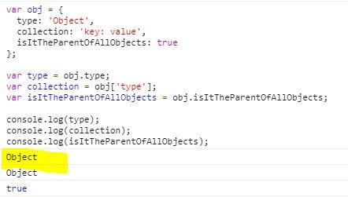

[← 뒤로가기](./README.md)

<br/>

# 질문하기

1. `.gitconfig`파일을 찾을 수 없다고 해요. 이럴 땐 어떻게 해야 하나요?
   

1. 아래의 예제에서 `obj['type']` 구문이 이해가 안가요. `obj`는 객체인데 `[]`나열된 배열이 아닌데 어떻게 `collection`의 결과 값이 `obj.type`의 값으로 나오는 걸까요?

   그리고 결과값이 `"Object"`처럼 문자값으로 나오지 않는걸까요?

   ```js
   var obj = {
     type: "Object",
     collection: "key: value",
     isItTheParentOfAllObjects: true,
   };

   var type = obj.type;
   var collection = obj["type"];
   var isItTheParentOfAllObjects = obj.isItTheParentOfAllObjects;

   console.log(type); // Object
   console.log(collection); // Object
   console.log(isItTheParentOfAllObjects); // true
   ```

   

1. `let` 키워드를 사용하려고 하니 아래 처럼 이미 사용한 변수명이라는 에러 메세지가 뜸니다. 이 때 콘솔 패드에서 이전에 입력한 데이터를 삭제하고 싶을 때 어떻게 하나요?

   

# TIL

21일차 학습을 통해 배운 내용을 정리합니다.

## 객체 지향 프로그래밍 용어 정리

- `Class` -객체 속성(Properties)을 정의합니다. ( 예: 설계 도면 )
- `Object` - Class의 인스턴스(Instance) 입니다. ( 예: 설계 도면을 통해 구현된 실제 제품 )
- `Property` - 객체의 속성을 말합니다. ( 예: color 등과 같은 명사 형태 )
- `Method` - 객체의 기능을 말합니다.( 예: walk() 등과 같은 동사 형태 )
- `Constructor` - 인스턴스 생성 순간에 호출 실행되는 메서드입니다.
- `Inheritance` - Class는 다른 Class로 부터 속성들을 상속받을 수 있습니다. (Super Class ⇒ Sub Class)
- `Encapsulation` - Class는 해당 객체의 속성, 메서드 만 정의할 수 있습니다. (외부 접근 불가)
- `Abstraction` - 복잡한 상속, 메서드, 객체 속성의 결합은 반드시 현실 모델을 시뮬레이션할 수 있어야 합니다.
- `Polymorphism` - 다른 Class 들이 같은 메서드나 속성으로 정의될 수 있습니다.

## 구조 분해 할당 Destructuring Assignment

구조 분해 할당은 객체나 배열의 아이템을 변수에 할당하는 것이다. ES5에서는 따로 변수 선언을 해주어야 했지만 ES6에서는 훨씬 짧고 간편한 방법으로 아이템을 변수에 할당 할 수 있다.

[[MDN]구조 분해 할당](https://developer.mozilla.org/ko/docs/Web/JavaScript/Reference/Operators/Destructuring_assignment)

### 배열 구조 분해 할당

```js
   [ES6 구문]

   let [a, b, c, d] = [1, 2, 3, 4];
   let [var1, var2] = [arr1,arr2, arr3];
```

배열의 아이템을 각 변수에 할당하는 방법을 ES5와 ES6를 비교하여 알아보자

- 기존의 ES5에서는 각 아이템을 var 키워드를 사용해 변수 선언을 통한 방법으로 변수에 할당했지만 ES6에서 부터는 배열을 구조 분해해서 각 변수에 아이템을 할당할 수 있다.

```js
// --------------------- ES5
var members = ["한나", "야무", "두나"];

var hanna = members[0];
var yamoo = members[1];
var duna = members[2];

console.log(hanna); // 한나
console.log(yamoo); // 야무
console.log(duna); // 두나

// --------------------- ES6
var [ha, ya, du] = ["한나", "야무", "두나"];

console.log(ha); // 한나
console.log(ya); // 야무
console.log(du); // 두나
```

- 특정 아이템만 선택해서 변수에 할당하고 싶다면 아래의 코드처럼 공백을 사용한다.

```js
// --------------------- ES6
var [ha, , du] = ["한나", "야무", "두나"];

console.log(ha); // 한나
console.log(du); // 두나
```

### 객체 구조 분해 할당

```js
   [ES6 구문]

   let { var1, var2, var3 } = Object;
```

```js
// --------------------- ES5
var obj = {
  type: "Object",
  collection: "key: value",
  isItTheParentOfAllObjects: true,
};

var type = obj.type;
var collection = obj["type"];
var isItTheParentOfAllObjects = obj.isItTheParentOfAllObjects;

// 질문 후에 결과 값 다시 입력
console.log(type);
console.log(collection);
console.log(isItTheParentOfAllObjects);

// --------------------- ES6
let { type, collection, isItTheParentOfAllObjects } = obj;

console.log(type); // 'Object'
console.log(isItTheParentOfAllObjects); // true
```

```js
// --------------------- ES5
var cafe = {
  name: "스타벅스",
  favorite: "허니 자몽 블랙티",
  dessert: "크림 카스테라",
  iWantToEatThisNow: true,
};

var name = cafe.name;
var favorite = cafe.favorite;
var dessert = cafe.dessert;
var iWantToEatThisNow = cafe.iWantToEatThisNow;

console.log(name); // 스타벅스
console.log(favorite); // 허니 자몽 블랙티
console.log(dessert); // 크림 카스테라
console.log(iWantToEatThisNow); // true

// --------------------- ES6
var cafe = {
  nameES6: "스타벅스",
  favoriteES6: "허니 자몽 블랙티",
  dessertES6: "크림 카스테라",
  iWantToEatThisNowES6: true,
};

var { nameES6, favoriteES6, dessertES6, iWantToEatThisNowES6 } = cafe;

console.log(nameES6); // 스타벅스
console.log(favoriteES6); // 허니 자몽 블랙티
console.log(dessertES6); // 크림 카스테라
console.log(iWantToEatThisNowES6); // true
```
