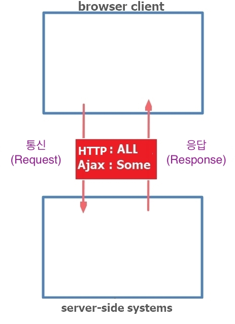
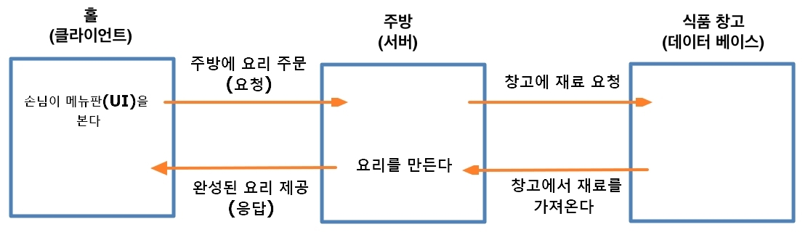

[← 뒤로가기](./README.md)

<br/>

# TIL

22일차 학습을 통해 배운 내용을 정리합니다.

## 비동기 프로그래밍(Ajax) - XMLHttpRequest

### AJAX

> 서버측으로 다양한 형식(JSON, XML, HTML 및 일반 텍스트 형식 등)의 정보를 주고 받을 수 있습니다. AJAX의 강력한 특징은 페이지 전체를 새로고침 하지 않고서도 수행 되는 비동기성 입니다. 이러한 비동기성을 통해 사용자의 인터랙션에 따라 전체 페이지가 아닌 일부분 만을 업데이트 할 수 있게 해줍니다.

#### 에이젝스(Ajax)란?

> JavaScript와 XML 또는 JSON을 사용해 비동기 통신 방법으로 웹 애플리케이션을 제작하는 것을 말한다. 간단히 말하면 서버측 Scripts와 통신하기 위한 XMLHttpRequest객체를 사용하는 것을 말한다.

- `AJAX`는 **A**synchronous **J**avascript **A**nd **X**ML라는 의미로 직역하자면 `JavaScript와` `XML` 사이에서 서버를 통신, 응답하는 **비동기 프로그래밍**이다.
- 당시엔 `JavaScript`와 `XML`를 연결했지만 지금 시대에서는 `XML`를 많이 사용하지 않는다. 다시 돌아가면 **`AJAX`는 특정한 기술이 아니며 기술들 간에 비동기로 작동하는 것을 부르는 용어**이다.

#### AJAX 용어의 탄생

`Jesse James Garrett`이라는 사람이 처음 비동기 프로그램에 `Ajax`라는 용어를 붙여 사용하기 시작했다.

#### HTTP(기존 기술)과 AJAX의 차이점

| 구분 | 통신 유형            | 차이점                                                                                                                                                                                                                                                  |
| ---- | -------------------- | ------------------------------------------------------------------------------------------------------------------------------------------------------------------------------------------------------------------------------------------------------- |
| HTTP | 동기(synchronous)    | 통신을 요청하면 기존의 모든 데이터(html, css, image 등)를 다시 요청하고 전송 받아서 또 해석하는 방식으로 했기 때문에 한 번 통신을 요청 할 때마다 페이지가 다시 로드되는 시간이 오래걸렸다.                                                              |
| AJAX | 비동기(asynchronous) | 페이지를 새로고침하지 않고 필요한 데이터만 받아와서 내용을 업데이트하기 때문에 시간이 단축되며 불필요한 데이터 해석을 할 필요가 없어져서 네트워크 사용량을 줄 일 수 있다. 사용자의 브라우저에 데이터를 전송하는 것은 네트워트를 통해 전송하기 때문이다. |


> `datastore` : 데이터 저장소  
>  `backend processing`: 백엔드에서 처리하는 공정  
>  `legacy systems` : 기존의 시스템이라고 볼 수 있다. 즉, 서버에서 하는 일(체계)이다.  
>  `server-side` : 서버 측  
>  `systems` 시스템(체계)



- 사용자가 도메인을 통해 사이트를 요청하면 브라우저에서는 서버에 데이터를 요청(통신)한다. 그리고 요청된 데이터를 꺼내서 사용자의 브라우저에 데이터를 전송(응답)한다. 그러면 전송받은 데이터를 브라우저는 조합을 해서 `UI`에 렌더링한다.

#### 브라우저와 서버의 통신 과정

위의 설명을 좀 더 쉽게 와닿도록 식당이라는 환경에서 보자


* 손님이 메뉴판(UI)을 보고 음식을 주문(요청)한다. → 주문을 주방에 전달 → 식품창고(데이터베이스)에서 재료를 요청 →  주방에서 요리를 만든다 → 완성된 요리를 손님에게 제공(응답)

### 동기와 비동기


### XMLHttpRequest

`XMLHttpRequest`는 `AJAX` 비동기 통신을 하기 위해 사용해야하는 객체(기술)이다. 브라우저와 서버의 중간 다리 역할을 한다.


`XMLHttpRequest`는 샛체이기 때문에 생성자 `new` 키워드를 통해 생성할 수 있다.

```js
new XMLHttpRequest
```

`.open()`메서드를 사용해 설정을 하고 `.send()`메서드를 사용해 설정된 내용을 보낸다.
```js
var xhr = new XMLHttpRequest;
xhr.open('GET', 'ajax/data.txt', false);
xhr.send();
```
`.open()`메서드의 입력 방식을 살펴보자
```js
xhr.open('통신 방법', '통신 파일', 비동기 통신 설정);
```
- 통신 방법 : GET, POST(GET보다 보안성이 더 높다) 
- 통신 파일 : HTML, XML, TEXT, JSON
- 비동기 통신 설정 : true(비동기, 생략 가능), false(동기)

* status (통신 상태)

  > 100 : continue  
  > 101 : swiching protocols  
  > 200 : OK   
  > 304 : not modified  
  > 404 : client error (UI 개발자 잘못)  
  > 5XX : server error (서버 개발자 잘못)  

  * 200, 300 번대는 성공! 
  * 304번의 `not modified`의 의미는?  
    클라이언트는 이미 파일을 서버로 부터 받은 적이 있다. 그래서 다시 로드를 했을 떄 클라이언트는 이미 받은 캐시 파일을 다시 받지 않는다. 하지만 해당 파일이 한번 수정된 적이 있다면 수정된 부분만 다시 서버로 부터 받아 오게 된다. 즉, `not modified`는 이미 받아 온 파일이 있고 그 파일을 수정된 적이 없으니 다시 받아올 필요가 없다고 얘기해주는 것이다. **"나 그 데이터 필요없어~!"**

### 비동기 프로그래밍(Ajax) 정리

- AJAX의 특징

  - 비동기 방식으로 작동해서 브라우저의 필요한 데이터만 받아와 업데이트 할 수 있다.
  - 서버로부터 받은 데이터로 작업을 한다

- 오늘 배운 용어 정리

| 구분             | 내용                                                                                                                        |
| ---------------- | --------------------------------------------------------------------------------------------------------------------------- |
| `AJAX`           | 브라우저와 서버 간의 통신을 비동기 방식으로 하는 기술 (기존의 동기방식은 `HTTP`이다.)                                       |
| `asynchronous`   | 브라우저의 작업을 중단하지 않고 서버로 부터 데이터를 받아 올 수 있다. 여러가지 멀티 작업이 가능하며 잃어버리는 시간이 없다. |
| `XMLHttpRequest` | AJAX 비동기 통신을 위해 사용하는 객체                                                                                       |

## ES6

### 단축 속성 - Shorthand Properties

객체의 속성과 값의 이름이 동일한 경우에만 사용 가능하다.

```js
var animations = [
  "원령 공주",
  "센과 치히로의 대모험",
  "명탐정 코난",
  "에반게리온",
];

var movies = ["인디애나 존스", "살인자의 기억법", "범죄 도시"];

var music = [
  {
    song: "선물",
    singer: "멜로망스",
  },
  {
    song: "피카부 (Peek-A-Boo)",
    singer: "Red Velvet (레드벨벳)",
  },
];
```

```js
[ES5];
var favorites = {
  animations: animations,
  movies: movies,
  music: music,
};
```

```js
const favorites = { animations, movies, music };

// 또는

var favorites = {
  animations,
  movies,
  music,
};
```
