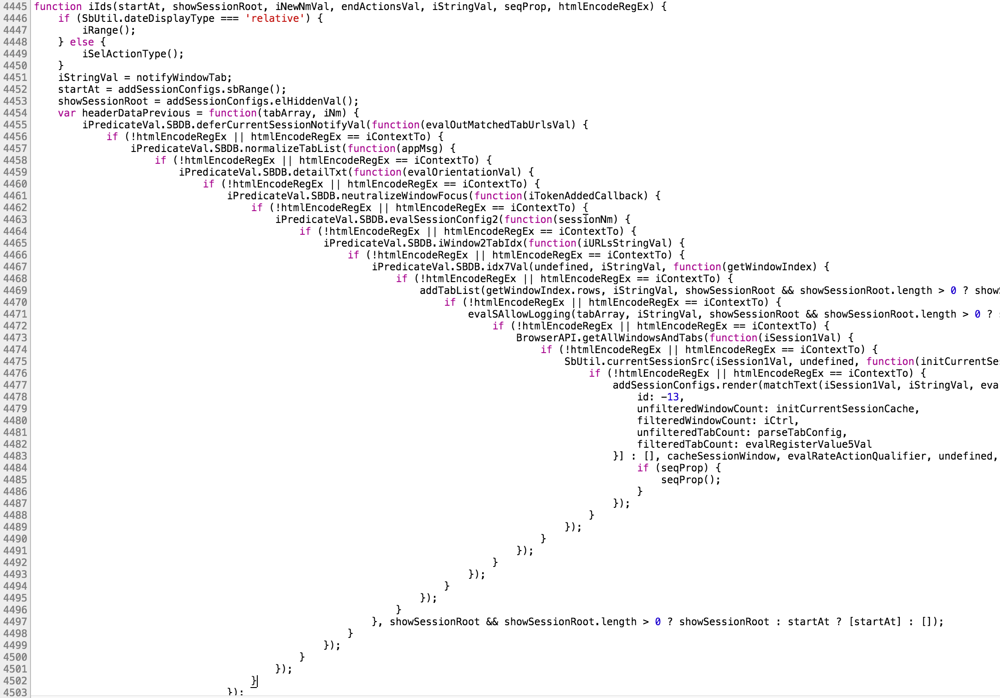
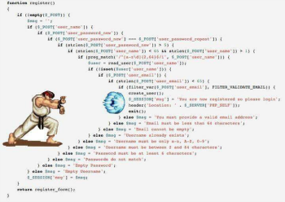
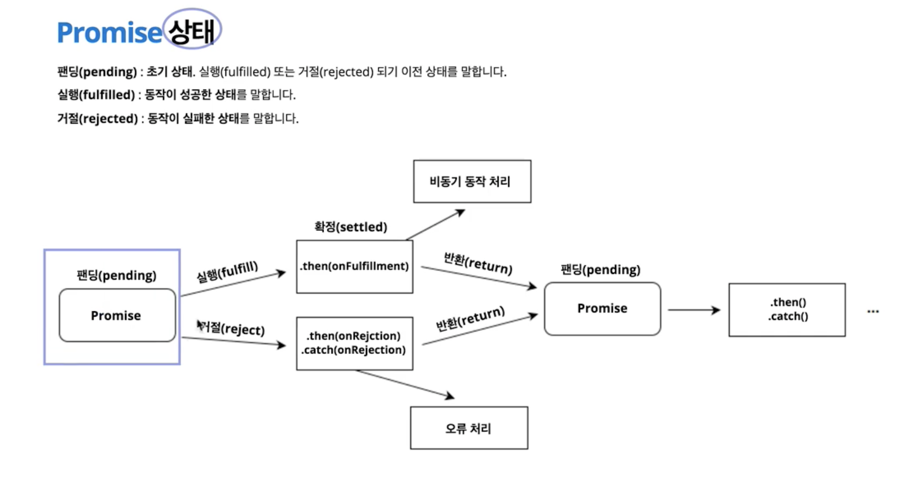
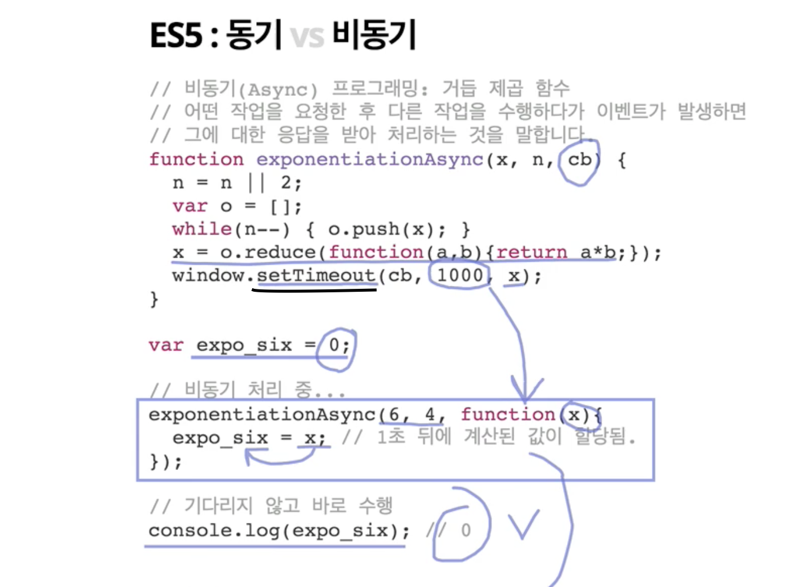

[← 뒤로가기](./README.md)

<br/>

# TIL

23일차 학습을 통해 배운 내용을 정리합니다.

## Promise

> Promise는 비동기 조작의 최종 완료(Resolve) 또는 실패(Reject)를 나타내는 객체입니다. 그리고 Fetch API를 이용하면 요청(Request), 응답(Resposne)와 같은 HTTP의 파이프라인을 구성하는 요소를 조작하는것이 가능합니다.


* `promise` 객체는 비동기 처리를 위한 목적으로 사용되며, 당장은 아니더라도 나중에 처리 될 것으로 기대되는 연산을 수행할 때 사용한다.

### 콜백 지옥 

> 

콜백을 여러번 중첩하여 코드를 엄~청 비효율적으로 작성하는 것을 말한다. 

* 앱이 구동이 될 때, 비동기 통신이 수십번 일어나게 된다면 모든 결과를 콜백을 통해 처리하는데 그 떄 콜백 지옥에 빠질 수 있다. ES5에서 이를 코트로 작성 할 때 유틸리티 함수를 만들지 않는다면 콜백을 여러번 중첩하여 사용하는 이른바 콜백지옥에 빠지기 쉬웠다. 하지만 ES6에서 부터는 콜백 지옥으로 부터 해방시켜주는 `Promise`가 나왔고 더 나아가서는 `Promise`보다 더 간편하게 사용가능한 `fetch`가 나왔다. 

* 총체적 난국의 콜백함 수 예시 🙅 🙅‍♂️ 🙅‍♀️ 🤦 🤦‍♂️ 🤦‍♀️




### Promise

```js
[기본 문법]
const promise = new Promise((resolve, reject) => {
  if ( true ) {
    resolve();
  } else {
    reject();
  }
});

promise
  // .then() : resolve() 실행할 경우
  .then(() => {
    // ...
  })
  // .catch() : reject() 실패할 경우
  .catch(error => {
    console.error(error.message);
  })
```
### Promise 상태


- `onFullfillment`, `onRejestion`은 콜백 함수이다. (함수에 이름을 붙인 것)

### `.then()` 메서드
- 비동기 통신에 성공 했을 때 실행 
- 이 메서드를 사용하면 콜백 지옥에 빠지지 않도록 하고 관리가 용이하며 코드를 간소화 할 수 있다. 

### `.catch()` 메서드
- 비동기 통신에 실패 했을 떄 실행되어 에러 메세지를 보여줌 (에러 메세지는 개발자를 위한 메세지이다.)

> 실행되고 구문이 끝나면 끝이다! `then`은 성공 할 때 까지 기다려주지 않음

### promise.all()
>비동기 처리가 요구되는 API 배열에 Promise의 .all()을 사용하면 Promise를 병렬 처리 할 수 있습니다.

병렬식으로 비동기 통신을 하는 함수이다. (직렬식은 동기 통신)

* promise.all()는 전달 인자인 객체가 Promise 생성자의 객체여야만 한다. 

```js
let a = new Promise ((rs, rj) => {
    window.setTimeout(rs, 1000, 'A');
});

let b = new Promise ((rs, rj) => {
    window.setTimeout(rs, 2000, 'B');
});

Promise.all([a, b])
    .then(values => console.log(values)); // 2초 후 ["A", "B"]

// reject() 실행시켜 오류 발생하게 하기

//  1
let a = new Promise ((rs, rj) => {
    window.setTimeout(rs, 1000, 'A');
});

let b = new Promise ((rs, rj) => {
    window.setTimeout(rj, 2000, '오류 발생');
});
Promise.all([a, b])
    .then(values => console.log(values));

//  2 
let a = new Promise ((rs, rj) => {
    window.setTimeout(rs, 1000, 'A');
});

let b = new Promise ((rs, rj) => {
    window.setTimeout(rj, 2000, 'B');
});

Promise.all([a, b])
    .then(values => console.log(values))
    .catch(e => console.error('${e} 오류 발생!'));
```
 
### Promise.race()
성공/실패와 상관없이 가장 먼저 실행M 되는 값이 바로 실행된다. 

```js
let a = new Promise ((rs, rj) => {
    // 실행 (먼저 종료)
    window.setTimeout(rs, 1000, 'A');
});

let b = new Promise ((rs, rj) => {
    // 거절
    window.setTimeout(rj, 2000, 'B');
});

Promise.race([a, b])
    .then(values => console.log(values))
    .catch(e => console.error('${e} 오류 발생!')); // 1초 뒤 A

// reject() 실행시켜 오류 발생하게 하기

let a = new Promise ((rs, rj) => {
    // 실행
    window.setTimeout(rs, 1000, 'A');
});

let b = new Promise ((rs, rj) => {
    // 거절 (먼저 종료)
    window.setTimeout(rj, 300, 'B');
});

Promise.race([a, b])
    .then(values => console.log(values))
    .catch(e => console.error('${e} 오류 발생!')); // 0.3초 뒤  ${e} 오류 발생!
```

### Promise.resolve() / Promise.reject()
- `resolve()` : 실행(fulfilled)된 `promise` 객체를 반환하는 메서드  
- `reject()` : 거절(rejected)된 `promise` 객체를 반환하는 메서드


```js
let a = Promise.resolve('fulfilled');

let b = Promise.reject('rejected');

Promise.race([a, b])
    .then(values => console.log(values))
    .catch(e => console.error('${e} 오류 발생')); // fulfilled
```

## 공부 메모
* 네트워크 : 클라이언트와 서버의 작동 방법
* `json` 
    - 메서드
        - stringify() : 문자화
        - parse() : 객체화
        - `json`은 문자이다. 서버에 저장할 때 문자로 저장하기 떄문이다. 그래서 위와 같은 메서드가 필요하다.
    - `json`을 사용하는 이유
        - 용량이 적다(경량), `JavaScript` 객체 방식이다 보니 `JavaScript`에 연결해서 사용이 용이하다. 

* `try ~ catch` 
    - `try` 구문이 실패한다면 `catch`구문 실행 -> `reject` 실행
    - `try` 구문이 성공한다면  -> `resolve` 실행


* 아래의 코드가 비동기임을 확인 하는 것은 `Web API`인 `setTimeout`다. `setTimeout`는 비동기로 통신되는 `API`이기 떄문이다.
    