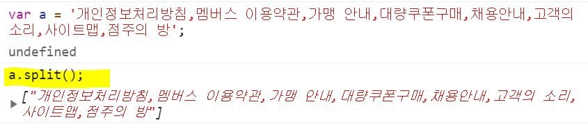
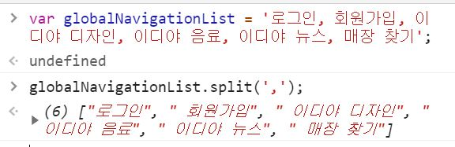
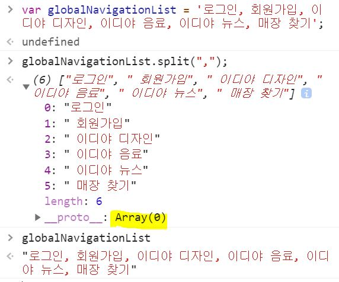

# String.prototype.split()

- [[MDN]문자 객체의 `split()`메서드](https://developer.mozilla.org/ko/docs/Web/JavaScript/Reference/Global_Objects/String/split)

## `split()`

- `split()` 메서드는 문자데이터(문자 객체)를 지정한 구분자(공백, 콤마(`,`) 등)를 이용해서 여러 개의 문자열로 나눈다. 그리고 나뉜 문자열을 담을 배열을 반환한다.
- 이 메서드를 사용하면 배열로 만들 아이템이 많아졌을 때 손 쉽게 구분지을 수 있다.

```js
var number = "one two three four five six seven eight";

// 공백을 기준으로 아이템을 구분한다.
var num = number.split(" ");
console.log(num);
// expected output: Array ["one", "two", "three", "four", "five", "six", "seven", "eight"]

// 각 문자 하나 하나를 아이템으로 구분한다.
var num = number.split("");
console.log(num);
// expected output: Array ["o", "n", "e", " ", "t", "w", "o", " ", "t", "h", "r", "e", "e", " ", "f", "o", "u", "r", " ", "f", "i", "v", "e", " ", "s", "i", "x", " ", "s", "e", "v", "e", "n", " ", "e", "i", "g", "h", "t"]

// 입력된 문자데이터 하나의 아이템으로 설정한다.
var num = number.split();
console.log(num);
// expected output: Array ["one two three four five six seven eight"]
```

## 구문

```
str.split([separator[, limit]])
```

### 매개변수

- `str` : 문자
- `[separator[, limit]] (= [Optional[, Optional]])` : 매개변수(parameter) 안에 (`[]`)가 있으면 옵션이라는 뜻이다.
  옵션? 값을 넣어도 안 넣어도 상관없다.
- `separator`(분리기) : 원본 문자데이터를 끊어야 할 부분을 나타내는 문자열을 나타낸다.
- `limit`(한도) : 끊어진 문자데이터의 최대 개수를 나타내는 정수이다.

### 반환값

- 주어진 문자데이터를 `separator`마다 끊어 문자열로 만들고 만든 문자열을 담은 배열(Array)을 반환한다.

## 실습 경험

1. `split()`

   - 입력한 문자데이터를 전부 하나의 아이템으로 묶어라!
   - Q : 왜 배열로 만들어 지지 않는 것일까? 아무런 값도 넣지 않았을 때는 배열 생성이 안되는 것일까?
   - A : 하나의 아이템(문자데이터)를 갖고 있는 배열이 만들어 졌다. 배열이 아닌 것이 아니다. 근거로는 출력된 값을 보면 각괄호(`[]`)로 묶여있다.
     

1. `split(',')`

   - 콤마(`,`)를 기준으로 아이템을 구분해라!
   - Q : 왜 인덱스[1] 이후로는 아이템 앞에 공백이 생길까?
   - A : 공백도 문자 데이터이다. 변수에 문자데이터를 할당할 때 `,(공백)회원가입`으로 문자를 구분했다. 거기에 입력한 공백 또한 문자데이터로 인식하기 때문에 각 인덱스 앞에 공백이 생긴 것이다.
     

1. 변수에 배열이 복사되지 않는다.
   - Q : `split()` 메서드를 사용해서 문자를 구분하여 문자열 배열이 나오게 만들었으나 변수에는 복사되지 않았다.
   - A : `globalNavigationList.split()`를 통해 나온 배열 객체를 할당할 변수를 선언해주지 않았기 때문이다. 즉, 애써만든 배열을 변수에 담지 않았다.
     
