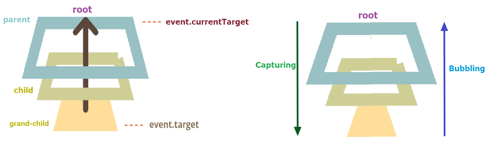
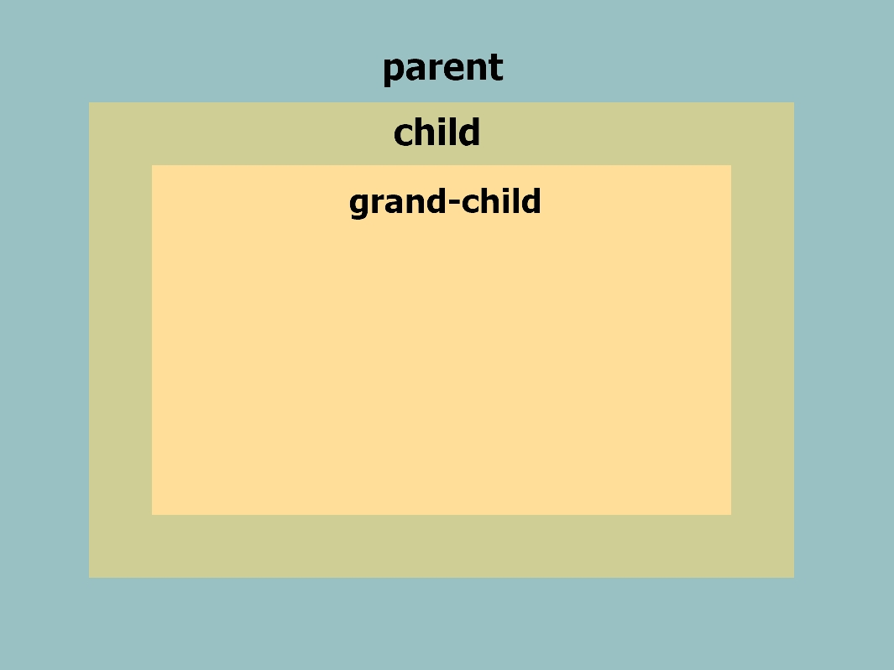
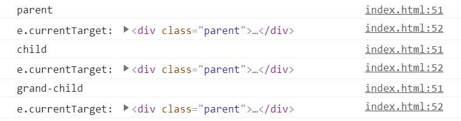

# 이벤트 위임(event delegation)

## 개념 정리

앞서 본 기능(클로저, 바인드)을 이용해서 이벤트를 걸어주는 방법은 요소 각각에 이벤트를 바인딩 해야하기 때문에 번거로운 작업이 될 수 있다.  
조금 더 수준을 높여 이벤트를 바인딩 하는 방법이 이벤트 위임이다.

### 이벤트 위임이란?

- 부모요소에 이벤트를 걸어서 **부모에 속해 있는 자식요소에게 이벤트를 전파** 시키는 것이다.

[[클릭!] 이벤트 위임을 더 자세하게 알아보자!](https://ko.javascript.info/event-delegation)

- 왜 사용할까?

  - 이 방법을 사용한다면 이벤트를 바인딩할 요소가 추가되더라도 다시 이벤트를 바인딩하는 코드를 입력 하지 않더라도 이미 자식요소들은 전부 이벤트가 걸려있기 때문에 번거롭게 작업할 필요가 없다.

- 의문점
  - 부모요소가 갖고 있는 자식요소 모두에게 이벤트를 걸어 준다면 내가 원하지 않은 요소까지 이벤트가 걸리게 되면 위험하지 않을까?
  - 방법! 이벤트 위임을 사용할 때 범위를 지정해 줄 수 있는 방법이 있다. 그것은 추후에 배우는 것으로!

### 캡처링과 버블링

- 버블링(bubbling) : 요소에 이벤트가 발생하면 이어서 부모요소, 그리고 그 최상단의 조상 요소를 만날 때까지 이 과정이 반복되며 각 요소의 이벤트 핸들러가 동작한다.
- 캡처링(capturing) : 상위 부모요소에 이벤트가 동작하면 순차적으로 그 하위 자식요소 그 아래 자식요소... 에 할당된 이벤트가 동작한다.

  ```js
  elem.addEventListener(...)       // 버블링
  elem.addEventListener(..., true) // 캡처링
  ```

  `capture` 옵션은 두 가지 값을 가질 수 있습니다.

  - `false`이면(`default` 값) 핸들러는 버블링 단계에서 동작한다.
  - `true`이면 핸들러는 캡처링 단계에서 동작한다.

[[클릭!] 캡처링과 버블링을 더 자세하게 알아보자!](https://ko.javascript.info/bubbling-and-capturing)

&spades; 그림을 보며 이해하기!

- **버블링**은 맨 아래의 자식요소에 이벤트가 동작하면 순차적으로 루트(상위요소)로 올라가며 이벤트가 동작한다. 마치 아래에서 위로 올라가는 흐름처럼 보인다.  
  버블링 이벤트 작동 순서 : `grand-child` &rarr; `child` &rarr; `parent`

- **캡처링**은 흐름이 버블링과 반대라고 생각하면 쉽다.



## 실습

- `e.target` : 현재 사용자가 클릭한 대상 또는 현재 이벤트가 이동중인 요소
- `e.currentTarget` : 이벤트를 바인딩한 부모 요소
<details>
  <summary>아래의 코드를 UI로 구현한 모습</summary>
  <br />



</details>

<br />

```html
<body>
  <div class="parent">
    <div class="child">
      <div class="grand-child"></div>
    </div>
  </div>
</body>
```

```js
const parentNode = document.querySelector(".parent");

parentNode.addEventListener("click", function (e) {
  console.log(e.target.className);
  console.log("e.currentTarget:", e.currentTarget);
});
```

- 결과 값
  - `parent`, `child`, `grand-child` 순으로 `click` 해보니 나오는 결과이다.  
    클릭을 했을 때 나오는 값. 즉, `e.target`은 내가 클릭한 요소가 나왔지만 `e.currentTarget`은 변함 없이 `parent`가 나오는 것을 볼 수 있다.
    
