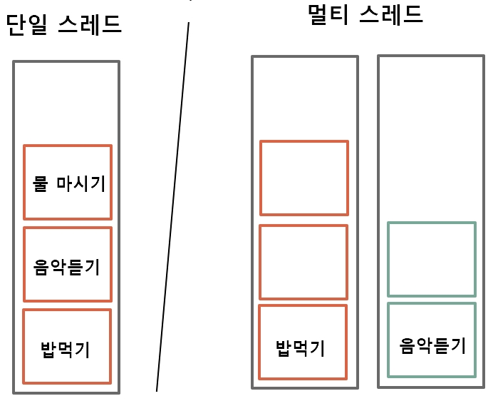

# 스레드(thread)

[스레드란?](<https://ko.wikipedia.org/wiki/%EC%8A%A4%EB%A0%88%EB%93%9C_(%EC%BB%B4%ED%93%A8%ED%8C%85)>) 프로그램 내에서, 특히 프로세스 내에서 실행되는 흐름의 단위를 말한다.

- 작동되려는 기능을 담은 메모리 공간이라고 생각하면 쉽다.

  - 단일 스레드 : 기능을 수행하는 메모리가 하나 뿐이라 순차적으로 기능을 수행한다. (예: 밥을 다 먹어야 음악 듣기 가능)
  - 멀티 스레드: 기능을 수행하는 메모리가 여러개라서 여러 기능을 동시에 수행한다. 스마트폰은 멀티스레드이다 (예: 밥먹기 음악듣기 동시에 가능)

  
